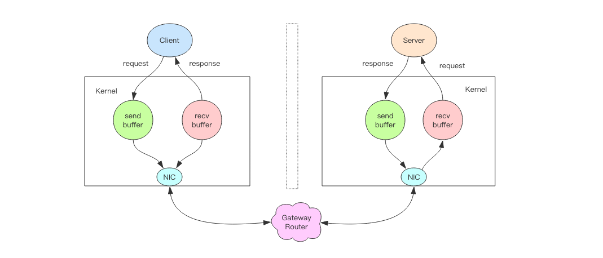
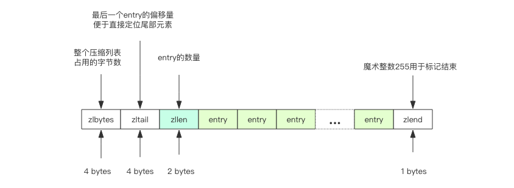
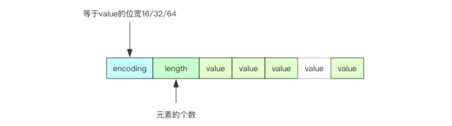

# Redis 深度历险核心原理与应用实践

## 第二篇：原理篇

### 2.1 线程 IO 模型

+ Redis 单线程程序；所有数据存储内存中，运算都是内存级别的；注意不要运行时间复杂度 O(n) 级别的指令，可能造成卡顿；
+ 阻塞IO：套接字 Socket 连接和读写默认是阻塞的；
+ 非阻塞IO：打开 Non_Blocking 选项，读写方法不阻塞；
+ 事件轮询（多路复用）：
    + Java 中的 NIO 技术；
    + 解决问题：非阻塞 IO 未读完和未写完的问题；
    + 实现 API：select 函数、epoll 函数等；
        + 区别：select 不管是否有数据传输均轮询；epoll 仅轮询有数据传输的；
        + select 提供 timeout 参数，若无任何事件，线程最多阻塞等待 timeout，过时立即返回；
        + select 缺点：若连接数量过多，所有连接每个周期均需轮询，造成单个连接等待的时间过长；
+ 指令队列：客户端发过来的指令，先来先服务；
+ 响应队列：将指令返回的结果回复给客户端；
+ 定时任务：
    + 若线程阻塞在 select 的调用上，那么定时任务将无法准时调用；
    + 解决：定时任务记录在“最小堆”的数据结构中，快到期的任务排在堆上方；每个周期里，Redis 会处理到时间点的任务，处理完毕后记录快到期的任务还需等待的时间（timeout 参数）；

### 2.2 通信协议

+ RESP：Redis 序列化协议（Redis Serialization Protocol）；直观的文本协议，优势实现过程简单解析性能好；
+ 五种最小单元类型：（单元结束时统一加回车换行：\r\n）
    + 单行字符串：“+” 开头
    + 多行字符串：“$” 开头，后接字符串长度
    + 整数值：“:” 开头，后接整数的字符串形式
    + 错误消息：“-” 开头
    + 数组：“*” 开头

```shell script
# 单行字符串 “hello world”
+hello world\r\n

# 多行字符串 “hello world”（也可表现成单行字符串）
$11\r\nhello world\r\n

# 整数 “1024”
:1024\r\n

# 错误
-WRONGTYPE\r\n

# 数组 [1,2,3]
*3\r\n:1\r\n:2\r\n:3\r\n

# NULL
$-1\r\n

# 空串
$0\r\n\r\n
```

### 2.3 持久化

+ Redis 持久化机制：
    + 快照：bgsave，**全量备份**；内存数据的二进制序列化形式；
    + AOF 日志：连续**增量备份**；内存数据修改的指令记录文本；定期需重写；
+ 快照原理：
    + Redis 单线程，线程同时负责多个客户端 Socket 的并发读写操作和内存数据结构的逻辑读写；
    + 内存快照需进行文件 IO 操作，且不能使用多路复用 API（会拖累服务器性能）；
    + 为不阻塞线上业务，Redis 需**一边持久化一边响应**客户端请求；
    + Redis 快照持久化机制：使用操作系统的**多线程 COW（Copy on write）实现**；
+ fork 多线程
    + Redis 持久化会调用 glibc 的函数 fork 产生一个子进程；持久化由子进程处理，父进程继续处理客户端请求；
    + 初期：父子进程共用内存中代码段和数据段；（内存几乎没有明显变化）
    + 接着：子进程做持久化，对内存数据仅遍历读取，不修改；父进程可能会不间断修改；————> COW 机制：数据段页面分离；
    + 若父进程要修改数据，该页面会被复制一份分离出来，然后对复制的页面进行修改；（内存增加）
    + 内存不会超过原来的两倍；又因 Redis 实例里冷数据普遍占比高，实际被分离的页面占少部分；
+ AOF 原理：
    + AOF 日志：存储 Redis 服务器顺序指令序列；只记录**修改**指令；
    + 记录逻辑：**先执行，后存储**；
    + Redis 长期运行，AOF 日志越来越长；日志过长影响 Redis 重启重放 AOF 日志耗时过长，导致长时间无法提供服务；过长需重写；
    + 重写：bgrewriteaof 指令，原理是开辟子进程对内存进行遍历，转换成一系列 Redis 操作指令，再序列化到新的 AOF 日志文件中；最后追加操作期间的发生的增量 AOF 日志，完成后替换；
+ fsync：
    + 对 AOF 文件的写操作：实际上将内容写到内核为文件描述符分配的一个**内存缓存**中，然后再由内核异步将脏数据刷回磁盘；
    + 手动刷回：Linux 中 glibc 中的 fsync(int fd) 函数；可将指定内容强制从内存刷到磁盘中；
    + Redis 两种刷回策略：
        + 周期性刷回：每隔一段时间刷回；（数据安全性和性能之间的折中）
        + 一个指令刷回一次：操作耗时，磁盘 IO 耗时；
        + 由操作系统配置：不安全，若机器突然宕机，AOF 日志内容可能没有刷回磁盘中；
+ 运维：
    + 快照是开启子进程的方式进行，需遍历整个内存，大块写磁盘；
    + AOF 的 fsync 是一个耗时 IO 操作，降低 Redis 性能和增加系统 IO 负担；
    + Redis **主节点**不进行持久化操作；持久化操作在**从节点**进行；
    + 在网络分区中，注意主从节点网络的畅通，做好实时监控工作，以免从节点长时间连不上主节点，造成数据丢失；
+ Redis 4.0 混合持久化：
    + 快照：很少用于恢复内存状态，因会丢失大量数据；
    + AOF 重放：通常使用；但 AOF 重放比快照慢，若数据量大启动花费较长时间；
    + 混合持久化：Redis 4.0 推出；快照 + 少量 AOF（持久化开始到结束这段时间的增量 AOF 日志）；Redis 重启后先加载“快照”，再重放 AOF；效率大幅提升；

### 2.4 管道

+ Redis 客户端提供，改变消息交互顺序，节省网络来回时间；
+ Redis 压力测试工具：redis-benchmark
+ 管道本质：
    + 客户端与服务端完整的请求交互流程
        1. **客户端进程**调用 write 将消息写到操作系统内核为套接字分配的发送缓冲区 send buffer 中；
        2. **客户端操作系统内核**将发送缓冲的内容发送至网卡，网卡硬件将数据通过“网际路由”送到服务器的网卡；
        3. **服务器操作系统内核**将网卡的数据放到内核为套接字分配的接收缓冲区 recv buffer 中；
        4. **服务器进程**调用 read 从接收缓冲中取出消息并进行处理；
        5. **服务器进程**调用 write 将响应消息写到内核为套接字分配的发送缓冲区 send buffer 中；
        6. **服务器操作系统内核**将发送缓冲的内容发送至网卡，网卡硬件将数据通过“网际路由”送到客户端的网卡；
        7. **客户端操作系统内核**将网卡的数据放到内核为套接字分配的接收缓冲区 recv buffer 中；
        8. **客户端进程**调用 read 从接收缓冲中取出消息返回给上层业务逻辑进程处理；
        9. 结束； 
    + write 操作：只负责将数据写到本地操作系统内核的发送缓冲区中就返回；（若缓冲区满了则需等待空出空闲空间，写操作 IO 操作真正耗时）
    + read 操作：只负责把数据从本地操作系统内核的接收缓冲区中取出；（若缓冲区为空则需等待数据到来，读操作 IO 操作真正耗时）
    + 所以相比较，写操作几乎没有耗时，而读操作需等待一个网络的来回开销；
    


客户端与服务端完整的请求交互流程

```shell script
# 压测 set 指令
> redis-benchmark -t set -q

# 加入管道选项 P 参数，表示单个管道内并行的请求数量
> redis-benchmark -t set -P 2 -q
```

### 2.5 事务

+ 基本用法：
    + 普通：begin 开始、commit 提交、rollback 回滚；
    + Redis：multi 开始、exec 执行、discard 丢弃；Redis 不支持回滚；
+ 因 Redis 的单线程特性，不用担心执行队列时被其他指令打搅，保证了“原子性”执行；
+ Redis 事务的原子性：
    + 事务的原子性：要么全部成功，要么全部失败；
    + Redis 事务不具备“原子性”，仅仅满足事务的“隔离性”中的串行化（当前执行的事务不被其他事务打断）；
+ 优化：Redis 事务每次发送指令到事务缓存队列中都需要经历一次网络读写，若指令较多，需要网络 IO 的时间会增加；一般结合管道 Pipeline 使用；
+ watch 机制：
    + 处理并发问题；分布式锁是悲观锁；watch 机制是乐观锁；
    + watch 在**事务开始前**关注一个或多个变量，当事务执行时，Redis 会判断该变量在 watch 之后是否被修改；若被修改则执行失败；
    + [示例Demo](./src/main/java/com/example/redis/RedisTransactionDemo.java)

### 2.6 PubSub

+ Redis 依靠基本数据结构队列的延时消息队列，不支持消息的多播机制；
+ 消息多播：生产者生产一次消息，由中间件负责将消息复制到多个消息队列，每个消息队列由对应的消费组进行消费；
+ PubSub
    + PubSub：PublisherSubscriber（发布者\订阅者模式）；
    + 支持消息多播的模块；
    + 生产者生产消息；消费者读取消息，若没有消息可以睡眠等待，也可使用 “listen” 阻塞监听来处理（原理和 blpop 一致）；
    + 消费者可同时订阅多个主题；Redis 提供模式订阅功能 Pattern Subscribe，可一次订阅多个主题，在同一模式的消息都可以接收到；
    + 消息结构：
        + pattern：消息订阅模式；若消息直接通过 subscribe 指令订阅，则为空；
        + type：消息类型；
            + 普通消息：message；
            + 控制消息：
                + subscribe：订阅指令的反馈；
                + psubscribe：模式订阅指令的反馈；
                + unsubscribe：取消订阅指令的反馈；
                + punsubscribe：取消模式订阅指令的反馈；
        + data：消息内容；字符串；
        + channel：当前订阅主题的名称；
    + PubSub 缺点：
        + 若不存在消费者，则消息直接被丢弃；
        + 若消费者在生产者发送消息前宕机，那么该消息也直接丢失；
        + PubSub 消息不被持久化；服务器宕机意味着不存在消费者；
+ Redis 5.0 新增 Stream 数据结构；该功能可持久化消息队列；PubSub 下岗；

### 2.7 小对象压缩

+ Redis 是一个非常消耗内存的数据库，需注意节约使用内存，若内存不足则崩溃；
+ 32 位与 64 位：
    + 32 位编译，内部所有数据结构所使用的指针空间占用减少一半；
    + 若内存不超过 4GB，建议使用 32 位；
+ 小对象压缩存储
    + 若集合数据结构很少，会使用**紧凑存储形式**压缩存储；（若 HashMap 为二维结构，若内部元素少，则使用一维数组存储）
    + **ziplist**：Redis 的一个紧凑字节数组结构；
        + 相关参数含义：
            + zlbytes：整个压缩列表占用的字节数；
            + zltail：最后一个 entry 的偏移量便于直接定位尾部元素；
            + zllen：entry 的数量；
            + zlend：标记结束；
        + 若存储 hash 结构，那么 key 和 value 作两个 entry 被相邻存储；
        + 若存储 zset 结构，那么 value 和 score 左两个 entry 被相邻存储；
    + **intset**：紧凑的整数数组结构；
        + 存放的元素都是**整数**且**个数较少**的 set 集合；
        + 若整数可用 uint16 表示，intset 则是 16 位的数组；若超过范围，可动态升级到 uint32 或 uint64；
        + 若添加字符串，则升级为 hashtable 结构；
        


ziplist 小对象压缩存储



intset 小对象压缩存储

+ Redis 内存回收机制：
    + 不把空闲内存立即归还操作系统；
    + 操作系统以**页**为单位来回收内存；只要页上还存在使用的 key，则该页不能被回收；
    + **flushdb**：所有 key 被干掉，使用的页面完全干净，内存立即被回收；
    + Redis 会**重新使用**尚未回收的内存空间；
    + 总结：Redis 中 key 被删除，内存没有被操作系统回收的原因
        1.Redis 中 key 分散很多页面，只要页面上存在还在使用的 key，那么该内存无法被回收；
        2.Redis 会重新使用尚未回收的内存空间；
+ Redis 内存分配算法：
    + 内存分配算法：划分内存页，考虑内存碎片，需要平衡性能和效率；
    + 内存分配细节由第三方内存分配库实现：
        + jemalloc（facebook）：默认，性能稍好；
        + tcmalloc（google）

```shell script
# 存储界限；超过后“小对象存储”升级为“标准存储”；
hash-max-ziplist-entries 512 #hash 元素个数超过 512
hash-max-ziplist-value 64 #hash 任意元素 key/value 的长度超过 64
list-max-ziplist-entries 512 #list 的元素个数超过 512
list-max-ziplist-value 64 #list 的任意元素长度超过 64
zset-max-ziplist-entries 128 #zset 元素个数超过 128
zset-max-ziplist-value 64 #zset 的任意元素长度超过 64
set-max-ziplist-entries 512 #set 整数元素个数超过 512
```
      