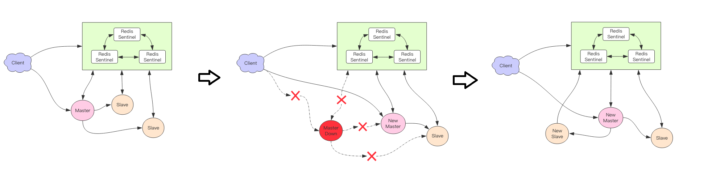
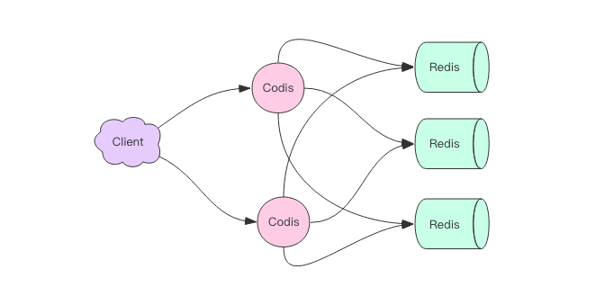
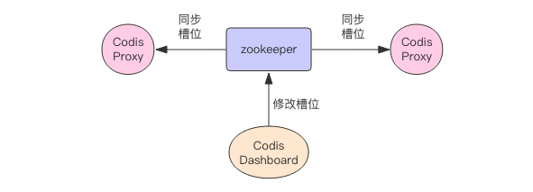
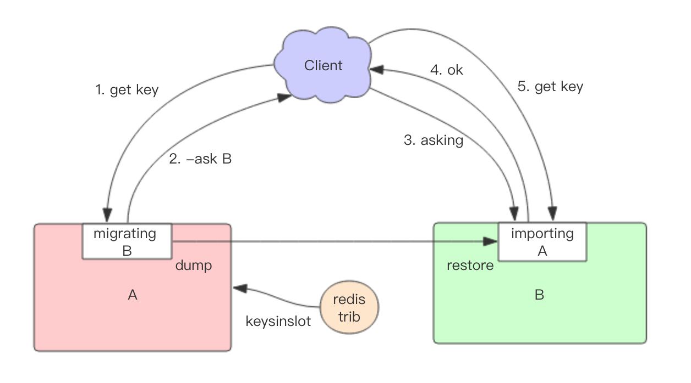

# Redis 深度历险核心原理与应用实践

## 第三篇：集群篇

### 3.1 主从同步

+ 集群的优点：
    + 保障系统数据安全；
    + 主节点 Master 挂掉时，从节点 Slave 接管，可继续服务；（否则主节点需要经过重启和数据恢复，耗时影响线上业务）
+ CAP 原理：
    + 现代分布式系统理论基石；
    + CAP：
        + C：Consistent，一致性；
        + A：Availability，可用性；
        + P：Partition tolerance，分区容忍性；
    + 网络分区：
        + 背景：分布式系统节点往往分布在不同的机器上进行网络隔开；
        + “网络分区”指网络断开的场景；
        + 若发生“网络分区”，“一致性”和“可用性”两难全；
+ 主从同步：
    + Redis 的主从数据是**异步同步**；（并不满足一致性，但满足**最终一致性**）
    + 客户端连接主节点修改数据后，立即返回；即使主从网络断开下，主节点依旧可对外正常服务；（满足可用性）
    + 最终一致性：只要主从节点连上，从节点积极追赶主节点，最终与主节点状态保持一致；
+ 从从同步：从从同步可减轻主节点同步的负担；
+ 增量同步：
    + **同步指令流**（对状态产生修改的指令）；
    + 主节点：将存储在本地内存 buffer 中的指令**异步**同步至从节点；
    + 从节点：一边同步指令，一边反馈偏移量；
    + 本地内存 buffer：
        + 容量有限，类似一个定长的环形数组；
        + 若数组容量满了，则从头开始覆盖前面内容；
        + 若因长时间没有同步，主节点的同步指令可能被覆盖掉，这时需更加复杂的同步机制 —— 快照同步；
+ 快照同步：
    + 同步快照；一个非常消耗资源的操作；
    + 主节点：bgsave，创建当前快照；再将快照文件的内容发送至从节点；
    + 从节点：接收快照文件，存储至硬盘中；清空当前内存中的数据；执行一次全量加载；加载后执行增量加载；
    + 问题：若**快照同步时间过长**或**复制 buffer 容量过小**，导致同步期间增量指令被覆盖，需再次发起快照同步，陷入死循环；（需配置合适的复制 buffer 大小）
+ 增加从节点：先执行快照同步，完成后再增量同步；
+ 无盘复制：
    + 主节点直接通过套接字将快照内容发送至从节点；
    + 主节点：一边遍历内存数据，一边将序列化的内容发送至从节点；
    + 优点：免去磁盘文件 IO 操作；   
+ wait 指令：
    + Redis 3.0 后推出；
    + wait 指令可让异步复制变成同步复制，确保强一致性（不严格）；
    + wait 指令两个参数：
        + 节点的数量 N；
        + 时间 t：毫秒为单位；
        + 意义：wait 指令之前所有写操作同步到 N 个从节点，最多等待时间 t；（确保 N 个从节点的同步没有滞后）
        + 若 t = 0，表示无限等待直到 N 个从节点同步完成；若出现网络分区，主从同步无法继续进行，wait 指令永远阻塞，Redis 丧失可用性；

### 3.2 Sentinel

+ Redis Sentinel：哨兵机制，一个高可用方案来抵抗节点故障；
+ Sentinel 集群类似 ZooKeeper 集群，是集群高可用的心脏；
+ Sentinel：负责持续监控主从节点的健康；客户端首先与其连接获取主节点地址；
+ Sentinel 宕机处理：
    + Sentinel：自动选择一个最优的从节点切换成主节点；
    + 客户端：会重新向 Sentinel 获取地址；（无需重启即可自动完成节点切换）
    + 主节点：原先主从复制断开，断开与客户端的连接；Sentinel 持续监控待其恢复，恢复后成从节点，与新的节点建立主从同步；
    + 从节点：一个从节点被提升为主节点，其他节点与新的主节点建立新的主从同步；客户端与新节点连接；
    

主节点宕机 Sentinel 处理过程示意图
    
+ 消息丢失：
    + Redis 主从采用异步复制，若主节点宕机，从节点可能没有收到全部的同步消息，没收到的部分丢失；（主从延迟过大下）
    + Sentinel 保证主从高可用，不保证数据完全不丢失（尽量保证消息少丢失）；
    + 限制主从延时过大的参数：
        + min-slaves-to-write：n；——> 主节点必须至少有 n 个从节点在进行正常复制，否则停止对外写服务，丧失可用性；
        + min-slaves-max-log：m；——> 判断从节点是否正常复制的参数，单位为秒；表示 m 秒内没有收到从节点的反馈意味着从节点同步不正常；
+ Sentinel 基本用法
    + Sentinel 默认端口：26379
    + 主节点地址有一个，从节点地址有多个；
    + Sentinel 发生主从切换，客户端如何察觉：
        + 与连接池建立连接：先往连接池查询主节点的地址，与内存中主节点的地址比较，若不相符则断开所有连接，重新使用新地址建立新连接；
        + 主节点宕机：关闭所有连接，执行上面的规则；
        + 主节点没有宕机：
            + 在执行修改指令时抛出异常，在异常处理中关闭所有旧连接，那么后续指令会进行重连；
            + 不执行修改指令：无需关闭；

### 3.3 Codis

+ 单个 Redis 实例的不足：
    + 内存：不宜过大
        + 过大导致 rdb 文件过大；
        + 导致主从同步时全量同步时间长；
        + 实例重启恢复需要消耗较长的数据加载时间；
        + 云环境上单个实例的内存大小受限；
    + CPU 利用率：单线程只利用单个核心，处理海量数据和管理工作；
+ Codis：Redis 集群方案之一；
    + 国产软件，非官方项目，Go 语言开发；
    + 使用 Redis 协议对外提供服务，客户端操纵 Codis 与 操纵 Redis 几乎没有区别；
    + 客户端向 Codis 发送指令时，Codis 负责将指令转发至 Redis 实例来执行，并将返回结果再转回给客户端；
    + Codis 无状态，一个转发代理中间件，可启动多个 Codis 实例供客户端使用；多个 Codis 可提升 QPS 需求，还有容灾功能；

    

多个 Codis 实例与多个 Redis 实例示意图

+ Codis 分片原理：
    + 默认将所有 key 划分为 1024 个槽（slot）；（大小可设置，若实例数过多可设大点）
    + 客户端传过来的 key 先进行 **crc32 算法**计算 hash 值，再将 hash 后的整数值对槽的个数进行取模，得到的余数就是对应 key 的槽位；
    + 每个槽位都会唯一映射到多个 Redis 实例之一，Codis 在内存维护槽位和 Redis 实例的映射关系； 
+ 不同 Codis 实例之间槽位关系：
    + Codis 的槽位映射关系不能只存储于内存中；因为不同 Codis 实例之间槽位的关系需同步；
    + 引申：需一个分布式配置存储数据库处理持久化槽位关系；（例：ZooKeeper、etcd等）
    + 如下图所示，Codis 将槽位关系存储于 ZooKeeper 中；提供 Dashboard 用于观察和修改槽位关系；当槽位关系发生改变时，Codis Proxy 会监听到变化并重新同步槽位关系（实现多个 Codis
     Proxy 之间共享相同槽位关系配置）；

   

Codis-ZooKeeper 相结合

+ Codis 扩容：
    + 扩容：需**调整槽位关系**；（调整槽位关系意味着某些 key 需迁移，迁移涉及遍历以及如何响应事件）
    + 例：原有一个 Redis 实例，1024 个槽全部指向它；现新增一个 Redis 实例，那么需将一半槽位划分到新的节点，意味着一半槽位对应的 key 迁移到新的 Redis 实例；
    + 如何通过槽位找到对应的所有 key：
        + SLOTSSCAN：遍历指定 slot 下所有的 key；（Codis 改造 Redis 中的 scan 指令）
            + 步骤：先扫描出待迁移槽位的所有 key，然后逐个 key 迁移，迁移后删除原有槽位的 key；
            + scan 指令通病：无法避免重复；但对迁移影响不大，因为重复的 key 已经被迁移和删除；
            + 迁移中有新请求打在当前需迁移的槽位上：
                + 背景：数据同时存在新旧槽位上，Codis 无法判定迁移中 key 究竟在哪个实例中（是否完成迁移）；
                + 处理方法：强制先处理当前单个 key 的迁移，迁移完成后再将请求转发到新的 Redis 实例；
+ 自动均衡：Redis 新增实例，Codis 提供可自动均衡功能；在系统空闲时候观察每个 Redis 实例对应的 slot 数量，不平衡则自动迁移；
+ Codis 的代价：
    + Redis 不再支持事务：因 key 分散在不同的 Redis 实例中；
    + Rename 操作异议：若新旧两个 key 在不同的实例中，该操作无法正常完成；
    + 单个 key 的 value 容量不宜过大：因为可能需要迁移；集群中迁移的最小单位为 key；容量过大造成迁移卡顿，影响服务；（建议总字节容量不超过 1MB）
    + 网络开销：新增 Proxy 中转层，数据包需多走一个网络节点；
    + 需配置分布式配置存储数据库：如配置 ZooKeeper；
+ Codis 的优点：
    + 简单：与官方的 Redis Cluster 集群方案对比；
    + 分布式问题由第三方负责（ZooKeeper 等）；
+ mget 指令的操作：
    + 背景：批量获取多个可能分布在多个 Redis 实例的 key；
    + Codis 策略：将 key 按照所实例分组，每个实例各自调用 mget 获取结果，最后将结果汇总返回客户端；
+ 发展与变化：
    + 强大的 Dashboard：能够便捷管理 Redis 集群；
    + Codis-fe 工具：可同时管理多个 Codis 集群；
    + 与官方的 Redis Cluster 竞争；Codis 是差异化竞争，体现在工具上而不是内核上；

### 3.4 Cluster

+ Redis Cluster：官方提供的 Redis 集群方案； 
+ Cluster 特点：
    + 去中心化的；（与 Codis 最大的区别）
    + 由多个节点组成；每个节点负责一部分数据（内容可多可少）；节点之间通过一种特殊的二进制协议交互集群信息（Gossip 协议）；
    + 将所有数据划分 **16384 个槽位**；每个节点负责一部分槽位；槽位信息存储在每个节点中；（去中心化）
    + 客户端连接集群时会获取**槽位映射表**，查找某个 key 时可以**直接定位**；
    + 客户端构造实例：
        + 可仅配置一个节点地址：其他地址可自动通过该节点实现；若该节点宕机就需手动更换地址；
        + 配置多个节点地址：安全性更好；
    + 不足的地方：
        + 不支持事务；
        + mget 速度比 Redis 的慢很多，因为拆分了多个 get 指令；
        + rename 不是原子操作，可能需要将数据从源节点迁移到目标节点；
+ 槽位定位算法：默认对 key 使用 **crc16 算法**计算 hash 值，得到的整数值再对 16384 进行取模运算，最终得到具体的槽位；
+ 跳转：
    + 指令：MOVED [槽位编号] [目标节点地址]
    + 客户端向节点发送指令，但指令的 key 所在槽位并不在该节点上，该节点会向客户端发送跳转指令（携带目标节点地址）；
    + 客户端收到跳转指令后，立即更新本地的槽位映射表，再向目标节点发送指令；
+ 迁移：
    + 迁移工具：redis-trib；Ruby 开发，通过组合各种原生 Redis Cluster 指令实现；（最小可用工具）
    + 迁移单位：槽；
    + 迁移过程：
        1. 设置状态：当一个槽进行迁移时，改槽处于**中间过渡状态**：
            + 源节点的状态：migrating
            + 目标节点的状态：importing
        2. 一次性获取源节点槽位所有 key 列表（keysinslot 指令获取）；
        3. 逐个 key 迁移；
    + 迁移实际步骤：
        1. 源节点对 key 执行 **dump 指令**得到序列化内容；
        2. 客户端向目标节点发送 **restore 指令**（携带序列化内容作为参数）；
        3. 目标节点收到指令后执行，对内容进行反序列化并恢复到内存中；完成后向客户端发送“OK”；
        4. 客户端收到“OK”后，向源节点发送 DEL 指令；
        5. 源节点收到后删除该 key；
    + 迁移过程是**同步的**，从目标节点执行 restore 指令到删除 key 之间，源节点处于**阻塞状态**，直至 key 被成功删除；
    + 迁移过程中出现的问题：
        + 突然出现网络故障：整个槽迁移只进行了一半，两个节点依旧处于中间过渡状态；解决——等待网络恢复；
        + 迁移内容很大的 key 造成卡顿：避免产生很大的 key；
        + 客户端的访问流程：（新旧两节点对应的槽位均存有部分 key 数据）
            + 先访问旧节点，发现数据则正常处理；否则**可能不存在**或者**已迁移至新节点**（旧节点无法判断）；
            + 旧节点向客户端发送 **ASK 重定向指令**；
            + 客户端向新节点发送**不带参数的 ASKING 指令**；
            + 新节点重新执行原先指令；
        + 客户端发送不带参数的 ASKING 指令的意义：迁移未完成前，该槽位不归新节点管理，若向新节点发送指令则会被跳转回旧节点；（重定向循环）
+ 客户端对槽位迁移的感知：
    + MOVED 指令：纠正槽位映射表；
    + ASKING 指令：临时纠正槽位，不会刷新槽位映射关系表；
    + 重试 1 次：一般情况下发生的；
    + 重试 2 次：客户端向错误节点发送指令，节点返回 MOVED 指令；客户端向另一个的节点发送指令，刚好该节点处于迁移中并且该数据不存在旧的节点上，旧节点返回 ASKING 指令；客户端向新的节点重试；
    + 重试多次：避免重试多次，可设置**最大重试次数**，当超过该值则抛出异常；

节点迁移中客户端访问的大致示意图

+ 容错：
    + Redis 可为每个主节点设置若干个从节点；
    + 若主节点发生故障，集群会自动将从节点提升为主节点；
    + 若主节点没有从节点，发生故障时集群处于不可用状态；
    + cluster-require-full-coverage：允许部分节点发生故障，其他节点继续提供对外访问；
+ 网络抖动：
    + 突然部分连接不可访问，然后很快恢复正常；
    + cluster-node-timeout：表示某个节点持续失联 timeout 时间，才认定出现故障，需要主从切换；（没有设置网络抖动导致频繁主从切换）
    + cluster-slave-validity-factor： 
        + 若设置为 0，无论从节点与主节点失联多久，从节点都可以尝试升级成主节点；
        + 若设置整数，表示 cluster-node-timeout 乘上 cluster-slave-validity-factory 得到的时间，是从节点与主节点失联后数据有效的最长时间，超过后从节点不会启动故障迁移；
+ 可能下线 PFail 与确定下线 Fail：
    + 节点之间**采用 Gossip 协议来广播**自己的状态以及改变整个集群的认知；
    + 一个节点与某个节点失联（可能下线 PFail），需将消息向整个集群广播，其他节点收到失联信息；
    + 其他节点若也与该节点失联，则也向整个集群广播；
    + 若收到该节点失联的节点数量达到集群大部分，则可标记该失联节点为确认下线状态 Fail，然后再向整个集群广播，并立即对该失联节点进行主从切换；
+ 客户端对集群变更的感知：
    + 目标节点宕机，客户端抛出异常并随机挑一个节点重试，重试节点会通过 MOVED 指令告知目标槽位被分配到的新的节点地址；
    + 运维手动修改集群信息；