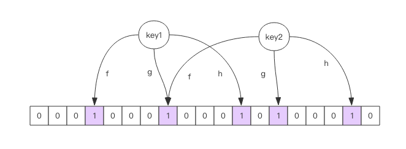

# Redis 深度历险核心原理与应用实践

## 第一篇：基础和应用篇

### 1.1 简介

+ Redis：Remote Dictionary Service 远程字典服务
+ 存储中间件
+ 优点：性能强悍、文档完整、源码简洁易懂、支持丰富客户端；
+ 用途：
    + 缓存；（与 Memcache 对比更易理解、使用和控制）
    + 分布式锁；
+ 细分应用范围：
    1. 记录帖子的点赞数、评论数、点击数、浏览数等；（hash）
    2. 记录用户帖子的列表（排序），便于快速显示用户的帖子列表；（zset）
    3. 记录帖子的标题、摘要、作者、封面等信息，用于帖子列表页的展示；（hash）
    4. 记录帖子点赞用户 ID 列表、评论 ID 列表、用于显示和去重计数；（zset）
    5. 缓存近期热帖内容（帖子内容的空间占用空间较大），减少数据库的压力；（hash）
    6. 记录帖子的相关文章 ID，根据内容推介相关帖子；（list）
    7. 若帖子的 ID 是整数递增的，可使用 Redis 来分配帖子的 ID；（计数器）
    8. 收藏集和帖子之间的关系；（zset）
    9. 记录热榜帖子 ID 列表、总热榜和分类热榜；（zset）
    10. 缓存用户历史行为，过滤恶意行为；（zset、hash）
 
### 1.2 基本数据结构

#### string 字符串

+ Redis 中所有数据结构均以**唯一的 key 字符串作名称**，通过这唯一的 key 获取对应的 value 数据；不同类型的数据结构的差异在于**value 结构的不同**；
+ 最简单的数据结构，用途十分广泛，常见于缓存用户信息；
+ 内部结构：
    + 字符数组；
    + 内容及大小可变；
    + 结构类似 Java 中的 ArrayList 集合；
    + 采用预分配冗余空间的方式来减少内存的频繁分配；
    + 实际分配空间 capacity > 实际字符串长度 len；
    + 拓展逻辑：
        + 当 len < 1MB，扩容成倍扩展；
        + 当 len > 1MB，每次仅扩 1MB；
        + 字符串的最大长度为 512MB；
+ 拓展：字符串由多个字节组成，每个字节又由 8 个 bit 组成； --> 一个字符串由很多 bit 组合 --> bitmap 位图
        
```shell script
# 键值对
> set key value #设值，成功返“OK”
> get key #取值，若成功返回该value，失败返“nil”
> exists key #判断该值是否存在，若存在返“1”，不存在返“0”
> del key #删除该值，成功返“1”，失败返“0”

# 批量键值对
> mset key1 value1 key2 value2 key3 value3 # 批量设值
> mget key1 key2 key3 #批量取值，返回一个列表

# 过期和set命令拓展
> set key value 
> expire key time #time为数字，表示多少秒后过期
> setex key time value #等价于 set + expire 
> setnx key value #若 key 不存在则设值，若存在则不作处理

# 计数
> incr key #key 自增
> incrby key number #为key的值加number
> decr key #key 自减
> decrby key number #为key的值减number
```

#### list 列表

+ 内部结构：
    + 类似 Java 中的 LinkedList，**双向链表**；
    + 插入和删除速度快；索引定位慢，需遍历；
    + 当列表弹出最后一个元素，该数据结构自动删除，内存被回收；
    + 实际上，底层不是简单的 LinkedList，而是“快速链表”的数据结构（quicklist）；
       + 元素少：使用一块连续的内存存储——ziplist（无需双向指针，节省空间）；
       + 元素较多：改用 quicklist（链表和ziplist结合，减少使用双向指针）；
+ 常用于“异步队列”；

```shell script
# 队列：先进先出（常用于消息排队和异步逻辑处理，确保元素的访问顺序）
> rpush key value1 value2 value3 #value 进队
> llen key #统计 key 队列中元素的个数
> lpop key #value 出队

# 栈：后进先出
> rpop key #value3 出队（队列与栈区别在于元素出队的顺序）

# 慢操作（索引元素需全表遍历，所以慢）
> lindex key index #显示 key 列表中第 index 个元素
> lrange key start_key end_index #显示从 start_index 到 end_index 的元素
> ltrim key start_index end_index #保留 start_index 到 end_index 的元素，区间外截断
```

#### hash 字典

+ 内部结构：
    + 类似 Java 中的 HashMap，数组+链表的无序字典；
    + 与 HashMap 的差异：
        + Redis 字典值（key）只能是字符串；
        + HashMap rehash （重新散列）需一次性全部完成；
        + Redis rehash 采用渐进式 rehash 策略；（追求高性能，不阻塞服务）
            + 同时保留新旧两个 hash 结构；
            + 查询时同时查询两个 hash 结构；
            + 后续定时任务或 hash 操作中，循序渐进将旧 hash 的内容迁移至新的 hash 结构中；
            + 完成迁移后，旧的 hash 结构自动被删除，内存被回收；
    + 与 string 字符串的差异：
        + string 字符串需要一次性全部序列化整个对象；（整体获取）
        + hash 字典可以根据每个字段单独获取，但存储消耗高于 string 结构； （可分段按需获取）
+ 常用于存储用户信息等；

```shell script
# string 设值
> set hash "key1:value1;key2:value2;key3:value3"

# hash 设值
> hset hash key1 value1
> hset hash key2 value2
> hset hash key3 value3
> hmset hash key1 value1 key2 value2 key3 value3 #批量设值，等价于上面

# 取值
> hget hash key1
> hgetall hash #entries(), key 和 value 间隔出现

# 计数（与 string 一样可对 hash 中单个子 key 进行操作）
> hlen hash #统计 hash 中有多少个元素
> hincr hash key #hash 中 key 的 value 自增
> hincrby hash key number #hash 中 key 的 value 加上 number
> hdecr hash key #hash 中 key 的 value 自减
> hdecrby hash key number #hash 中 key 的 value 减去 number
```

#### set 集合

+ 内部结构：
    + 类似 Java 中 HashSet，键值对无序且唯一；
    + 内部实现相当于一个特殊的 hash 字典，只是 hash 中所有 value 均为 NULL；
    + 当 set 集合中最后一个元素被移除后，set 结构自动删除，内存被回收；
+ 常用于去重；

```shell script
# 设值
> sadd key value1
> sadd key value2 value3 #可一次添加多个元素

> smembers key #遍历所有元素

> spop key #随机弹出一个元素

> sismember key value1 #判断某个元素是否存在

> scard key #获取当前 set 的元素的个数
```

#### zset 有序集合

+ 内部结构：
    + 类似 Java 中 SortedSet 和 HashMap 的结合体；
        + set：内部 value 唯一；
        + sort：每个 value 均赋予一个 score，代表 value 的**排序权重**；
    + 内部实现：跳跃列表；
    + 当 zset 集合中最后一个元素被移除后，结构被删除，内存被回收；
+ 常用于存储需要排序的列表，例如分数排行版等；

```shell script
# 基本操作
> zadd key socre1 value1 #往有序集合 key 中添加元素 value1
> zadd key socre2 value2
> zcard key #统计有序集和 key 中元素的个数
> zscore key value #获取指定 value 的 score 值
> zrank key value #获取指定 value 的排名
> zrem key value #移除value

#遍历
> zrange key start_index end_index #在 start_index 和 end_index 区间中正序遍历key有序集合
> zrevrange key start_index end_index #在 start_index 和 end_index 区间中逆序遍历key有序集合
> zrangebyscore key start_score end_score #根据score分值区间 (start_score, end_score) 遍历key有序集合
> zrangebyscore key -inf socre withscores #根据score分值区间 (-∞, score] 遍历key有序集合
```    

#### 基本数据结构总结
+ 基本数据结构：
    + string
    + list
    + hash
        + set
        + zset
+ 容器型数据结构：list、set、hash、zset；
+ 规则：
    + create if not exists：容器不存在则创建；
    + drop if no elements：容器中没有元素则销毁容器，释放内存；
+ 过期时间：
    + 所有数据结构均可以设置过期时间；
    + 若过期时间到了，则该对象自动被删除；
    + 若没有设置过期时间，该对象永久存在；
    + 过期时间以对象为单位；如 hash 中某个 key 设置了过期时间，若到期则整个 key 均被删除；

```shell script
# 过期时间
> set key value
> expire key 30 #对象key在30秒后过期
> ttl key #查询对象key的生存时间，-1则表示永久存在
> set key value #若已设置对象key的过期时间，重新set后过期时间会消失
```

### 1.3 分布式锁

+ 本质：“**占坑**”——设值；若该值存在则设值失败（获取锁失败），若该值为空则设值成功（成功获取锁）；
+ Redis 分布式锁实际情况：
    + 加锁：setnx xxx-lock true;（setnx：set if not exists）
    + 释放锁：del xxx-lock;
    + 弊端：若应用在执行过程中出现异常无法调用 del 语句，导致该锁一直被占用，无法释放，造成死锁；
+ 改良方案一：
    + 加锁后给该值设置一个过期时间，那么即使应用运行出现异常也能保证锁能自动释放；
    + 加锁：setnx xxx-lock true;
    + 过期时间：expire xxx-lock time;
    + 释放锁：del xxx-lock;
    + 弊端：因 setnx 和 expire 不是原子操作，难以保证 setnx 执行后 expire 能顺利执行；若 setnx 执行后因某些情况导致 expire 无法执行，那么死锁也可能会出现；
+ 改良方案二：
    + 社区方案：引入插件——分布式锁 library，但实现方式复杂；
    + Redis 2.8 后方案：新增 set 指令的扩展参数，是 setnx 和 expire 可一起执行；
    + 加锁及设置过期时间： set xxx-lock true ex time nx;
    + 语句解析：SET key value [EX seconds] [PX milliseconds] [NX|XX]
        + EX seconds：设置键的过期时间为 second 秒；
        + PX milliseconds：设置键的过期时间为 milliseconds 毫秒；
        + NX：只在键不存在时，才对键进行设置操作；
        + XX：只在键存在时，才对键进行设置操作；
        + SET 语句操作成功完成后返回 “OK”，否则 “nil”；
+ 涉及的问题：
    + 超时问题：Redis 分布式锁不适用于执行时间长的任务；
    + 锁被其他线程释放：为 value 参数设置一个随机数，释放时先比较随机数是否一致；
    + 问题延伸——比较随机数和释放锁不是原子操作：可使用 Lua 脚本保证连续多个指令的原子性执行；
    + 锁可重入性问题：
        + 可重入性：该锁支持同一个线程多次加锁；
        + 实现：需对客户端 set 方法进行包装，使用线程 ThreadLocal 变量存储当前持有锁的计数；
        + [实现Demo](./src/main/java/com/example/redis/RedisWithReentrantLock.java)

### 1.4 延时队列

+ Redis 可充当**简易版**的消息队列中间件；
+ Redis 异步消息队列常用 list 列表，rpush / lpush 操作入队，rpop / lpop 操作出队；
+ 问题一：队列为空时，客户端一直轮询陷入 pop 的死循环
    + 弊端：客户端一直轮询消耗资源，拉高 Redis 的 QPS；
    + 解决：让线程睡眠，提高客户端轮询的间隔；
+ 问题二：线程睡眠导致消息延迟增大
    + 弊端：若有多个消息，每消费一个消息均需要睡眠等待，导致不必要延迟；
    + 解决：**阻塞读**，blpop / brpop，队列没消息时休眠，一旦有数据后立即唤醒，延迟几乎为0；
+ 问题三：长时间空闲连接被自动断开
    + 弊端：若客户端长时间休眠，超过某个时间限值后，Redis 客户端连接变成闲置连接，闲置过久后服务器主动断开连接，导致再次 blpop / brpop 时抛出异常；
    + 解决：捕捉异常后**重连**；
+ 锁冲突 —— 分布式锁加锁失败处理策略：
    + 直接抛出异常，通知用户稍后处理；（直接舍弃）
    + sleep 一会，然后重试；（等待）
    + 将请求转移至消息队列，排队等待重试；（排队）
+ [延时队列的实现 Demo](./src/main/java/com/example/redis/RedisDelayingQueue.java)
    + 可使用 zset（有序集合）来实现；value - 消息，score - 消息到期处理时间；
    + 具体操作：多个线程轮询 zset 获取到期的任务；

### 1.5 位图

+ 常用于**存储较常规整齐的数据**，如一年的签到记录等；
+ 最小单位：比特 bit；大小自动扩展；设置某个偏移位置若超出现有内容范围则自动将位数组填充0；
+ 位图不是特殊的数据结构，实际上是普通的字符串，也就是**byte数组**（注意：位数组的顺序和字符的位顺序相反）；
+ 可直接使用 get/set 获取整个位图内容（**整存整取**）；也可以使用 getbit/setbit 将 byte 数组当成“位数组”处理（**零存零取**）；
+ 统计与查找：
    + 统计指令：bitcount [start] [end]：统计指定范围内 1 的个数；
    + 查找指令：bitpos key [0/1] [start] [end]：查询指定范围内出现第一个 0 或 1 的位置；
    + 注意：start 和 end 是字节索引，以 8 的倍数出现；
+ 魔术指令：bitfield
    + Redis 3.2 后新增指令，可一次操作多个位（之前需使用管道），但最多 64 个连续位（超过 64 个连续位需使用多个子指令）；
    + bitfield 一次执行多个子指令；
    + 三个子指令：
        + get
        + set
        + incrby：对指定范围的位进行自增操作；可能出现溢出；
            + Redis 默认处理溢出的方法：折返（出现溢出，溢出部分丢弃）；
            + 溢出策略子指令：overflow
                + wrap 折返（默认）：出现溢出，溢出部分丢弃；
                + fail 失败：报错不执行；
                + sat 截断：超过范围就停留在最大或最少值；

```shell script
# 统计
> bitcount key #全部字符中 1 的位数
> bitcount key 0 0 #第一个字符中 1 的位数
> bitcount key 0 1 #前两个字符中 1 的位数

# 索引
> bitpos key 0 #第一个 0 位
> bitpos key 1 #第一个 1 位
> bitpos key 1 1 1 #从第二个字符算起，第一个 1 位
> bitpos key 1 2 2 #从第三个字符算起，第一个 1 位

# bitfield 魔术指令
> bitfield key get u4 0 #从第一个位开始取 4 个位，结果是无符号数（u）
> bitfield key get u3 2 #从第三个位开始取 3 个位，结果是无符号数（u）
> bitfield key get i4 0 #从第一个位开始取 4 个位，结果是有符号数（i）
> bitfield key get u4 0 get u3 2 get i4 0 #等价上三条语句

> bitfield key set u8 8 97 #从第 9 个位开始，将接下来 8 个位用无符号数 97 替换

> bitfield key incrby u4 2 1 #从第三个位开始，对接下来的 4 位无符号数 + 1
> bitfield key overflow sat incrby u4 2 1
> bitfield key overflow fail incrby u4 2 1
```

### 1.6 HyperLogLog

+ 使用场景：
    + 统计 PV （网站访问量）：Redis 计数器，key 为网站地址 + 时间后缀，value 为访问次数；每次点击累加一次；
    + 精准统计 UV （独立访客）：set 去重集合，将用户唯一标识放入集合，再统计集合元素的个数；不适用于访问量非常大的页面（浪费存储空间）；
    + 大致统计 UV：HyperLogLog；
+ Redis 高级数据结构；提供不精确的去重计数方案，标准误差 0.81%；
+ 基本操作：
    + pfadd：增加计数
    + pfcount：获取计数
    + pfmerge：将多个 pf 计数值累加形成新的 pf 值；
+ 实现原理：todo

### 1.7 布隆过滤器

+ Redis 高级数据结构；Redis 4.0 后以插件的形式提供；存在误判概率，有参数可设置；
+ 特点：判断某元素是否存在于集合时，若判定存在，则可能存在；若判定不存在，则一定不存在；（误差：将不存在误判成存在）
+ 与 HyperLogLog 的区别：HyperLogLog 只有累加统计，不能判断元素是否存在；布隆过滤器整好相反；
+ 使用例子：新闻客户端向用户推介其未阅读的文章；
    + 服务器记录用户所有历史记录，推介时将从中筛选；（当用户量大，每个用户的阅读记录多，系统性能跟不上；）
    + 将历史数据存储在关系数据库中；（频繁的 exists 查询，当系统并发量高时，数据库难以抵御压力）
    + 将历史数据存储至缓存中；（存储空间随时间线性增长，浪费大量存储空间）
    + 使用布隆过滤器判断；（**专门解决**此类问题，去重虽存在误判，但可节省大量存储空间）
+ Docker 镜像：redislabs/rebloom
+ Java 客户端支持的 Jar 包：RedisLabs 提供的 JReBloom（基于 Redis 3.0 以上）、letture；
+ 基本操作：
    + bf.add [key] [value]：添加元素；
    + bf.exists [key] [value]：查询元素是否存在；
    + bf.madd [key] [value1] [value2] ……：可批量添加元素；
    + bf.mexists [key] [value1] [value2] ……:可批量查询元素是否存在；
+ 自定义参数：需在 bf.add 命令执行前使用 bf.reserve 指令显式创建；（不创建则使用默认配置；若 key 存在则报错）
    + bf.reserve 三个参数：
        + key
        + error_rate：错误率；数值越小所需的存储空间越大；默认：0.01；
        + initial_size：预计放入元素的数量；当**小于**实际放入元素数量时，错误率上升；默认100；
    + 注意事项：
        + 使用前需精确估算元素的数量，initial_size 数值不宜过小也不宜过大（过小错误率上升，过大浪费空间）；
        + 在不需要十分精确的场景下可将 error_rate 调高；
+ 布隆过滤器原理：（类似 Java 中 HashMap 的原理）
    + 内部组成：一个大型的位数组 + 几个不一样的**无偏 hash 函数**（可将元素的 hash 算得比较均匀，让元素随机被 hash 映射到位数组中）；
    + 首先，添加元素时，让多个 hash 函数对 value 进行 hash 运算得到多个整数索引值；
    + 然后，将多个整数索引值与位数组长度取模，得到数组下标，并将其置1；
    + 最后，比较 value 是否存在，同样先 hash 运算再取模，得到的数组下标在与位数组的比较，若不全为 1 说明不存在；
    + 所以：当实际元素数量 > 初始值，需尽快重建位数组；（新建再迁移旧数据） 
    


Redis 布隆过滤器原理图（其中 f、g、h 表示无偏 hash 函数）

+ 空间占用估计：
    + 预计放入元素的数量 n，错误率 f，hash 函数最佳数量 k
    + k = 0.7 / (l / n)
    + f = 0.6185 ^ (1 / n)
    + 推导过程：略；
    + 计算器：[https://krisives.github.io/bloom-calculator/](https://krisives.github.io/bloom-calculator/)
+ 使用场景：
    + 爬虫系统对 URL 的去重；
    + NoSQL 数据库的使用，可降低数据库 IO 请求数量；
    + 邮件系统中过滤垃圾邮件；

### 1.8 简单限流

+ 限流：“断尾求生”、“弃卒保车”；
    + 控制流量：在分布式领域中，若系统处理能力有限，阻止计划外计划外的请求继续对系统施压；
    + 控制用户行为，避免垃圾请求；（如某个行为在规定时间内被允许的次数）
+ Redis 实现简单限流策略：
    + 常见简单限流策略：系统限定用户某个行为在指定时间内只能允许发生 N 次；
    + Redis 解决方案：
        + 限流需求中存在一个滑动时间窗口（定宽）；
        + 数据结构：zset 有序集合；
            + key：行为
            + value：无意义，需唯一（区分）
            + score：记录时间窗口
        + [实现 Demo](./src/main/java/com/example/redis/SimpleRateLimiter.java)
        + 缺点：因需记录窗口内所有的行为记录，若量很大，则会消耗大量存储空间；（如 60s 内操作不得超过 100 万次）

### [1.9 漏斗限流]()

### [1.10 GeoHash]()

### [1.11 scan]()

### [1.12 相关命令指南]()

## [第二篇：原理篇]()

## [第三篇：集群篇]()

## [第四篇：拓展篇]()

## [第五篇：源码篇]()