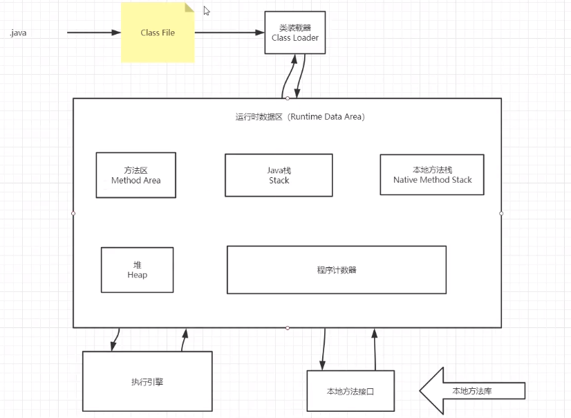
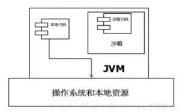
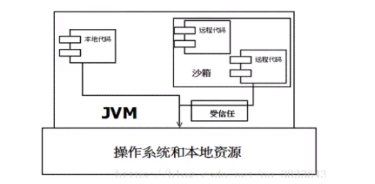
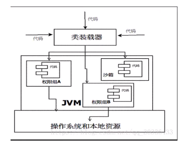
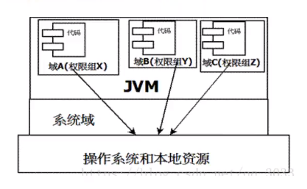

# JVM 探究

2021/05/14

原文链接：[【狂神说Java】JVM快速入门篇](https://www.bilibili.com/video/BV1iJ411d7jS)

## 常见面试题：

+ JVM 的理解（java -> class -> jvm 运行）； JVM 8 虚拟机的变化；
+ OOM —— 内存溢出，StackOverflowError —— 栈溢出？怎么分析？
+ JVM 常用调优参数；
+ 内存快照如何抓取？如何分析 Dump 文件？
+ JVM 中类加载器；

1. JVM 位置

软件，操作系统之上；

java -> class -> 类装载器 ClassLoader -> JVM 

2. JVM 体系结构

3. 类加载器

加载、链接、初始化

+ 作用：加载 Class文件（new 创建一个对象，引用在 Java 栈 Stack 中，数据内容在堆 heap 中），并初始化对象；
+ 类型：
  + 虚拟机自带加载器
  + 启动类（根）加载器
  + 扩展类加载器
  + 应用程序加载器
+ 类加载步骤：
  1. 类加载器收到类加载器的请求；
  2. 将请求向上委托给父类加载器去执行，一直向上委托，直到启动类加载器；
  3. 启动类加载器检查是否能够加载当前类，若能加载便结束寻找，使用当前加载器；否则，通知子加载器进行加载；
  4. 重复步骤 3，直至应用程序加载器；若依旧无法加载，则抛出空异常说明该类不存在；

4. 双亲委派机制

为保证安全，运行一个类时，由最顶层加载器加载（若存在），不存在则委托给下一级加载器加载，直至加载成功或寻找不到该类；

5. 沙箱安全机制

+ 沙箱：限制程序运算的环境；主要限制对系统资源的访问，如 CPU、内存、文件系统、网络等；
+ Java 沙箱机制：将 Java 代码限定在 JVM 特定运行范围，且严格控制代码对本地系统资源访问；
  + 保证对代码有效隔离，防止对本地系统造成破坏；
  + Java 程序的运行都可以指定沙箱，可以定制安全策略；
+ Java 代码：本地代码和远程代码；本地代码默认视为可信任，可访问一切本地资源，而远程代码视为不受信任的；
+ JDK 1.0 时，严格限制远程代码对本地系统资源的访问，对程序扩展带来障碍；

+ JDK 1.1，改进安全机制，增加**安全策略**，允许用户指定代码对本地资源的访问权限；

+ JDK 1.2，再次改进安全机制，增加**代码签名**；无论本地代码或者是远程代码，都会按照用户的安全策略，由类加载器加载到虚拟机中不同权限的运行空间，来实现差异化代码执行权限控制；
  + 代码签名：由 Java 生成一个认证文件；

+ JDK 1.6，引入**域**；
  + JVM 将所有代码加载到不同的系统域和应用域；
    + 系统域：负责与关键资源进行交互；
    + 应用域：通过系统域的代理对各种需要的资源进行访问；
  + JVM 中不同的受保护域对应不一样的权限；
  + 存在于该域的类具有当前域的所有权限；
  

+ 沙箱的基本组件：
  + 字节码校验器 bytecode-verifier：确保遵循 Java 语言规范；判断对象在使用前有没有初始化，程序中有没有违背私有数据、方法调用规则等；
  + 类装载器 classLoader：
    + 防止被恶意代码修改；（双亲委派机制）
    + 守护被信任类库边界；
    + 将代码归入保护域，确定代码可进行的操作；
    + JVM 为不同的 classLoader 载入的类提供不同的命名空间，命名空间由一系列唯一的名称组成，由 JVM 维护；
  + 存取控制器 access controller：控制核心 API 对操作系统的存取权限；由控制策略设定，可由用户指定；
  + 安全管理器 security manager：核心 API 和操作系统之间的主要接口；实现权限控制，比存取控制器优先级高；
  + 安全软件包 security package：java.security 下的类和扩展包下的类，允许用户自定义安全特性；
    + 可自定义的安全特性：
      + 安全提供者
      + 消息摘要
      + 数字签名
      + 加密
      + 鉴别

6. Native

+ native：关键字，Java 作用范围达不到，需去调用底层 C 语言的库；执行该方法时需要调用本地方法接口 —— JNI（Java Native Interface）；
+ JNI 作用：扩展 Java 类的使用，融合不同的编程语言；
+ 本地方法栈：登记 native 方法；

7. PC 寄存器

程序计数器 Program Counter Register

每个线程都有一个程序计数器，线程私有的，是一个指针指向方法区中的方法字节码（存储指向即将要执行的指令代码）；

8. 方法区 Method Area

+ 共享区域，所有线程共享，存储所有字段（静态变量、常量、运行时常量池）、方法字节码、一些特殊方法（如构造函数等）、接口定义等；

（字符串的常量池、实例变量存储在堆内存中）

9. 栈

+ 栈：先进后出
+ 队列：先进先出（FIFO）；
+ 程序运行先执行 main() 函数，将 main() 函数压进栈；
+ 栈：栈内存，主管程序的运行，生命周期、线程同步等；不存在垃圾回收问题；
+ 栈的内容：八大基本类型、对象引用（地址）、实例的方法；

10. 三种 JVM

+ Sun 公司 —— HotSpot
+ BEA 公司 —— JRockit
+ IBM 公司 —— J9VM

11. 堆

+ 一个 JVM 只有一个 Heap 堆内存，其大小可以调节；
+ 堆存放的内容：实例的类、方法、常量、变量等；
+ 细分三个区域：
  + 新生区：（伊甸园区）young/new
      + Eden
      + From Survivor
      + To Survivor
  + 老年区：oldGen
  + 永久区(1.8 移除，移到方法区中 —— Metaspace 元空间)

12. 新生区、老年区
    
13. 永久区

14. 堆内存调优

15. GC 垃圾回收器
    + 常用算法
    
16. JMM

17. 总结