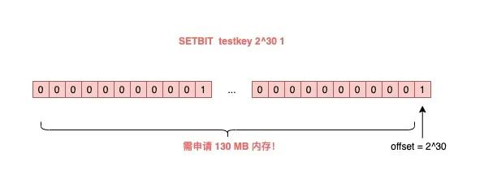

# 颠覆认知——Redis会遇到的15个「坑」，你踩过几个？

2021/04/12

原文链接：[颠覆认知——Redis会遇到的15个「坑」，你踩过几个？](https://mp.weixin.qq.com/s/CHtZI9k2qQ_YJb5Mwzrukw)

## 常见命令的坑

### 过期时间意外丢失

原因：key 重新设值而没有再加上过期时间；

### DEL 也会阻塞 Redis

+ DEL 一个 key 的耗时，与这个 key 的类型有关：
    + key 为 String 类型，DEL 时间复杂度为 O(1)；（若单个对象存储大量数据，那么也有可能）
    + key 为 List/Hash/Set/ZSet 类型，DEL 时间复杂度为 O(M)，M 为该 key 元素的数量；（数量越多越耗时）
+ DEL List/Hash/Set/ZSet 正确的处理方式：
    1. 查询元素数量：LLEN/HLEN/SCARD/ZCARD；
    2. 判断元素数量：若元素数量少可直接 DEL；否则可以分批删除；
    3. 分批删除：LRANGE/HSCAN/SSCAN/ZSCAN + LPOP(RPOP)/HDEL/SREM/ZREM；
    
### RANDOMKEY 也会阻塞 Redis

+ RANDOMKEY 随机查看一个 key；
+ Redis 的过期策略：
    + 定时清理
    + 懒惰清理：RANDOMKEY 随机获取一个 key，先判断是否过期，若已过期则删除清理（继续循环，直至找到一个未过时的 key）；
+ 总结：
    1. 若有大量的 key 已经过期但未清理，执行 RANDOMKEY 有可能触发 Redis 的懒惰清理机制还有寻找未过期的 key，导致需要等待较长时间；
    2. 因为 Slave 从节点不会清理过期的 key，导致有可能存在大量的已过期的 key；（Redis 5.0 后新增最大查找几次，以免陷入死循环）
    
### SETBIT 可能导致内存溢出 OOM

+ 位图，底层为 byte 数组，大小可自动扩容；
+ 坑位：若设置的偏移量很大，即使存储很小的内容也占用很大的内存空间；（例如大容量 key 的弊端）

bitmap 中设置偏移量 offset 较大的后果

### 执行 MONITOR 导致内存溢出 OOM

+ MONITOR：将指令写到客户端的“输出缓冲区”中，客户端从缓冲区中读取服务器返回的结果；
+ 若 QPS 很高，会导致输出缓冲区内存持续增长，占用 Redis 大量内存；

## 数据持久化的坑

### master 宕机，slave 数据也丢失

+ 发生数据丢失的部署方式：
    + master - slave + sentinel 哨兵部署实例；
    + master 没有开启数据持久化功能；
    + Redis 进程使用 supervisor 管理，并配置为“进程宕机，自动重启”；
+ 数据丢失过程：
    1. master 宕机，哨兵未发起切换，此时 master 进程立即被 supervisor 自动拉起；
    2. master 没有开启数据持久化功能，导致启动了一个“空实例”；
    3. slave 为了与 master 保持一致，同步了 master 的内容（清空所有数据）；
+ 如何避免：
    + Redis 实例不使用进程管理工具自动拉起；
    + master 宕机应由 sentinel 哨兵发起切换，将 slave 提升为 master；
    + 切换完成后，原 master 重启，退化成 slave；
    
### AOF everysec 阻塞主线程

+ AOF 刷盘策略：everysec，每秒刷一次；在后台线程中执行；
+ 阻塞线程的大致步骤：    
    1. 执行刷盘操作时，若磁盘 IO 负载过高，那么调用 fsync 就会被阻塞；
    2. Redis 主线程若接收写请求，先判断上次刷盘是否已完成；
    3. 若未完成则判断距离上次完成刷盘的时间是否在 2 秒内；
    4. 若在 2 秒内则不写 AOF page cache，否则强制写；
    5. 此时因磁盘 IO 负载过高，fsync 发生阻塞，主线程写 AOF page cache 时也阻塞等待；
+ 问题本身：磁盘 IO 负载过高导致刷盘操作阻塞等待；

### AOF everysec 不止丢失 1 秒数据

+ 在磁盘 IO 负载过高时，导致刷盘阻塞，而主线程又有新的写指令，需要写 AOF page cache，但此时与上次成功刷盘不超过 2 秒就不写；（意味着主线程最多等待 2 秒不写）若此时宕机则丢失 2 秒数据；
+ 等待 2 秒的目的：
    + 降低主线程被阻塞的风险；
    + 若刷盘阻塞，主线程让出 1 秒时间，等待刷盘成功；
    
### RDB 和 AOF rewrite 时，Redis 会发生内存溢出 OOM

+ 出现内存溢出大致步骤：
    1. 实例重启或者同步时重写，重写会 fork 创建新线程去处理（父线程处理指令，子线程处理重写），此时父子线程共享内存数据；
    2. 若此时有需要修改的 key，父线程先拷贝该 key 存在的页，然后在新的页上处理；（写时复制机制 Copy on write）
    3. 若该 Redis 实例的特点是“写多读少”的，而且 QPS 非常高，那么在重写过程中会存在大量拷贝内存的操作；若资源不足则 OOM；（有点勉强，毕竟最多申请两倍内存）
    
## 主从复制的坑

### 主从复制也会丢失数据

若主节点宕机，而又有部分数据未同步到从节点；若当缓存使用，对业务没有什么影响；若当 NoSQL 数据库使用或者是分布式锁，则导致数据的丢失；

### 同一指令查询 key，主从节点各返回不同结果

+ 若一个 key 已过期，但还未被主节点清除，在从节点上查询可能正常返回该 key 的值或者返回 NULL；
+ 归结于：
    + Redis 版本：Redis 3.2 以下版本，只要 key 未被主节点清除，那么在从节点上依旧可以查询到该 key 的值；若在主节点上查询则会被清除然后返回 NULL；
    + 具体执行的指令：Redis 4.0.11 以下版本，在从节点上，exists 指令把已过期的 key 当作依然存在；
    + 机器时钟：Redis 判断一个 key 是否过期比较的是机器时钟；
    
### 主从切换导致雪崩

若主从节点机器时钟不一致，从节点的比较快，那么在从节点中存在许多已经过期的 key；若此时发生主从切换，那么从节点成为主节点后，开始大量清除过期的 key，导致主线程阻塞和引发缓存雪崩；

### 主从节点大量数据不一致

+ Redis 中 maxmemory：控制整个 Redis 实例内存使用的上限，超过这上限并且配置了淘汰策略，那么实例开始淘汰数据；
+ 若主从节点配置的 maxmemory 不一样，那么可能会导致数据不一致；
+ 调整 maxmemory 大小需注意调整顺序：
    + 调大时，先调整从节点，再调整主节点；
    + 调小时，先调整主节点，再调整从节点；
+ 问题解决：Redis 5.0 以后新增配置项：“replica-ignore-maxmemory”，默认为 yes，表示尽管从节点的内存超过了 maxmemory 也不会淘汰数据；

### 从节点内存泄漏问题

若在 Redis 4.0 以下的版本，从节点配置了从库可写，往从库中写入带有过期时间的 key；即使时间过期，从节点也不会清除该 key，一直消耗内存直至手动清除；查询已过期的 key 会返回 null；
（问题出现比较勉强，写法不符合规范，从节点应同步主节点的操作，主要修改操作应在主节点进行）

### 主从节点全量同步一直失败

+ “复制风暴”：主从全量同步失败又重新开始同步，之后又同步失败，以此反复，恶性循环，持续浪费机器资源；
+ 原因导致：
    + 主节点的实例数据过大，从节点加载快照时耗时过长；
    + 从节点的复制缓冲区（client-output-buffer-limit）配置过小；
    + 主节点写请求很大；