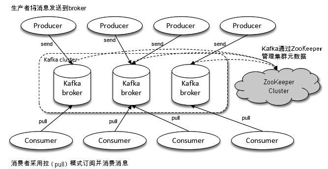
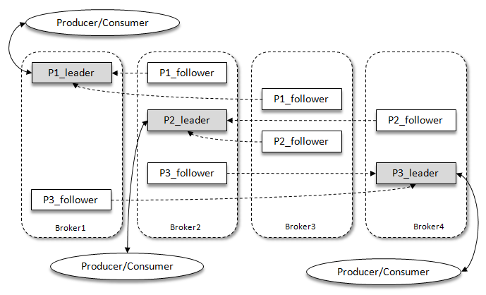
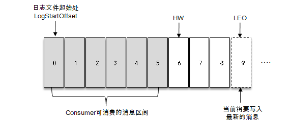
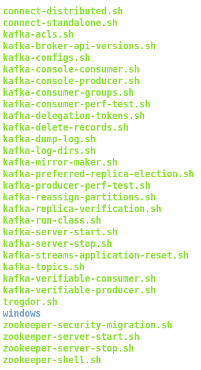

# 深入理解 Kafka 核心设计与实践原理

## 基础篇
### 1.认识 Kafka
+  Kafka 由 LinkedIn 采用 Scala 开发的一个多分区、多副本且基于 ZooKeeper 协调的分布式消息系统；
+  Kafka 分布式流式处理平台；以高存吐、可持久性、可水平拓展、支持流数据处理等多种特性；
+  Kafka 三大角色：
    +  消息系统：具备系统解耦、冗余存储、流量削峰、缓冲、异步通信、拓展性、可恢复性等功能；还提供消息顺序性保障及回溯消费的功能；
    +  存储系统：持久化到磁盘，相对比其他基于内存存储的系统而言，有效降低数据丢失的风险；可把 Kafka 作长期数据存储系统使用，只需把对应的数据保留策略设置为“永久”或启用主题的日志压缩功能；
    +  流式处理平台：不仅为每个流行的流式处理框架提供可靠的数据来源，还提供了一个完整的流式处理类库；
    
#### 1.1  基本概念
+  一个典型的 Kafka 体系架构包括若干 Producer 、 若干 Broker 、 若干 Consumer 以及一个 ZooKeeper 集群；
    +  ZooKeeper ： 是 Kafka 用来负责集群元数据的管理、控制器的选举等操作；
    +  Producer ： 将消息发送给 Broker；
    +  Broker ： 负责将接收到的消息存储到磁盘中；
    +  Consumer ： 负责从 Broker 订阅并消费信息；
    


Kafka 体系结构

+  Kafka 术语：
    +  Producer ： 生产者，发送消息的一方；负责创建消息，然后将其投到 Kafka 中；
    +  Consumer ： 消费者，接收消息的一方；连接到 Kafka 上并接收消息，进而进行相应的业务逻辑处理；
    +  Broker ： 服务代理节点；可简单看作一个独立的 Kafka 服务节点 或 Kafka 服务实例；
    
    +  Topic ： 主题
        +  消息以主题为单位进行归类；
        +  生产者负责将消息发送到特定的主题（发送到 Kafka 的每条消息均需指定一个主题）；
        +  消费者负责订阅主题并进行消费；
        +  逻辑概念，可细分多个分区；
    +  Partition ： 分区（也称“主题分区”）
        +  一个分区只属于单个主题；
        +  分区在存储层面可做一个可追加的日志文件（Log）；
            +  会分配一个特定的偏移量 offset ;
            +  offset 是消息分区中唯一标识；用于保存消息在分区内的顺序性；
            +  offset 仅在分区内有效； -> Kafka 保证分区有序而不是主题有序；
            
+  消息处理逻辑：
    +  消息发送 broker 之前， 会根据分区规则选择存储到哪个具体的分区；
    +  若一个主题对应一个文件，那么这文件所在机器 I/O 将会成为这主题性能的瓶颈；
        +  分区解决这问题：创建主题时可设置分区的个数，创建后也可修改分区的数量，通过修改分区的数量可实现水平拓展；
    +  分区多副本（Replica）机制：
        +  意义： 通过增加副本数量**提升容灾能力**；
        +  同一分区不同副本中保存的是相同的消息（同一时刻，副本之间并非完一样），副本之间关系是**一主多从**；
            +  leader 副本： 负责处理读写请求；
            +  follower 副本： 只负责与 leader 副本的消息同步；
        +  副本处于不同的 broker 中，若 leader 副本出现故障时，从 follower 副本中重新选举新的 leader 副本 对外界提供服务； ——> 实现故障自动转移，当 Kafka 集群中某个 broker 失效时任可保证服务可用； 
        +  leader 副本负责维护和跟踪 ISR 集合中所有 follower 副本的滞后状态；
            +  若 follower 副本落后太多时，会被 leader 副本从 ISR 集合中剔除；
            +  若 OSR 集合中有副本“追上” leader 副本，那么 leader 副本会将它从 OSR 集合中移植 ISR 集合中；
            +  默认情况下，若 leader 副本发生故障时，只在 ISR 集合中选举新的 leader 副本；（可在参数修改这一原则）
        +  简称：
            +  AR(Assigned Replicas)： 分区中所有副本统称；
            +  ISR(In-Sync Replicas)： 所有与 leader 副本保持一定程度同步的副本（包括 leader 副本在内）；（ISR 集合是 AR 集合中的一个子集）（与 HW 和 LEO 有紧密的关系）
            +  OSR(Out-of-Sync Replicas)： 与 leader 副本同步滞后过多的副本（不包括 leader 副本）；
            +  AR = ISR + OSR
            +  正常情况下：所有 follower 副本均应该与 leader 副本保持一定程度的同步；——> AR = ISR，OSR 为空
            +  HW(High Watermark)： 高水位，标识一个特定的消息偏移量（offset），消费者只能拉取到这个 offset 之前的消息;
            +  LEO(Log End Offset)： 标识当前日志文件中下一条待写入消息的 offset；
            
    +  Kafka 消费端的容灾能力：Consumer 使用拉（pull）模式用服务器拉取消息，并且保存消费的具体位置；若消费者宕机后恢复上线时可根据之前保存的消费位置重新拉取需要的消息进行消费；


Kafka 多副本架构
    
+  Kafka 多副本架构说明（例子）
    +  Kafka 集群中有4个 broker， 某个主题有3个分区，且副本因子（副本个数）为3个；
    +  每个分区有1个 leader 副本和 2个 follower 副本；
    +  生产者和消费者只与 leader 副本进行交互， 而follower 副本只负责消息的同步；（很多情况下，follower 副本中的消息相对 leader 副本有一定程度的滞后）
        +  滞后范围可通过参数进行配置；
        


分区中各种偏移量的说明

+  分区中各种偏移量的说明
    +  上图所示表示一个日志文件，共有9条消息；第一条消息的 offset 为0，最后一条消息的 offset 为8；
    +  offset 为9的消息用虚线表示，代表下一条待写入的消息；
    +  日志文件的HW：6，表示消费者只能拉取到 offset 在0-5之间的消息，其余的对消费者不可见；
    +  LEO：下一条待写入消息的 offset，其大小相当于当前日志分区中最后一条消息的 offset 值加1；
    +  分区 ISR 集合中的每个副本都会维护自身的 LEO，而 ISR 集合中最小的 LEO 即为分区的 HW；（对消费者而言只能消费 HW 之前的消息）
    
+  Kafka 复制机制：
    +  既不完全的同步复制，也不单纯的异步复制；
    +  同步复制：要求所有能工作的 follower 副本都复制完， 这条信息才会被确认为已成功提交；
    +  异步复制：follower 副本异步地从 leader 副本中复制数据，数据只要被 leader 副本写入就认为已经成功提交；（若 follower 副本没完全复制完而落后于 leader 副本，突然 leader 副本宕机，则会造成数据丢失）
    +  Kafka 使用 ISR 方式则有效地权衡了数据可靠性和性能之间的关系；
    
#### 1.2 安装与配置

[kafka安装与配置](./kafka-install.md)

#### 1.3 生产与消费

+  生产者将消息发送至 Kafka 的主题的分区中，而消费者也通过订阅主题从而消费信息；
+  演示前需要创建一个主题作为消息的载体；
+  在 $KAFKA_HOME/bin 目录下，kafka 提供许多实用脚本工具；
    +  kafka-topics.sh ： 与主题有关；
    +  kafka-console-producer.sh : 与发送消息有关；
    +  kafka-console-consumer.sh : 与消费消息有关；

```
// 创建一个分区数为4，副本因子为3的主题 topic-demo
bin/kafka-topics.sh --zookeeper localhost:2181/kafka --create --topic topic-demo --replication-factor 3 --partitions 4

// --zookeeper: Kafka 所连接的 ZooKeeper 服务地址
// --topic : 创建主题的名称
// --replication-factor : 副本因子
// --partitions : 分区个数
// --create ： 创建主题的动作指令

// 通过 --describe 展示主题的更多具体信息
bin/kafka-topics.sh --zookeeper localhost:2181/kafka --describe --topic topic-demo

// 通过 kafka-console-consumer.sh 脚本来订阅主题 topic-demo
bin/kafka-console-consumer.sh --bootstrap-server localhost:9092 --topic topic-demo

// --bootstrap-server : 连接 Kafka 集群地址
// --topic : 指定了消费者订阅的主题

// 通过 kafka-console-producer.sh 脚本来发送消息 topic-demo
bin/kafka-console-producer.sh --broker-list localhost:9092 --topic topic-demo
// --broker-list : 连接 Kafka 集群地址
// --topic ： 发送消息的主题
```



kafka 的实用脚本工具

[kafka-producer-demo](./src/main/java/kafkaQuickStart/ProducerFastStart.java)
[kafka-consumer-demo](./src/main/java/kafkaQuickStart/ConsumerFastStart.java)

### 2.生产者

### 3.消费者

### 4. 主题与分区

##  原理篇
### 5.日志存储

### 6.深入服务器

### 7.深入客户端

### 8.可靠性研究

##  拓展篇
### 9. Kafka应用

### 10. Kafka监控

### 11.高级应用

### 12. Kafka 与 Spark 的集成