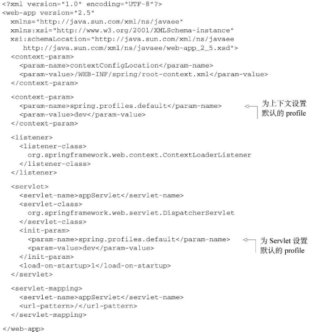

#  Spring 实战（第四版）

## 第一部分：Spring 框架的核心知识
+  Spring 核心： 依赖注入（DI）和面向切面编程（AOP）；
+  Spring **容器**（Spring框架核心）负责创建、装配对象，配置并管理对象的整个生命周期；
    +  类型：
        +  bean 工厂：由 org.springframework.beans.factory.BeanFactory 接口定义；提供基本的 DI 支持；
        +  ApplicationContext 应用上下文：由 org.springframework.context.ApplicationContext 接口定义；基于 BeanFactory 构建，并提供应用框架级别的服务；
            +  多种应用上下文类型：
                +  AnnotationConfigApplicationContext：从一个或多个基于 Java 的配置类中加载 Spring 应用上下文；
                +  AnnotationConfigWebApplicationContext：从一个或多个基于 Java 的配置类中加载 Spring Web 应用上下文；
                +  ClassPathXmlApplicationContext：从**类路径**下的一个或多个 XML 配置文件中加载上下文定义，把应用上下文的定义文件作为类资源；
                +  FileSystemXmlApplicationContext：从**文件系统**下的一个或多个 XML 配置文件中加载上下文定义；
                +  XmlWebApplicationContext：从 Web 应用下的一个或多个 XML 配置文件中加载上下文定义；
    +  生命周期：
        +  传统的生命周期：init()、service()、destroy()；
        +  Spring 容器的生命周期：
            1. 实例化
            2. 填充属性
            3. 调用 BeanNameAware 的 setBeanName() 方法
            4. 调用 BeanFactoryAware 的 setBeanFactory() 方法
            5. 调用 ApplicationContextAware 的 setApplicationContext() 方法
            6. 调用 BeanPostProcessor 的预初始化方法
            7. 调用 InitializingBean 的 afterPropertiesSet() 方法
            8. 调用自定义的初始化方法
            9. 调用 BeanPostProcessor 的初始化后方法
            10. bean 可以使用
            11. 调用 DisposableBean 的 destroy() 方法
            12. 调动自定义的销毁方法


+  bean 的生命周期说明
1.  Spring 对 bean 进行实例化；
2.  Spring 将值和 bean 引用注入到 bean 对应的属性中；
3.  若 bean 实现了 BeanNameAware 接口， Spring 将 bean 的 ID 传递给 setBeanName() 方法；
4.  若 bean 实现了 BeanFactoryAware 接口， Spring 将调用 setBeanFactory() 方法， 将 BeanFactory 容器实例传入；
5.  若 bean 实现了 ApplicationContextAware 接口，Spring 调用 setApplicationContext() 方法将 bean 所在的应用上下文的引入传入进来；
6.  若 bean 实现了 BeanPostProcessor 接口， Spring 调用 postProcessBeforeInitialization() 方法；
7.  若 bean 实现了 InitializingBean 接口， Spring 调用 afterPropertiesSet() 方法；（若 bean 使用了 init-method 声明了初始化方法，那么该方法也被调用）
8.  若 bean 实现了 BeanPostProcessor 接口， Spring 调用 postProcessAfterInitialization() 方法；
9.  此时 bean 已准备就绪，可被使用，将一直驻留在应用上下文中，直至该应用上下文被销毁；
10. 若 bean 实现了 DisposableBean 接口， Spring 调用 destroy() 接口方法；（若 bean 使用了 destroy-method 声明销毁方法，那么该方法也被调用）


+  Spring 体系结构
    +  Spring 核心容器：Spring 最核心部分，管理 Spring 应用中 bean 的创建、配置和管理；
    +  AOP 模块：Spring 开发切面的基础，对面向切面编程提供丰富支持；
    +  数据访问和集成：
        +  JDBC
        +  ORM：Object-Relational Mapping
        +  JMS：在 Java Message Service 之上构建的 Spring 抽象层，会使用消息以异步的方式与其他应用集成；
    +  Web 与远程调用
        +  MVC：model-view-controller
    +  Instrumentation （使用场景有限）
        +  为 JVM 添加代理
    +  测试 

### 2.装配 Bean
+  **自动化装配 bean** （隐式装配）
    +  两个角度来实现 ——> 较少显示配置
        +  组件扫描（component scanning）：Spring 会自动发现应用上下文中所创建的 bean；
            +  注解开启：@ComponentScan
            +  XML 配置开启：Spring context 命名空间的 <context:component-scan base-package="*">
        +  自动装配（autowiring）：Spring 自动满足 bean 之间的依赖；
    +  注解：
        +  @ComponentScan：启动组件扫描（默认不启用）
            +  默认会扫描与配置类相同的包；
            +  指定基础包：@ComponentScan("package") 或 @ComponentScan(basePackages="package")
            +  若多个基础包：@ComponentScan(basePackages = {"package1", "package2"})
                +  基础包 String 类型 ——> 类型不安全
                +  基础包指定所包含的类或接口：@ComponentScan(basePckageClasses = {AClass.class, BClass.class})
        +  @Component：创建 bean
            +  默认ID：类名（第一个字母变小写）；
            +  指定：@Component("name");
            +  使用 Java 依赖注入范式中 @Named 注解来设置；（Spring 支持将 @Named 作 @Component 的替代）
        +  @Autowired: 自动装配
            +  成员变量
            +  构造函数
            +  成员变量的 set 函数
            +  其他方法
            +  @Autowired(required = false)：Spring 会尝试执行自动装配，若没有匹配，则这个 bean 处于未装配的状态；
            +  @Inject : 源于Java 依赖注入规范，可替换@Autowired；
+  **通过 Java 代码装配 bean** （显式装配）
    +  @Configuration：表明这类是一个配置类；
    +  @Bean：使用方法创建实例，方法添加 @Bean 注解，该实例对象要注册为 Spring 应用上下文中的 bean；
        +  默认情况下，bean 的 ID 与 带 @Bean 注解的方法名一样；
        +  可指定 bean 的 ID：@Bean(name = "bean")
+  **通过 XML 装配 bean** （显示装配）
    +  借助 Spring Tool Suite 创建 XML 配置文件：[URL](https://spring.io/tools/sts)
    +  bean 的声明：<bean class="package.Demo" />（类似 @Bean）
        +  默认 ID ： 会根据全限定类名来命名；（例：package.Demo#0）
        +  可指定ID ： <bean id="demo" class="package.Demo" />
        +  Spring 会调用 Demo 的默认构造器来创建 bean；
    +  借助构造器注入初始化 bean 
        +  **强依赖**使用构造器注入；
        +  <constructor-arg ref="" /> 或 <constructor-arg value="" /> 元素
        +  使用 Spring 3.0 所引入的 c-命名空间
            +  需在 XML 顶部声明其模式： xmlns:c="http://www.springframework.org/schema/c"
            +  <bean id="" class="" c:name-ref="" />
                +  c:cd-ref=""
                    +  c : 命名空间前缀
                    +  name : 构造器参数名（可直接用参数列表的位置信息：“_0”，若只有一个参数：“_”）
                    +  -ref : 注入 bean 应用
                    +  "" : 要注入 bean 的 ID
            +  <bean id="" class="" c:_value="" />
                +  c:_value : 为成员变量 value 赋值
                +  c:_0 : 可使用位置信息替换参数名
                +  c:_ : 若仅有一个参数可省略
        +  若构造器参数为集合时：(c-命名空间无法实现)
            +  可设置为null : <null />
            +  List：
                +  基本元素：<list><value>value1</value><value>value2</value></list>
                +  bean 引用：<list><ref bean="bean1"/><ref bean="bean2"/></list>
            +  Set : <set></set>
    +  属性注入初始化 bean
        +  **可选性依赖**使用属性注入；
        +  <bean id="" class=""><property name="" value=""/></bean> 或 <bean id="" class=""><property name="" ref=""/></bean>
        +  p-命名空间
            +  需在 XML 顶部声明其模式： xmlns:p="http://www.springframework.org/schema/p"
            +  与 c-命名空间差不多
        +  util-命名空间
            +  需在 XML 顶部声明其模式： xmlns:util="http://www.springframework.org/schema/util"
            +  定义：<util:list id="list"><value>value</value></util:list>
            +  引用：<bean id="" class="" p:listName-ref="list"/>
            +  util:constant ： 引用某个类型的公有静态域，并将其暴露为 bean；
            +  util:list ： 创建一个 List 的 bean
            +  util:map ： 创建一个 Map 的 bean
            +  util:properties ： 创建一个 Properties 的 bean
            +  util:property-path ： 引用一个 bean 属性（或内嵌属性），并将其暴露为 bean
            +  util:set ： 创建一个 Set 的 bean
```xml
<?xml version="1.0" encoding="UTF-8"?>
<beans xmlns="http://www.springframework.org/schema/beans"
       xmlns:xsi="http://www.w3.org/2001/XMLSchema-instance"
       xmlns:context="http://www.springframework.org/schema/context"
       xmlns:mvc="http://www.springframework.org/schema/mvc"
        xsi:schemaLocation="http://www.springframework.org/schema/beans
        http://www.springframework.org/schema/beans/spring-beans.xsd
        http://www.springframework.org/schema/context 
        http://www.springframework.org/schema/context/spring-context.xsd
        http://www.springframework.org/schema/mvc 
        http://www.springframework.org/schema/mvc/spring-mvc.xsd  ">
    
</beans>
```     
+  **导入和混合配置**
    +  在 JavaConfig 中引用 XML 配置
        +  @Import
        +  @ImportResource
    +  在 XML 配置中引用 JavaConfig 配置
    
### 3.高级装配
+  环境与 profile
    +  应用程序用一个开发环境迁移到生产环境；数据库配置、加密算法以及外部系统的集成等；
    +  配置 profile bean
        +  @Profile ： 指定某个 bean 属于哪个 profile；
            +  Spring 3.1及以上可在类级别上使用；
            +  Spring 3.2及以上可在方法级别上使用；
        +  在 XML 配置文件中配置 profile
            +  在根 <beans></beans> 元素中添加 profile=""
            +  在根 <beans></beans> 元素中嵌套 <beans profile=""></beans>
    +  激活 profile
        +  spring.profiles.active ： 若设置该属性，那么该值为激活的 profile；
        +  spring.profiles.default ： 若 spring.profiles.active 没有设置，则该值为激活的 profile；
        +  若两者均没有设置，则就没有激活 profile ，因此只创建没有定义在 profile 的 bean；
        +  设置两值的方式：
            +  作为 DispatcherServlet 的初始化参数；(如下图所示)
            +  作为 Web 应用的上下文参数；
            +  作为 JNDI 条目；
            +  作为环境变量；
            +  作为 JVM 的系统属性；
            +  在集成测试类是哪个，使用 @ActiveProfiles 注解设置；
    +  使用 profile 进行测试
        +  @ActiveProfiles 注解
        +  Spring 4.0 的 @Conditional 注解
        
  
<div style="text-align: center;">profile 作为 DispatcherServlet 的初始化参数</div>

```java
/* 使用 profile 进行测试 */ 
@RunWith(SpringJUnit4ClassRunner.class) 
@ContextConfiguration(classes ={PersistenceTestConfig.class}) 
@ActiveProfiles("dev") 
public class PersistenceTest {

}
```

+  条件化的 bean ： @Conditional
    +  某些 bean 只有在应用的类路径下包含特定的库才创建；
    +  某些 bean 只有当某个特定的 bean 声明了才创建；
    +  某个特定环境变量设置后才创建某个 bean；
    +  @Conditional 类实现了 Condition 接口类型，其中需要实现 matches(ConditionContext, AnnotatedTypeMetadata) 方法；
        +  若 matches(ConditionContext, AnnotatedTypeMetadata) 返回 true ， 则 bean 创建；
        +  若 matches(ConditionContext, AnnotatedTypeMetadata) 返回 false ， 则 bean 不创建；
        +  ConditionContext : 接口
            +  BeanDefinitionRegistry getRegistry(); // 检查 bean 定义
            +  ConfigurableListableBeanFactory getBeanFactory();  // 检查 bean 是否存在
            +  Environment getEnvironment();  // 检查环境变量是否存在以及其值是什么
            +  ResourceLoader getResourceLoader();  // 检查所加载的资源
            +  ClassLoader getClassLoader(); // 检查某类是否存在
        +  AnnotatedTypeMetadata ： 接口
            +  boolean isAnnotated(String annotationType); // 判断带 @Bean 注解的方法是不是还有其他特定的注解；
            +  Map<String, Object> getAnnotationAttributes(String annotationType); 
            +  Map<String, Object> getAnnotationAttributes(String annotationType, boolean classValuesAsString); 
            +  MultiValueMap<String, Object> getAllAnnotationAttributes(String annotationType);
            +  MultiValueMap<String, Object> getAllAnnotationAttributes(String annotationType, boolean classValuesAsString);

+  处理自动化装配的歧义性
    +  自动装配 ——> 一个 bean 匹配时才有效；若多个匹配，则出现歧义性，spring 抛出 NoUniqueBeanDefinitionException 异常；
    +  多种解决歧义性的方案：
        +  标示首选（primary）的 bean ： @Primary
        +  使用限定符（qualifier）：限定自动装配的 bean
            +  @Qualifier : 注入时指定要注入的 bean，依赖 bean ID 作为限定符；
                +  @Qualifier 与 @Autowired 连用，限定注入；
            +  创建自定义的限定符 ： @Qualifier 与 @Component 连用，自定义限定符；
            +  使用自定义的限定符注解 ： 
            
+  bean 的作用域

+  运行时值注入

### 4.面向切面

## 第二部分：Web 中的 Spring

## 第三部分：后端中的 Spring

## 第四部分：Spring 集成