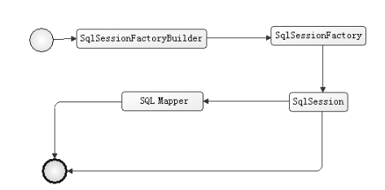
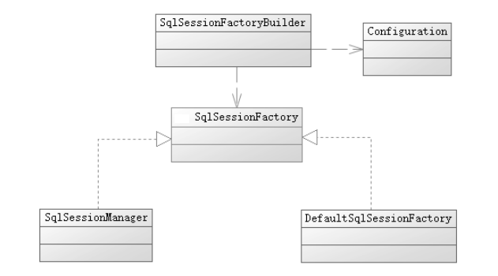
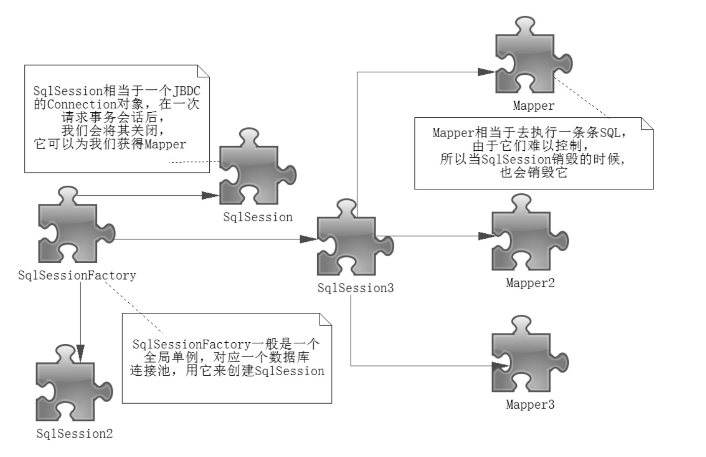

# MyBatis 入门

## 2.1 开发环境的准备
+  [https://github.com/mybatis](https://github.com/mybatis)
+  [https://mybatis.org/](https://mybatis.org)

## 2.2 MyBatis 的基本构成

+  概况：
    +  **SqlSessionFactoryBuilder** 构造器：
        +  根据配置信息或者代码生成 SqlSessionFactory 工厂接口；
    +  **SqlSessionFactory** 工厂接口: 
        +  依靠工厂生成 SqlSession 会话；
    +  **SqlSession** 会话:
        +  一个既可以发送 SQL 语句去执行并返回结果，也可以获取 Mapper 的接口； 
    +  **SQL Mapper** : 
        +  MyBatis 组件，由 Java 接口或 XML 文件构成，需要给出对应的 SQL 和 映射规则；
        
+  SqlSessionFactory：
    +  工厂接口
    +  由 SqlSessionFactoryBuilder 获得，MyBatis 应用中心，任务是创建 SqlSession；
    +  MyBatis 两种模式创建 SqlSessionFactory：
        +  XML 配置（可避免硬编码、方便配置修改、避免重复编译代码）
            +  大概配置内容
                +  数据源
                +  事务处理范围和控制方式
                +  映射器
        +  JavaBean 代码方式
    +  org.apache.ibatis.session.Configuration：
        +  以 Configuration 类对象的形式存在；
        +  存在于整个 MyBatis 应用的生命周期中，以便重复读取和运用；
        +  MyBatis 配置信息的 XML 文件保存于 Configuration 类对象中；
        +  以单例的形式存在；
    

+  SqlSession：    
    +  类似 JDBC 中的 Connection 对象；
    +  接口，主要是定义功能和参数、返回结果；
    +  获取：sqlSessionFactory.openSession();
        +  用完需关闭；
    +  主要用途：
        +  获取映射器，让映射器通过命名空间和方法名称找到相应的 SQL，发送给数据库执行后返回结果；
        +  直接通过命名信息去执行 SQL 返回结果；
+  Mapper 映射器：
    +  由 Java 接口和 XML 文件（或注解）共同组成；
    +  作用：
        +  定义参数类型；
        +  描述缓存；
        +  描述 SQL 语句；
        +  定义查询结果和 POJO 的映射关系；
    +  定义接口和 XML 文件实现 Mapper 能运行原因：
        +  运用到 Java 语言动态代理实现；
        +  在 MyBatis 上下文中描述这个接口，而 MyBatis 会为这个接口生成代理类对象，代理对象会根据“接口全路径+方法名”去匹配，找到相应的 XML 文件（或注解）去完成任务返回结果；

## 2.3 生命周期

+  SqlSessionFactoryBuilder：SqlSessionFactory构造器
    +  生命周期：局部；
    +  构造 SqlSessionFactory 作用完结，被回收；
+  SqlSessionFactory：SqlSession 构建工厂
    +  生命周期：全局；
    +  SqlSession 是一个会话，相当于 JDBC 的 Connection；每次应用访问数据库均需要获取一个会话；
    +  单例模式存在；
+  SqlSession：SqlSession 会话
    +  生命周期：局部；
    +  JDBC中的 Connection 对象，生命周期应该是在请求数据库处理事务的过程中；使用完应关闭；【线程不安全，多线程操作数据库时需注意隔离界别、数据库锁等高级特性】
+  Mapper：接口，无实现类，作用是发送 SQL 并返回结果，生命周期应与 SqlSession 事务方法之内；

## 2.4 实例