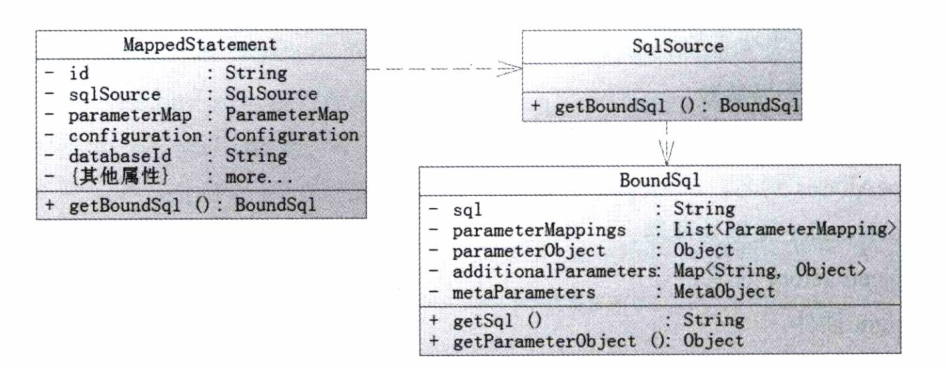
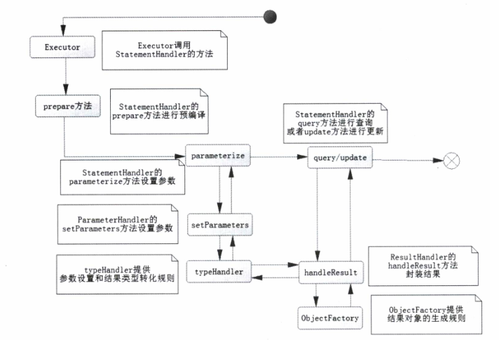

# MyBatis 的解析和运行原理
+ 两大部分：
    + 读取配置文件缓存到 Configuration 对象，用于创建 SqlSessionFactory；
    +  SqlSession 执行过程；

## 6.1 涉及技术
+ 反射 [demo](../src/main/java/mybatis/reflect/ReflectHelloServiceDemo.java)
+ 动态代理：Mapper 执行器仅仅是接口，不包含逻辑的实现类，它是通过动态代理去实现其逻辑功能；
    + 代理模式：
        + 定义：在原有的服务上多加一个占位，通过这个占位去控制服务的访问；
        + 目的：可控制如何访问真正的服务对象提供额外服务；通过重写一些类来满足特定的需要；
    + **JDK 动态代理（需要接口）**
        +  由 java.lang.reflect.* 包提供支持；
        +  步骤：
            +  编写服务类和接口；
            +  编写代理类，主要提供绑定和代理方法；需要实现 InvocationHandler 接口的代理方法；[JDK代理类Demo](../src/main/java/mybatis/reflect/proxy/HelloServiceJdkProxy.java)
    + **CGLIB 动态代理（不需要接口）**：实现 MethodInterceptor 的代理方法；[CgLib代理类Demo](../src/main/java/mybatis/reflect/proxy/HelloServiceCgLibProxy.java)
        +  在 MyBatis 中通常在延迟加载的时候才使用；
        
## 6.2 构建 SqlSessionFactory 过程
+ SqlSessionFactory：
    + 接口，默认实现类：org.apache.ibatis.session.defaults.DefaultSqlSessionFactory; MyBatis 核心类之一；
    + 最重要的功能：提供创建 MyBatis 的核心接口 SqlSession；
    + 创建需配置文件和相关参数；
    + 构造模式创建实例，分两个步骤：（builder 模式）
        1. org.apache.ibatis.builder.xml.XMLConfigBuilder 解析配置的 XML 文件，读取配置参数，并保存至 org.apache.ibatis.session.Configuration 类中；【Configuration 类使用的目的：一步步有秩序的构建，可降低复杂性】     
        2. 使用 Configuration 对象创建 SqlSessionFactory；
        
+ 6.2.1 构建 Configuration
    + 作用：
        + 读取配置文件，包括基础配置的 XML 文件和映射器的 XML 文件；
        + 初始化基础配置，如别名、一些重要的类对象（插件、映射器、ObjectFactory、typeHandler等）；
        + 提供单例，为后续创建 SqlSessionFactory 服务并提供配置的参数；
        + 执行一些重要的对象方法，初始化配置信息；
    + 初始化：
        + properties 全局参数
        + settings 设置 
        + typeAliases 别名
        + typeHandler 类型处理器
        + ObjectFactory 对象
        + plugin 插件
        + environment 环境
        + DatabaseIdProvider 数据库标识
        + Mapper 映射器

+ 6.2.2 映射器的内部组成
    + 三大部分组成：
        + MappedStatement：保存映射器的一个节点（select|insert|delete|update），包括许多配置的 SQL 、SQL 的 ID、缓存信息、resultMap、parameterType、resultType、languageDriver 等重要配置内容；
        + SqlSource：接口，主要作用是根据参数和其他的规则组装 SQL，MappedStatement 的一个属性；提供 BoundSql；
        + BoundSql：构建 SQL 和参数的地方；三个常用属性：SQL、parameterObject、parameterMappings；
            +  parameterObject：参数；
                +  传递基本类型数据时，会将参数变成其**包装类**传递；
                +  传递的是 POJO 或 Map 时，则不变；
                +  传递多个参数，若没有使用 @Param 注解，则将变成 Map<String, Object> 对象，可指定顺序或名称读取（“1”：p1,……,"param1":p1,……）；
                +  传递多个参数，若使用 @Param 注解，与没有使用 @Param 注解类似，只是由可指定顺序读取变为按 key 读取；
            +  parameterMappings：List，每个元素都是 parameterMapping 对象【描述参数：属性、名称、表达式、javaType、jdbcType、typeHandler等】；
            +  sql：映射器中的 SQL 语句；

映射器的内部组成

+ 6.2.3 构建 SqlSessionFactory：

sqlSessionFactory = new SqlSessionFactoryBuilder().build(inputStream);

## 6.3 SqlSession 运行过程
+ 6.3.1 映射器的动态代理  
    +  MyBatis 只用 Mapper 接口便能运行 SQL：映射器通过对全路径+方法名的方式进行资源绑定，通过动态代理技术，实现接口；

+ 6.3.2 SqlSession 四大对象
    + Executor：执行器，调度 StatementHandler、ParameterHandler、ResultHandler等执行对应的 SQL；
        +  设置：setting 元素属性：defaultExecutorType
        +  MyBatis 三大执行器：
            +  SIMPLE：简易执行器，默认；
            +  REUSE：一种执行重用预处理语句；
            +  BATCH：执行器重用语句和批量更新，针对批量专用的执行器；
    + StatementHandler：数据库会话器，使用数据库 Statement（PreparedStatement）执行操作；（核心，最关键）
        + Configuration 类 -> newStatementHandler() -> 创建 StatementHandler，实际上是 RoutingStatementHandler
         对象(实现 StatementHandler 接口)
        + 三种适配模式，分别对应 Executor 执行器三种模式；
            + SimpleStatementHandler
            + PrepareStatementHandler
                +  三大主要方法：
                    + prepare：方法执行前参数和 SQL 语句被预编译；
                    + parameterize：启用 ParameterHandler 设置参数，完成预编译；
                    + query：执行方法，并返回结果；
            + CallableStatementHandler
    + ParameterHandler：参数处理器，SQL 对参数的处理；
        + 接口，两个方法：
            + getParameterObject() ：返回参数对象；
            + setParameters(PreparedStatement ps)：设置预编译 SQL 语句参数；
    + ResultHandler：结果处理器，对数据集 ResultSet 的封装返回处理；
    

SqlSession 内部运行图