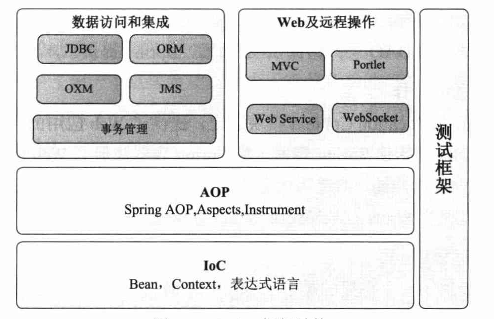

# 精通Spring 4.x 企业应用开发实战

## 第一部分 基础篇

### 1.概述

+ Spring：
    + 分层的 Java SE/EE 应用一站式的轻量级开源框架；
    + 核心：IoC（Inverse of Control，控制反转）和 AOP（Aspect Oriented Programming，切面编程）；
    + 外加展示层（Spring MVC）、持久层（Spring JDBC）以及业务层事务管理等的一站式企业级应用技术；
+ 作者：Rod Johnson

Spring 的体系结构

+ 体系结构：
    + IoC：
        + IoC 容器：
            + Spring 核心模块；脱离代码中类与类之间的依赖，用配置的方式描述依赖关系；
            + IoC 容器负责依赖类之间的创建、拼接、管理、获取等工作；
            + BeanFactory 是 Spring 框架的核心接口；
        + Bean：
            + 拓展 BeanFactory 功能，构建于核心模块之间上；
            + 主要实现功能：il8n 国际化、控制 Bean 的生命周期、构建框架事件体系、让资源加载透明化等；提供许多企业级服务的支持，如邮件服务、任务调度、JNDI 获取、EJB 集成、远程访问等；
            + ApplicationContext 是 Context 模块的核心接口；
        + 表达式语言：
            + 统一表达式语言（Unified EL）的一个扩展；
            + 主要用于查询和管理运行期的对象，支持设置/获取对象属性，调用对象方法、操作数据集合等；还可逻辑表达式运算、变量定义等；
            + 可方便通过表达式串和 Spring IoC 容器交互；
    + AOP：横切逻辑编程思想；
    + 数据访问和集成：通过模块化技术对各种数据访问技术进行了薄层封装，简化数据访问；
    + Web 及远程操作：
        + 建立在 Application Context 模块之上；
        + 提供 Web 应用的各种工具；      
+ Spring 4.0 新特性：
    + 全面支持 Java8
        + Lambda 表达式
        + 时间日期 API
        + 支持重复注解
        + 处理空指针异常 Optional<>
    + 增强核心容器
        + 支持泛型依赖注入
        + @Description 注解
        + @Conditional 实现 Bean 的条件过滤
        + @Lazy 延时依赖注入
        + 支持 Bean 被注入 List 或 Array 时可通过 @Order 注解或基于 Ordered 接口进行排序
        + 可使用自定义注解来组合多个注解
    + 支持 Groovy 定义 Bean
    + Web 的增强：
        + @RestController 注解
        + 新增 AsyncRestTemplate，支持 REST 客户端的异步无阻塞请求；
    + 支持 WebSocket
    + 测试增强

### [2.快速入门]()

### [3.Spring Boot]()