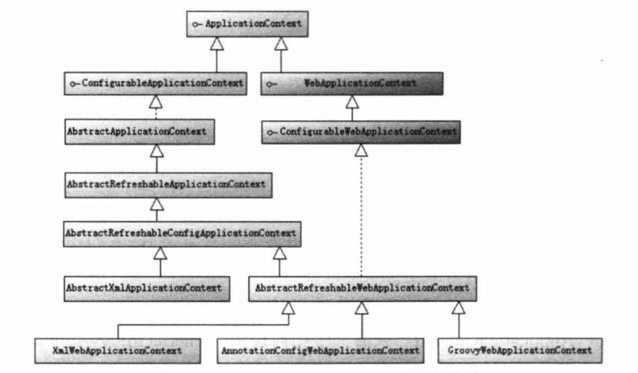

# 精通Spring 4.x 企业应用开发实战

## 第二部分 核心篇

### 4.IoC 容器

#### 4.1 控制反转与依赖注入：

+ IoC 概述：Inverse of Control，控制反转；Spring 容器的内核；
    + 实际：将某一个接口具体实现类的选择控制权从调用类中移除，转交由第三方决定；
+ DI 概述：Dependency Injection，依赖注入；由于 IoC 概念隐晦不宜理解，用 DI 概念代替；
    + 实际：让调用类对某一个接口实现类的依赖关系由第三方（容器或协作类）注入，已移除调用类对某一个接口实现类的依赖；
+ IoC 的类型：
    + 构造函数注入
    + 属性注入
    + 接口注入（调用类实现某一个接口方法，通过该方法实现注入）
+ 通过容器完成依赖关系的注入：配置文件使用 <bean> 标签写上实现的类，然后通过 XmlBeanFactory("beans.xml") 等方式启动容器；容器启动后会根据描述信息自动实例化 Bean 并完成依赖关系的装配；

#### 4.2 相关 Java 基础：

+ Java 反射技术 —— Spring 实现依赖注入的 Java 底层技术；
    + 传统构建对象：new
    + 反射构建对象：[Demo](./src/main/java/com/example/reflect/ReflectBookTest.java)
        + 重要的反射类：
            + ClassLoader
            + Class
            + Constructor
            + Method
+ 类装载技术
    + 寻找类的字节码文件并构造出类在 JVM 内部表现对象的组件；
    + 工作机制：类装载器将类装入 JVM 的步骤：
        1. 装载：查找和导入 Class 文件；
        2. 链接：执行校验、准备和解析步骤；
            + 校验：检查载入 Class 文件数据的正确性；
            + 准备：为类的静态变量分配存储空间；
            + 解析：将符号引用转换成直接引用；
        3. 初始化：对类的静态变量、静态代码块执行初始化工作；
    + ClassLoader：Java 运行时重要的系统组件；负责运行时查找和装入 Class 字节码文件；
    + 类装载由 ClassLoader 以及其子类负责；
    + JVM 运行时产生三个 ClassLoader：
        + 根装载器：不是 ClassLoader 的子类；由 C++ 编写，负责装载 JRE 核心类库；
        + ExtClassLoader 拓展类装载器：负责装载 JRE 扩展目录 ext 中的 JAR 类包；
        + AppClassLoader 应用类装载器：负责装载 Classpath 路径下的类包；
    + 全盘负责机制：指当一个 ClassLoader 装载一个类时，除非显式地使用另外一个 ClassLoader，否则该类所依赖及引用的类也由同一个 ClassLoader 装载；
    + ClassLoader 重要方法：
        + Class loadClass(String name)：指定类装载器装载指定的类；
        + Class defineClass(String name, byte[] b, int off, int len)：将类文件的字节数组转换成 JVM 内部的 Class 对象；
        + Class findSystemClass(String name)：从本地文件系统载入 Class 文件；（默认使用的加载机制）
        + Class findLoaderClass(String name)：查看 ClassLoader 是否已装入某个类；
        + ClassLoader getParent():获取类装载器的父装载器；
+ Java 反射机制：
    + 三个主要的反射类：
        + Constructor：类构造函数的反射类；
            + getConstructors()：获取类所有构造函数反射对象数组；
            + getConstructor(Class…… parameterType)：获取特定入参的构造函数反射对象；
            + newInstance(Object[] initargs):创建实例；
        + Method：类方法的反射类；
            + getDeclaredMethods()：获取类的所有方法反射类对象数组；
            + getDeclaredMethod(String name, Class…… parameterType)：获取特定类的方法的反射类对象；
            + invoke(Object obj, Object[] args)：调用方法；
        + Field：类成员变量的反射类
            + getDeclaredFields()：获取类成员变量反射对象数组；
            + getDeclaredField(String name)：获取某个特定名称的成员变量反射对象；
            + set(Object obj， Object value)：设值；
    + Java 反射体系可通过程序化方式访问目标类中所有元素；private 或 protected 修饰的属性或方法只要 JVM 安全机制允许，则可通过反射调用；
        + field.setAccessible(true); // 取消 Java 语言检查
        + method.setAccessible(true);

    

Resource 以及其实现类的关系

#### 4.3 资源访问：

##### 4.3.1 资源访问接口：Resource，让应用可访问底层资源；

+ Spring 使用 Resource 装载各种资源，包括配置文件、国际化属性文件等；
+ Resource 的实现：
    + WritableResource：可写资源接口；
    + ByteArrayResource：二进制数组表示资源；
    + ClassPathResource：类路径下资源；
    + FileSystemResource：文件系统资源；[Demo](src/main/java/com/example/resource/FileSourceExample.java)
    + InputStreamResource：以输入流返回表示的资源；
    + ServletContextResource：为访问 Web 容器上下文中的资源而设计的类，支持以流和 URL 的方式访问；
    + UrlResource：可访问任何通过 URL 表示的资源；
    + PathResource：Spring 4.0 提供读取资源文件的新类；Path 封装了 URL、Path、文件系统，可访问可通过 URL、Path、系统文件路径表示的资源；

##### 4.3.2 资源加载：

+ 资源地址表达式：（特别标识访问资源的类型）
    + “classpath:”：从类路径中加载资源；
        + "classpath*:"：扫描所有 JAR 包和类路径下都加载 xxx 包的类路径；
        + “classpath:”：只扫描第一个加载 xxx 包的类路径；
    + “file:”：使用 UrlResource 从文件系统目录中装载资源；
    + “http://”：从 Web 服务器中装载资源；
    + “ftp://”：从 FTP 服务器中装载资源；
    + 无前缀：根据 ApplicationContext 的具体实现类采用对应的 Resource 装载资源；
+ Ant 风格的资源地址支持的三种匹配符：
    + ?：匹配一个字符
    + *：匹配任意字符
    + **：匹配多层路径
+ 资源加载器：
    + ResourceLoader 接口：仅有一个方法 getResource(String location)，根据地址加载文件资源；（不支持 Ant 风格的资源路径表达式）
    + ResourcePatternResolver：拓展 ResourceLoader 接口；
    + PathMatchingResourcePatternResolver：Spring 标准实现类；

    

Spring 资源加载接口与实现类

#### 4.4 BeanFactory 和 ApplicationContext 概述：

+ IoC 容器基础：Spring 通过**配置文件**描述 Bean 与 Bean 之间的依赖关系；利用 Java 语言的反射功能实例化 Bean 并建立 Bean 之间的依赖关系；
+ IoC 容器高级服务：Bean 实例缓存、生命周期管理、Bean 实例代理、事件发布、资源装载等；
+ Spring 核心接口 —— Bean 工厂：com.springframework.beans.factory.BeanFactory；（IoC 容器）
+ 应用上下文：com.springframework.context.ApplicationContext；建立在 BeanFactory 的基础上，提供面向应用的功能；（Spring 容器）

##### 4.4.1 BeanFactory：

+ 类工厂，创建并管理各种类对象；
+ 创建的类对象满足 JavaBean 规范，但 Spring 中的比其宽泛：
    + 有无参构造函数；
    + getter/setter；
    + 不依赖某一特定容器等等；
+ BeanFactory 类体系结构：
    + 常用 XmlBeanFactory，Spring 3.2 后废弃；XmlBeanDefinitionReader、DefaultListableBeanFactory 替代；
    + ListenBeanFactory：该接口定义访问容器中 Bean 基本信息的若干个方法，如查看 Bean 的个数、获取某一类型 Bean 的配置名、查看容器中是否包含某个 Bean 等；
    + HierarchicalBeanFactory：父子级联 IoC 容器接口，子容器可通过接口方法访问父容器；
    + ConfigurableBeanFactory：增强 IoC 容器可定制性的接口，定义设置类装载器、属性编辑器、容器初始化后置处理器等方法；
    + AutowireCapableBeanFactory：定义将容器中的 Bean 按某种规则（名字匹配、类型匹配等）进行自动装配；
    + SingletonBeanRegistry：定义允许在运行期间向容器注册单实例 Bean 方法；
    + BeanDefinitionRegistry：该接口提供向容器手工注册 BeanDefinition 对象的方法；BeanDefinition 对象描述 Bean 的配置信息，Spring 配置文件中的 <bean> 均通过其表示；
+ 初始化 BeanFactory：
    + [Demo](./src/main/java/com/example/bean/BeanFactoryDemo.java)
    + 首先 XmlBeanDefinitionReader 通过 Resource 装载 Spring 配置信息并启动 IoC 容器；
    + 然后通过 BeanFactory#getBean 方法从 IoC 容器中获取 Bean；
    + Bean 实例并不会在初始化配置文件中定义，而是在发生第一次调用时才实例化；


BeanFactory 体系结构

##### 4.4.2 ApplicationContext 类体系结构：

+ ApplicationContext 由 BeanFactory 派生而成，提供更多面向应用的功能；
+ 配置文件加载的主要实现类：
    + ClassPathXmlApplication：默认从类路径加载配置文件；
    + FileSystemXmlApplication：默认从文件系统中加载配置文件；
+ ApplicationContext 继承 BeanFactory 的特性：继承 HierarchicalBeanFactory 和 ListableBeanFactory 接口；
    + ApplicationContext 与 BeanFactory 初始化 Bean 的区别：
        + BeanFactory：初始化容器时并未初始化 Bean，只在实际调用前才完成 Bean 的初始化；
        + ApplicationContext：初始化容器时就实例化所有单实例 Bean；（因此初始化花费时间稍长）
+ ApplicationContext 的扩展特性：
    + ApplicationEventPublisher：让容器有发布应用上下文事件的功能，包括容器启动、关闭事件等；实现 ApplicationListener 事件监听接口的 Bean 可以接收容器事件，并对事件进行响应处理；
    + MessageSource：提供 il8n 国际化消息访问的功能；
    + ResourcePatternResolver：可通过带前缀的 Ant 风格的资源文件路径装载 Spring 的配置文件；
+ ConfigurableApplicationContext 扩展了 ApplicationContext，新增 refresh()/close() 两个主要方法，让 ApplicationContext 具有启动、刷新和关闭应用上下文的能力：    
    + LifeCycle：主要用于控制异步处理过程；
+ 其他加载方式：
    + Spring 支持基于类注解的配置方式：
        + 实现 JavaConfig；
        + @Configuration 注解 POJO 即可提供 Spring 配置 Bean； 
        + 基于注解类的配置的 ApplicationContext 的实现类：AnnotationConfigApplicationContext； 
    + Spring 4.0 支持使用 Groovy DSL 来定义 Bean 配置：
        + 主要实现类：GenericGroovyApplicationContext


ApplicationContext 体系结构

##### 4.4.3 WebApplicationContext 类体系结构：

+ 概况：扩展 ApplicationContext，Web 应用使用，允许从相对于 Web 根目录的路径中装载配置问价完成初始化工作；
+ 与 ServletContext 的关系：
    + 在上下文启动时，WebApplicationContext 定义常量 ROOT_WEB_APPLICATION_CONTEXT_ATTRIBUTE 为键 WebApplicationContext 为值的方式放置 ServletContext 属性列表中；
    + WebApplicationContext 可获取 ServletContext 的引用；
    + ServletContext 也可获取 WebApplicationContext 的实例，WebApplicationContextUtils#getWebApplicationContext(ServletContext sc)；
    + 整个 Web 应用环境均可访问到 Spring 应用上下文；
+ Bean 的作用域：
    + 非 Web 环境下：singleton、property；
    + Web 环境下：新增 request、session、global session；
+ ConfigurableWebApplicationContext 扩展 WebApplication，允许通过配置的方式实例化 WebApplicationContext；
    + 定义两个重要方法：
        + setServletContext(ServletContext sc)：为 Spring 设置 Web 应用上下文；
        + setConfigLocations(String[] configLocations)：设置 Spring 配置文件地址；
    


WebApplicationContext 类继承体系

##### 4.4.4 WebApplicationContext 初始化

+ 与 BeanFactory 和 ApplicationContext 的区别：WebApplicationContext 的实例化需 ServletContext 实例，需要 Web 容器启动；
+ 可在 web.xml 中配置自启动的 Servlet 或定义 Web 容器监听器启动 Spring Web 应用上下文工作；
    + Spring 分别提供启动 WebApplicationContext 的 Servlet 和 Web 容器监听器：
        + Servlet：org.springframework.web.context.ContextLoaderServlet
        + Web 容器监听器：org.springframework.web.context.ContextLoaderListener
+ WebApplication 需使用日志功能，需先启动；
    + Spring 中启动 Log4j 引擎的 Web 容器和监听器：Log4jConfigServlet / Log4jConfigListener；

```xml
<!-- 指定配置文件 -->
<context-param>
    <param-name>contextConfigLocation</param-name>
    <param-value>
        /WEB-INF/spring.xml,dao.xml<!-- 多个文件可用逗号、空格或冒号分隔-->
    </param-value>
</context-param>

<!-- 声明 Web 容器监听器 -->
<listener>
    <listener-class>
        org.springframework.web.context.ContextLoaderListener
    </listener-class>
</listener>

<!-- 声明自启动 Servlet -->
<servlet>
    <servlet-name>springContextLoaderServlet</servlet-name>
    <servlet-class>org.springframework.web.context.ContextLoaderServlet</servlet-class>
    <load-on-startup>2</load-on-startup>
</servlet>


<!-- 配置 Log4j 日志引擎 -->
<context-param>
    <param-name>log4jConfigLocation</param-name>
    <param-value>
        log4j.properties
    </param-value>
</context-param>
<servlet>
    <servlet-name>log4jConfigServlet</servlet-name>
    <servlet-class>org.springframework.web.util.Log4jConfigServlet</servlet-class>
    <load-on-startup>1</load-on-startup>
</servlet>

<!-------------------------------------------------->
<!-- 注解配置 -->
<!-- 指定 Spring 使用 AnnotationConfigWebApplicationContext 启动容器 -->
<context-param>
    <param-name>contextClass</param-name>
    <param-value>
        org.springframework.web.context.support.AnnotationConfigWebApplicationContext
    </param-value>
</context-param>
<!-- 指定标注了 @Configuration 的配置类-->
<context-param>
    <param-name>contextConfigLocation</param-name>
    <param-value>
        org.example.demo.JavaConfigDemo
    </param-value>
</context-param>

<listener>
    <listener-class>
        org.springframework.web.context.ContextLoaderListener
    </listener-class>
</listener>
```

#### 4.5 Bean 的生命周期

+ Servlet 的生命周期：init()、service()、destroy();
+ Bean 的生命周期：由多个特定的生命阶段组成；
+ Bean 生命周期的两个定义：
    + Bean 的作用范围；
    + 实例化 Bean 经历的一系列阶段；

##### 4.5.1 BeanFactory 中 Bean 的生命周期


BeanFactory 中 Bean 的生命周期

+ Bean 生命周期具体的过程：
    1. 调用 getBean(name) 向容器请求 Bean，若容器注册了 org.springframework.beans.factory.config.InstantiationAwareBeanPostProcessor 接口，则在 Bean 实例化前调用该接口的 postProcessBeforeInstantiation() 方法；
    2. 根据配置情况调用 Bean 构造函数或工厂方法实例化 Bean；
    3. 若容器注册 InstantiationAwareBeanPostProcessor 接口，则在 Bean 实例化后调用该接口的 postProcessAfterInstantiation() 方法；（呼应步骤 1）
    4. 若 Bean 配置了属性信息，那么将配置的属性值设置到 Bean 中，不过设置前调用 InstantiationAwareBeanPostProcessor 接口的 postProcessPropertyValues() 方法；
    5. 调用 Bean 的属性设置方法设置属性值；
    6. 若 Bean 实现了 org.springframework.beans.factory.BeanNameAware 接口，则调用 setBeanName() 接口方法，将配置文件中该 Bean 对应的名称设置到 Bean 中；
    7. 若 Bean 实现了 org.springframework.beans.factory.BeanFactoryAware 接口，则调用 setBeanFactory() 接口方法，将 BeanFactory 容器实例设置到 Bean 中；
    8. 若 BeanFactory 装配了 org.springframework.beans.factory.config.BeanPostProcessor 后处理器，则调用 Object postProcessBeforeInitialization(Object bean, String baneName) 接口方法对 Bean 进行加工操作，入参为当前的 Bean 和其配置的名，返回的对象是加工处理后的 Bean；（Bean 后续加工的切入点，如实现 AOP、动态代理等功能）
    9. 若 Bean 实现 InitializingBean 接口，那么调用 afterPropertiesSet() 接口方法；
    10. 若在配置文件中 <bean> 通过 init-method 属性定义了初始化方法，那么执行该方法；
    11. 若 BeanFactory 装配了 BeanPostProcessor 后处理器，则调用 Object postProcessAfterInitialization(Object bean, String beanName) 接口方法对 Bean 再进行加工；（呼应步骤 8）
    12. 若 Bean 的作用范围为 scope="prototype"，则将 Bean 返回给调用者，调用者负责 Bean 后续生命的管理；若 scope="singleton"，则 Bean 将放入 Spring IoC 容器的缓存池中，并将 Bean 的引用返回，Spring 继续对 Bean 进行后续的生命管理；
    13. 对于 scope="singleton" 的 Bean （默认情况），当容器关闭时，触发 Spring 对 Bean 后续生命周期的管理；若 Bean 实现 DisposableBean 接口，则调用接口的 destroy()；（可执行释放资源、记录日志等操作）
    14. 对于 scope="singleton" 的 Bean，若 <bean> 中 destroy-method 属性定义了销毁方法，那么执行该方法；
+ Bean 生命周期调用方法的大致划分：
    + Bean 自身方法：如构造函数实例化 Bean（2）、调用 setter 设置属性值（5）、调用 init-method 指定的方法（10）、调用 destroy-method 指定的方法（14）；
    + Bean 生命周期接口方法：BeanNameAware（6）、BeanFactoryAware（7）、InitializingBean（9）、DisposableBean（13）；（个性）
    + 容器级生命周期接口方法：（后处理器）InstantiationAwareBeanPostProcessor（1、3、4）、BeanPostProcessor（8、11）；（共性）
    + 工厂后处理器接口方法：AspectJWeavingEnabler、CustomAutowireConfigurer、ConfigurationClassPostProcessor 等，在应用上下文装配配置文件后立即调用；
+ [BeanFactory 中 Bean 生命周期的演示 Demo](./src/main/java/com/example/lifecycle/beanfactory/BeanFactoryLifeCycleDemo.java)
+ 注意事项：
    + 注册多个后处理器问题，后处理器需实现 org.springframework.core.Ordered 接口，需指定依次调用的顺序；
    + 后处理器中，InstantiationAwareBeanPostProcessor 是 BeanPostProcessor 接口的子接口，适配类：InstantiationAwareBeanPostProcessorAdapter；
    + 为了业务代码与 Spring 框架解耦，实际上初始化或销毁 Bean 时可通过实现 init-method 和 destroy-method 属性来配置，效果与实现 InitializingBean 和 DisposableBean 接口一致；
    + 后置处理器 InitDestroyAnnotationBeanPostProcessor，负责处理标注 @PostConstruct、@PreDestroy 的 Bean；
    + 实际开发中几乎可以忽略上述接口，除非编写 Spring 子项目或在其之上的插件；（实现额外功能）

##### 4.5.2 ApplicationContext 中 Bean 的生命周期


ApplicationContext 中 Bean 的生命周期

+ ApplicationContext 中 Bean 的生命周期与 BeanFactory 的几乎一致；
+ 在 Bean 生命周期中 ApplicationContext 与 BeanFactoryContext 的不同：
    + 在 ApplicationContext 中，若 Bean 实现 org.springframework.context.ApplicationContextAware 接口，则增加一个调用 setApplicationContext() 接口方法的步骤；
    + ApplicationContext 会利用 Java 反射机制自动识别出配置文件中定义的 BeanPostProcessor、InstantiationAwareBeanPostProcessor 和 BeanFactoryPostProcessor，并自动注册到应用上下文；而 BeanFactory 需调用 addBeanPostProcessor() 进行手动注册；（ApplicationContext 只需配置好就可以自动运行）
+ [ApplicationContext 中 Bean 生命周期的演示 Demo](./src/main/java/com/example/lifecycle/applicationcontext/ApplicationContextLifeCycleDemo.java) 

### 5.在 IoC 容器中装配 Bean

#### 5.1 Spring 配置概述

##### 5.1.1 Spring 容器高层视图

+ 成功启动 Spring 容器的三方面条件：
    + Spring 框架的类包；
    + Spring 下 Bean 的配置信息；
    + Bean 类的实现；
+ Bean 的配置信息（又称“Bean 的元数据信息”）：
    + Bean 的实现类；
    + Bean 的属性信息；
    + Bean 的依赖关系；
    + Bean 的行为配置，如生命周期范围及生命周期各过程的回调函数等；
+ Spring 支持多种形式的 Bean 配置方式：
    + Spring 1.0：支持基于 XML 的配置；
    + Spring 2.0：支持基于注解配置的支持；
    + Spring 3.0：支持基于 Java 类配置的支持；
    + Spring 4.0：支持基于 Groovy 动态语言的配置的支持；
    


Spring 容器、Bean 配置信息、Bean 实现类以及应用程序之间相互的关系

##### 5.1.2 基于 XML 的配置信息

+ XML 配置：Spring 1.0 采用 DTD 格式，Spring 2.0 采用 Schema 格式（配置简化、但声明头复杂）；
+ Schema 的命名空间声明：
    + 默认命名空间；
    + xsi 标准命名空间；
    + xxx 命名空间，如 aop 等，属自定义命名空间；
+ 指定命名空间的 Schema 文件地址的用途：
    + XML 解析器对文档格式合法性验证；
    + IDE 自动补全功能；
    


XML 配置文件示例


Spring 4.0 的 Schema 文件

#### 5.2 Bean 基本配置

```<bean id="" name="" class=""/>```

+ id：Bean 的名称；
    + IoC 容器中唯一；
    + 命名规范：必须以字母开始，后可接字母、数字、连字符、下划线、句号、冒号等完整结束的符号；
    + 若需要使用特殊字符，可使用 name 属性；
+ name：Bean 的名称
    + 命名可重复，若重复则使用最后命名那个 Bean；（前面被覆盖）
    + 可使用任何字符；
    + 可设置多个并使用逗号隔开；
    + 若 bean 中，id 和 name 均没有设定，则 Spring 自动将全限定类名作为 Bean 的名称；
+ class：Bean 的实现类

#### 5.3 依赖注入

+ 属性注入：
    + ```<bean><property name="" value=""/></bean>```
    + 通过 setter 方式注入 Bean 的属性值或依赖对象；
    + 优点：具有可选择性和灵活性高；
    + 注意：Spring 只检查 Bean 中是否有对应的 setter 方法，不要求是否有对应的属性成员；
+ 构造函数注入：
    + 按类型匹配入参：
        + ```<bean><constructor-arg type="Class" value=""/></bean>```
        + 因为 Spring 配置文件采用和元素标签顺序无关的策略；
        + 若存在多个相同类型的属性，则不适用；
    + 按索引匹配入参：
        + ```<bean><constructor-arg index="0" value=""/></bean>```
        + 较准确，在存在相同类型的参数时可用；
        + 若存在多个入参个数相同的构造函数，则不适用；
    + 联合使用类型和所用匹配入参：
        + ```<bean><constructor-arg index="0" type="Class" value=""/></bean>```
        + 解决上面两种方式的缺陷；
    + 通过自身类型反射匹配入参：
        + ```<bean><constructor-arg value=""/></bean>```
        + 适用于入参类型是可辨别的构造函数；
    + 循环依赖问题：
        + 构造函数注入的前提条件：入参引用对象必须已经实例初始化；
        + 解决：使用 setter 属性注入；
+ 工厂方法注入：
    + 非静态工厂方法：
        + 先定义工厂类 Bean：```<bean id="xxx-factory" class="xxx-factory">```
        + 定义实体类 Bean（由非静态工厂方法创建）：```<bean id="bean" factory-bean="xxx-factory" factory-method="createBean"/>```
    + 静态工厂方法：
        + 因静态工厂，可无需定义工厂类的 Bean；
        + 定义实体类 Bean（由静态工厂方法创建）：```<bean id="bean" class="com.example.xxx-factory" factory-method="createBean"/>```

#### 5.4 注入参数详解

+ 在 Spring 配置文件中，除可将 String、int 等字面值注入 Bean 中，还可以注入集合、Map、其他定义的 Bean 等类型的数据；
+ 字面值：
    + 指可用字符串表示的值；
    + 通过标签 value 注入；
    + Spring 容器内部为字面值提供编辑器，可将字符串转换成内部变量相应类型；也可自定义编辑器；
    + 特殊字符的处理：
        + 特殊字符可能会对 XML 的格式造成破坏，需特殊处理；
        + 方法一：<![CDATA[]]> 标签；可将标签内的字符串当成普通文本对待；
        + 方法二：将特殊字符转换成转义字符；
        + XML 特殊字符与转义字符：
            + ```“&”：“&amp;”```
            + ```“<”：“&lt;”```
            + ```“>”：“&gt;”```
            + ```“"”：“&quot;”```
            + ```“'”：“&apos;”```
+ 引用其他 Bean：
    + Spring IoC 容器中定义的 Bean 可以互相引用；
    + ref 标签：
        + bean：可引用同一容器或父容器中的 Bean，最常见形式；
        + local：只能引用同一配置文件中定义的 Bean，XML 解析器可自动检测引用合法性；
        + parent：引用父容器的 Bean; [Demo](./src/main/java/com/example/bean/ParentBeanDemo.java)
+ 内部 Bean：
    + 该 Bean 只能被 property 属性概括的父 Bean 引用；
    + 与 Java 匿名内部类相似；
    + scope 默认为 prototype 类型；
+ 设置 null 值：```<null/>```
+ 级联属性：
    + 直接为对象的属性提供注入值，可直接使用圆点（.），如 object.xxx 等；
    + 注意：需在 Bean 初始化时将该对象实例化；Spring 没有限制层级数；
+ 集合类型属性：
    + List 集合：```<list><value/></list>```
    + Set 集合：```<set><value/></set>```
    + Map 集合：```<map><entry><key><value/></key><value></value></entry>```
    + Properties：Map 类型特例；```<prop key="key">value</prop>```
    + 强类型集合
    + 集合合并：先在父 Bean 标签中设置 abstract="true"，再在子 Bean 标签中设置 parent="" 父 Bean 的 ID，最后在集合标签中设置 merge="true"；
    + 通过 util 命名空间配置集合类型：
        + List 集合：```<util:list></util:list>```
        + set 集合：```<util:set></util:set>```
        + Map 集合：```<util:map><entry key="" value=""/></util:map>```
+ 简化配置方式：
    + 字面值属性：
        + 字面值属性：```<property name="" value=""/>```
        + 构造函数参数：```<construct-arg type="" value=""/>```
        + 集合元素：```<map><entry key="" value=""/></map>```
    + 引用对象属性：
        + 字面值属性：```<property name="" ref=""/>```
        + 构造函数参数：```<construct-arg ref=""/>```
        + 集合元素：```<map><entry key-ref="" value-ref=""/></map>```
    + p 命名空间：
        + 字面值：p:xxx=""
        + 引用对象：p:xxx-ref=""
+ 自动装配：
    + Spring IoC 容器根据 Java 反射机制获取实现类的结构信息，如构造函数、属性等信息；
    + 根据获取到的结构信息，可进行自动装配；
    + 四种装配类型：
        + byName：根据名称自动匹配；
        + byType：根据类型自动匹配；
        + constructor：与 byType 类似，针对构造函数；
        + autodetect：根据 Bean 的自省机制决定采用 byType 或者是 constructor 进行自动装配；
    + bean 标签中属性 default-autowire 可以配置是否开启全局自动匹配，默认 no 不开启，可选上面四种类型；

#### 5.5 方法注入：

+ 背景：实现 Bean 的 scope=“singleton”，但每次 Bean#getXXX() 都获取一个全新的对象；
+ 方式一：实现 BeanFactoryAware 接口，且能够访问容器的引用； getXXX() 就可以实现 factory.getBean("xxx") 达到目的； 
+ lookup 方法注入：
    + 依赖 CGLib 包；
    + 需声明一个接口，然后在 XML 配置文件中为该接口提供动态的实现；
+ 方法替换：
    + 替换的方法该类需实现 Spring 中 org.springframework.beans.factory.support.MethodReplacer 接口的 reimplement() 方法；
    + 在 XML 配置文件中，在被替换方法的 bean 中加上 ```<replace-method name="被替换方法的名称" replace="替换方法的 bean"/>```

#### 5.6 bean 之间的关系

+ 继承：父 Bean 标签中将 abstract 设置为 true；子 Bean 中添加 parent="" 指向父 Bean；
+ 依赖：
    + ref 元素标签建立；
    + 实例化 Bean 时，其依赖的 Bean 需已经完成实例化；
    + 前置依赖：depends-on 属性显式指定 Bean 的前置依赖 Bean，前置依赖的 Bean 将会在本 Bean 实例化前创建好；
+ 引用：一个 Bean 需引用另一个 Bean 的属性值：```<property name=""><idref bean="" /></property>```

```xml
<!-- lookup 的实现 -->
<!-- prototype 下的 bean-->
<bean id="xxObject" class="java.lang.xx.XXObject" p:id="1" p:name="name1" scope="prototype"/>
<!-- 实施方法注入 -->
<bean id="iMethod" class="com.example.interface.IMethod">
    <lookup-method name="getXXX" bean="xxObject"/>
</bean>
```

#### 5.7 整合多个配置文件：```<import resource="">``` 标签

#### 5.8 Bean 的作用域

+ 作用域类型：
    + singleton：Bean 以单例的形式存在；
        + 容器启动时，自动实例化所有 singleton 的 Bean 并缓存于容器中；
        + 好处：
            + Bean 前提实例化操作会发现潜在配置问题；
            + Bean 以缓存方式保存，当运行时就无需实例化，提高运行效率；
        + 若不需容器启动时提前实例化 singleton 的 Bean，可使用 lazy-init 属性控制；（若该 Bean 需被其他提前实例化的 Bean 引用，那么忽略该设置）
    + prototype：每次调用 Bean 时均是一个新的实例；
    + request：每次 HTTP 请求时会创建一个新的 Bean；
    + session：同一个 HTTP Session 共享一个 Bean，不同 HTTP Session 使用不同的 Bean；
    + globalSession：同一个全局 Session 共享一个 Bean，一般用于 Portlet 应用环境；
+ 可自定义作用域，
    + 自定义的作用域（类）需实现 org.springframework.beans.factory.config.Scope 接口；
    + 然后通过 org.springframework.beans.factory.config.CustomScopeConfigurer 这个 BeanFactoryPostProcessor 注册自定义 Bean 的作用域；
+ 与 Web 应用环境相关的 Bean 作用域
    + 使用前需在 web 容器中配置：
        + 低版本（Servlet 2.3 前）:可使用 HTTP 请求过滤器配置；
        + 高版本：使 HTTP 请求监听器配置；
    + ContextLoaderListener 与 RequestContextListener： Web 容器与 Spring 容器进行整合
        + ContextLoaderListener：
            + 实现 ServletContextListener 监听器接口；
            + 负责监听 Web 容器启动和关闭事件；
        + RequestContextListener：
            + 实现 ServletRequestListener 监听器接口；
            + 负责监听 HTTP 请求事件，Web 服务器接收的每一次请求都会通知监听器；
            + 支持 Bean 另外 3 个作用域的原因：
                + request、session、globalSession 这三个作用域控制逻辑需 HTTP 请求事件驱动；
        + 两者分开的原因：考虑版本兼容问题；三个新增作用域适用场景不多；

```xml
<web-app>
<!-- 低版本 -->
<filter>
    <filter-name>requestContextFilter</filter-name>
    <filter-class>org.springframework.web.filter.RequestContextFilter</filter-class>
</filter>
<filter-mapping>
    <filter-name>requestContextFilter</filter-name>
    <url-pattern>/*</url-pattern>
</filter-mapping>

<!-- 高版本 -->
<listener>
    <listener-class>
        org.springframework.web.context.request.RequestContextListener
    </listener-class>
</listener>
</web-app>
```

#### 5.9 FactoryBean

+ 实例化 Bean 的方式：
    + 配置方式创建：通过反射机制利用 bean 标签的 class 属性指定实现类实例化 Bean；若实例化过程复杂，需提供大量配置信息，灵活性受限；
    + 工厂创建：可实现 org.springframework.beans.factory.FactoryBean 工厂类接口，定制实现 Bean 的逻辑；
        + 当 Bean 实现了 FactoryBean 接口，getBean() 返回的是 FactoryBean#getObject() 所返回的对象；（相当于代理了 getBean() 方法）
        + 若需要获取 FactoryBean 的 Bean，获取时需在 beanName 前加“&”，如 getBean("&xxxFactoryBean");
        + Spring 3.0 支持泛型，接口声明改为 FactoryBean<T>
        + FactoryBean 三个接口方法：
            + T getObject()：返回由 FactoryBean 创建的 Bean 实例；
            + boolean isSingleton()：判断 FactoryBean 创建的 Bean 的作用域是否是 singleton；
            + Class<T> getObjectType()：返回 FactoryBean 创建 Bean 的类型；

#### 5.10 基于注解的配置

+ 注解定义 Bean：
    + @Component：对 Bean 实体类进行标注；
    + @Repository：对 DAO 实现类进行标注；
    + @Service：对 Service 实现类进行标注；
    + @Controller：对 Controller 实现类进行标注；
+ 扫描注解定义的 Bean：
    + ```<context:component-scan base-package="xxx.xxx.XXXBean"/>``
    + resource-pattern 属性：可按资源名称对基类包中的类进行过滤；
    + 子标签：
        + ```<context:include-filter>```：表示要包含目标类；
        + ```<context:exclude-filter>```：表示要排除目标类；
    + use-default-filters 属性：默认 true；表示默认会对标注 @Component、@Controller、@Service 以及 @Repository 的 Bean 进行扫描；
+ 自动装配 Bean
    + 对属性进行标注：
        + 通过 @Autowire 进行自动注入：默认通过按类型 byType 匹配的方式查找匹配 Bean；
        + 使用 @Autowire 的 required 属性：默认为 false；表示没有匹配到 Bean 会抛出异常；true 表示忽略；
        + 使用 @Qualifier 指定注入 Bean 的名称；
    + 对类方法进行标注（对属性的 setter 方法标注，等同对该属性进行标注）（实际项目中建议采用）
    + 对集合类进行标注：可将容器中匹配集合元素类型的所有 Bean 均注入；
    + 对延迟依赖注入的支持：@Lazy + @Autowire；
    + 对标准注解的支持：@Resource 和 @Inject（功能没有 @Autowire 丰富）
    + Bean 的作用范围及生命过程方法：
        + @Scope：显式指定 Bean 的作用范围；
        + @PostConstruct：显式指定 Bean 启动时 init-method；
        + @PreDestroy：显式指定 Bean 销毁时 destroy-method；

#### 5.11 基于 Java 类的配置

#### 5.12 基于 Groovy DSL 的配置

#### 5.13 通过编码方式动态添加 Bean

#### 5.14 不同配置方式比较

### [6.Spring 容器高级主题]()

### [7.Spring AOP 基础]()

### [8.基于 @AspectJ 和 Schema 的 AOP]()

### [9.Spring SpEL]()