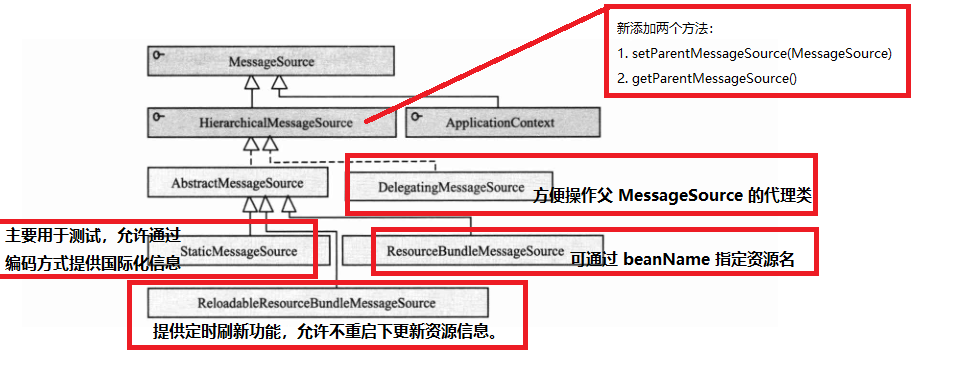
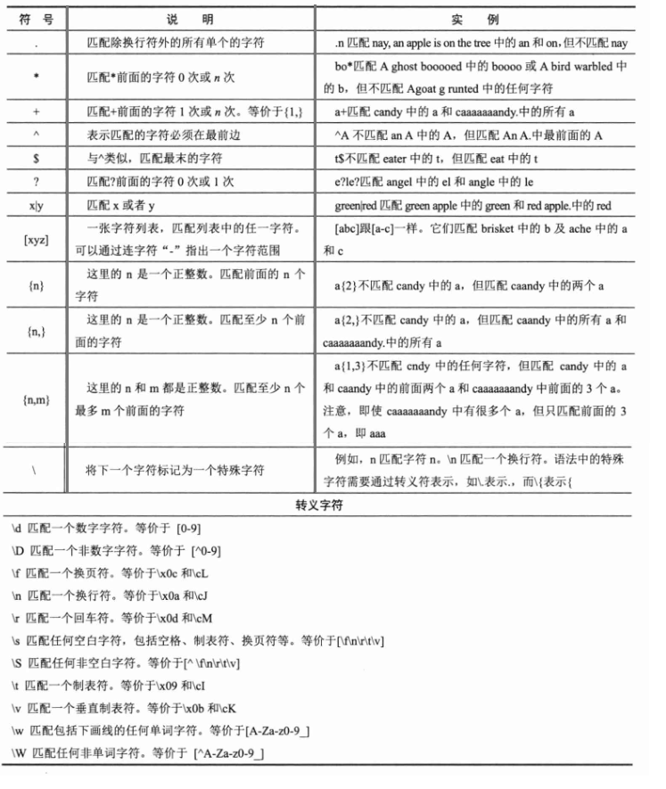

# 精通Spring 4.x 企业应用开发实战

## 第二部分 核心篇

### 4.IoC 容器

#### 4.1 控制反转与依赖注入：

+ IoC 概述：Inverse of Control，控制反转；Spring 容器的内核；
    + 实际：将某一个接口具体实现类的选择控制权从调用类中移除，转交由第三方决定；
+ DI 概述：Dependency Injection，依赖注入；由于 IoC 概念隐晦不宜理解，用 DI 概念代替；
    + 实际：让调用类对某一个接口实现类的依赖关系由第三方（容器或协作类）注入，已移除调用类对某一个接口实现类的依赖；
+ IoC 的类型：
    + 构造函数注入
    + 属性注入
    + 接口注入（调用类实现某一个接口方法，通过该方法实现注入）
+ 通过容器完成依赖关系的注入：配置文件使用 <bean> 标签写上实现的类，然后通过 XmlBeanFactory("beans.xml") 等方式启动容器；容器启动后会根据描述信息自动实例化 Bean 并完成依赖关系的装配；

#### 4.2 相关 Java 基础：

+ Java 反射技术 —— Spring 实现依赖注入的 Java 底层技术；
    + 传统构建对象：new
    + 反射构建对象：[Demo](./src/main/java/com/example/reflect/ReflectBookTest.java)
        + 重要的反射类：
            + ClassLoader
            + Class
            + Constructor
            + Method
+ 类装载技术
    + 寻找类的字节码文件并构造出类在 JVM 内部表现对象的组件；
    + 工作机制：类装载器将类装入 JVM 的步骤：
        1. 装载：查找和导入 Class 文件；
        2. 链接：执行校验、准备和解析步骤；
            + 校验：检查载入 Class 文件数据的正确性；
            + 准备：为类的静态变量分配存储空间；
            + 解析：将符号引用转换成直接引用；
        3. 初始化：对类的静态变量、静态代码块执行初始化工作；
    + ClassLoader：Java 运行时重要的系统组件；负责运行时查找和装入 Class 字节码文件；
    + 类装载由 ClassLoader 以及其子类负责；
    + JVM 运行时产生三个 ClassLoader：
        + 根装载器：不是 ClassLoader 的子类；由 C++ 编写，负责装载 JRE 核心类库；
        + ExtClassLoader 拓展类装载器：负责装载 JRE 扩展目录 ext 中的 JAR 类包；
        + AppClassLoader 应用类装载器：负责装载 Classpath 路径下的类包；
    + 全盘负责机制：指当一个 ClassLoader 装载一个类时，除非显式地使用另外一个 ClassLoader，否则该类所依赖及引用的类也由同一个 ClassLoader 装载；
    + ClassLoader 重要方法：
        + Class loadClass(String name)：指定类装载器装载指定的类；
        + Class defineClass(String name, byte[] b, int off, int len)：将类文件的字节数组转换成 JVM 内部的 Class 对象；
        + Class findSystemClass(String name)：从本地文件系统载入 Class 文件；（默认使用的加载机制）
        + Class findLoaderClass(String name)：查看 ClassLoader 是否已装入某个类；
        + ClassLoader getParent():获取类装载器的父装载器；
+ Java 反射机制：
    + 三个主要的反射类：
        + Constructor：类构造函数的反射类；
            + getConstructors()：获取类所有构造函数反射对象数组；
            + getConstructor(Class…… parameterType)：获取特定入参的构造函数反射对象；
            + newInstance(Object[] initargs):创建实例；
        + Method：类方法的反射类；
            + getDeclaredMethods()：获取类的所有方法反射类对象数组；
            + getDeclaredMethod(String name, Class…… parameterType)：获取特定类的方法的反射类对象；
            + invoke(Object obj, Object[] args)：调用方法；
        + Field：类成员变量的反射类
            + getDeclaredFields()：获取类成员变量反射对象数组；
            + getDeclaredField(String name)：获取某个特定名称的成员变量反射对象；
            + set(Object obj， Object value)：设值；
    + Java 反射体系可通过程序化方式访问目标类中所有元素；private 或 protected 修饰的属性或方法只要 JVM 安全机制允许，则可通过反射调用；
        + field.setAccessible(true); // 取消 Java 语言检查
        + method.setAccessible(true);

    

Resource 以及其实现类的关系

#### 4.3 资源访问：

##### 4.3.1 资源访问接口：Resource，让应用可访问底层资源；

+ Spring 使用 Resource 装载各种资源，包括配置文件、国际化属性文件等；
+ Resource 的实现：
    + WritableResource：可写资源接口；
    + ByteArrayResource：二进制数组表示资源；
    + ClassPathResource：类路径下资源；
    + FileSystemResource：文件系统资源；[Demo](src/main/java/com/example/resource/FileSourceExample.java)
    + InputStreamResource：以输入流返回表示的资源；
    + ServletContextResource：为访问 Web 容器上下文中的资源而设计的类，支持以流和 URL 的方式访问；
    + UrlResource：可访问任何通过 URL 表示的资源；
    + PathResource：Spring 4.0 提供读取资源文件的新类；Path 封装了 URL、Path、文件系统，可访问可通过 URL、Path、系统文件路径表示的资源；

##### 4.3.2 资源加载：

+ 资源地址表达式：（特别标识访问资源的类型）
    + “classpath:”：从类路径中加载资源；
        + "classpath*:"：扫描所有 JAR 包和类路径下都加载 xxx 包的类路径；
        + “classpath:”：只扫描第一个加载 xxx 包的类路径；
    + “file:”：使用 UrlResource 从文件系统目录中装载资源；
    + “http://”：从 Web 服务器中装载资源；
    + “ftp://”：从 FTP 服务器中装载资源；
    + 无前缀：根据 ApplicationContext 的具体实现类采用对应的 Resource 装载资源；
+ Ant 风格的资源地址支持的三种匹配符：
    + ?：匹配一个字符
    + *：匹配任意字符
    + **：匹配多层路径
+ 资源加载器：
    + ResourceLoader 接口：仅有一个方法 getResource(String location)，根据地址加载文件资源；（不支持 Ant 风格的资源路径表达式）
    + ResourcePatternResolver：拓展 ResourceLoader 接口；
    + PathMatchingResourcePatternResolver：Spring 标准实现类；

    

Spring 资源加载接口与实现类

#### 4.4 BeanFactory 和 ApplicationContext 概述：

+ IoC 容器基础：Spring 通过**配置文件**描述 Bean 与 Bean 之间的依赖关系；利用 Java 语言的反射功能实例化 Bean 并建立 Bean 之间的依赖关系；
+ IoC 容器高级服务：Bean 实例缓存、生命周期管理、Bean 实例代理、事件发布、资源装载等；
+ Spring 核心接口 —— Bean 工厂：com.springframework.beans.factory.BeanFactory；（IoC 容器）
+ 应用上下文：com.springframework.context.ApplicationContext；建立在 BeanFactory 的基础上，提供面向应用的功能；（Spring 容器）

##### 4.4.1 BeanFactory：

+ 类工厂，创建并管理各种类对象；
+ 创建的类对象满足 JavaBean 规范，但 Spring 中的比其宽泛：
    + 有无参构造函数；
    + getter/setter；
    + 不依赖某一特定容器等等；
+ BeanFactory 类体系结构：
    + 常用 XmlBeanFactory，Spring 3.2 后废弃；XmlBeanDefinitionReader、DefaultListableBeanFactory 替代；
    + ListenBeanFactory：该接口定义访问容器中 Bean 基本信息的若干个方法，如查看 Bean 的个数、获取某一类型 Bean 的配置名、查看容器中是否包含某个 Bean 等；
    + HierarchicalBeanFactory：父子级联 IoC 容器接口，子容器可通过接口方法访问父容器；
    + ConfigurableBeanFactory：增强 IoC 容器可定制性的接口，定义设置类装载器、属性编辑器、容器初始化后置处理器等方法；
    + AutowireCapableBeanFactory：定义将容器中的 Bean 按某种规则（名字匹配、类型匹配等）进行自动装配；
    + SingletonBeanRegistry：定义允许在运行期间向容器注册单实例 Bean 方法；
    + BeanDefinitionRegistry：该接口提供向容器手工注册 BeanDefinition 对象的方法；BeanDefinition 对象描述 Bean 的配置信息，Spring 配置文件中的 <bean> 均通过其表示；
+ 初始化 BeanFactory：
    + [Demo](./src/main/java/com/example/bean/BeanFactoryDemo.java)
    + 首先 XmlBeanDefinitionReader 通过 Resource 装载 Spring 配置信息并启动 IoC 容器；
    + 然后通过 BeanFactory#getBean 方法从 IoC 容器中获取 Bean；
    + Bean 实例并不会在初始化配置文件中定义，而是在发生第一次调用时才实例化；


BeanFactory 体系结构

##### 4.4.2 ApplicationContext 类体系结构：

+ ApplicationContext 由 BeanFactory 派生而成，提供更多面向应用的功能；
+ 配置文件加载的主要实现类：
    + ClassPathXmlApplication：默认从类路径加载配置文件；
    + FileSystemXmlApplication：默认从文件系统中加载配置文件；
+ ApplicationContext 继承 BeanFactory 的特性：继承 HierarchicalBeanFactory 和 ListableBeanFactory 接口；
    + ApplicationContext 与 BeanFactory 初始化 Bean 的区别：
        + BeanFactory：初始化容器时并未初始化 Bean，只在实际调用前才完成 Bean 的初始化；
        + ApplicationContext：初始化容器时就实例化所有单实例 Bean；（因此初始化花费时间稍长）
+ ApplicationContext 的扩展特性：
    + ApplicationEventPublisher：让容器有发布应用上下文事件的功能，包括容器启动、关闭事件等；实现 ApplicationListener 事件监听接口的 Bean 可以接收容器事件，并对事件进行响应处理；
    + MessageSource：提供 il8n 国际化消息访问的功能；
    + ResourcePatternResolver：可通过带前缀的 Ant 风格的资源文件路径装载 Spring 的配置文件；
+ ConfigurableApplicationContext 扩展了 ApplicationContext，新增 refresh()/close() 两个主要方法，让 ApplicationContext 具有启动、刷新和关闭应用上下文的能力：    
    + LifeCycle：主要用于控制异步处理过程；
+ 其他加载方式：
    + Spring 支持基于类注解的配置方式：
        + 实现 JavaConfig；
        + @Configuration 注解 POJO 即可提供 Spring 配置 Bean； 
        + 基于注解类的配置的 ApplicationContext 的实现类：AnnotationConfigApplicationContext； 
    + Spring 4.0 支持使用 Groovy DSL 来定义 Bean 配置：
        + 主要实现类：GenericGroovyApplicationContext


ApplicationContext 体系结构

##### 4.4.3 WebApplicationContext 类体系结构：

+ 概况：扩展 ApplicationContext，Web 应用使用，允许从相对于 Web 根目录的路径中装载配置问价完成初始化工作；
+ 与 ServletContext 的关系：
    + 在上下文启动时，WebApplicationContext 定义常量 ROOT_WEB_APPLICATION_CONTEXT_ATTRIBUTE 为键 WebApplicationContext 为值的方式放置 ServletContext 属性列表中；
    + WebApplicationContext 可获取 ServletContext 的引用；
    + ServletContext 也可获取 WebApplicationContext 的实例，WebApplicationContextUtils#getWebApplicationContext(ServletContext sc)；
    + 整个 Web 应用环境均可访问到 Spring 应用上下文；
+ Bean 的作用域：
    + 非 Web 环境下：singleton、property；
    + Web 环境下：新增 request、session、global session；
+ ConfigurableWebApplicationContext 扩展 WebApplication，允许通过配置的方式实例化 WebApplicationContext；
    + 定义两个重要方法：
        + setServletContext(ServletContext sc)：为 Spring 设置 Web 应用上下文；
        + setConfigLocations(String[] configLocations)：设置 Spring 配置文件地址；
    


WebApplicationContext 类继承体系

##### 4.4.4 WebApplicationContext 初始化

+ 与 BeanFactory 和 ApplicationContext 的区别：WebApplicationContext 的实例化需 ServletContext 实例，需要 Web 容器启动；
+ 可在 web.xml 中配置自启动的 Servlet 或定义 Web 容器监听器启动 Spring Web 应用上下文工作；
    + Spring 分别提供启动 WebApplicationContext 的 Servlet 和 Web 容器监听器：
        + Servlet：org.springframework.web.context.ContextLoaderServlet
        + Web 容器监听器：org.springframework.web.context.ContextLoaderListener
+ WebApplication 需使用日志功能，需先启动；
    + Spring 中启动 Log4j 引擎的 Web 容器和监听器：Log4jConfigServlet / Log4jConfigListener；

```xml
<!-- 指定配置文件 -->
<context-param>
    <param-name>contextConfigLocation</param-name>
    <param-value>
        /WEB-INF/spring.xml,dao.xml<!-- 多个文件可用逗号、空格或冒号分隔-->
    </param-value>
</context-param>

<!-- 声明 Web 容器监听器 -->
<listener>
    <listener-class>
        org.springframework.web.context.ContextLoaderListener
    </listener-class>
</listener>

<!-- 声明自启动 Servlet -->
<servlet>
    <servlet-name>springContextLoaderServlet</servlet-name>
    <servlet-class>org.springframework.web.context.ContextLoaderServlet</servlet-class>
    <load-on-startup>2</load-on-startup>
</servlet>


<!-- 配置 Log4j 日志引擎 -->
<context-param>
    <param-name>log4jConfigLocation</param-name>
    <param-value>
        log4j.properties
    </param-value>
</context-param>
<servlet>
    <servlet-name>log4jConfigServlet</servlet-name>
    <servlet-class>org.springframework.web.util.Log4jConfigServlet</servlet-class>
    <load-on-startup>1</load-on-startup>
</servlet>

<!-------------------------------------------------->
<!-- 注解配置 -->
<!-- 指定 Spring 使用 AnnotationConfigWebApplicationContext 启动容器 -->
<context-param>
    <param-name>contextClass</param-name>
    <param-value>
        org.springframework.web.context.support.AnnotationConfigWebApplicationContext
    </param-value>
</context-param>
<!-- 指定标注了 @Configuration 的配置类-->
<context-param>
    <param-name>contextConfigLocation</param-name>
    <param-value>
        org.example.demo.JavaConfigDemo
    </param-value>
</context-param>

<listener>
    <listener-class>
        org.springframework.web.context.ContextLoaderListener
    </listener-class>
</listener>
```

#### 4.5 Bean 的生命周期

+ Servlet 的生命周期：init()、service()、destroy();
+ Bean 的生命周期：由多个特定的生命阶段组成；
+ Bean 生命周期的两个定义：
    + Bean 的作用范围；
    + 实例化 Bean 经历的一系列阶段；

##### 4.5.1 BeanFactory 中 Bean 的生命周期


BeanFactory 中 Bean 的生命周期

+ Bean 生命周期具体的过程：
    1. 调用 getBean(name) 向容器请求 Bean，若容器注册了 org.springframework.beans.factory.config.InstantiationAwareBeanPostProcessor 接口，则在 Bean 实例化前调用该接口的 postProcessBeforeInstantiation() 方法；
    2. 根据配置情况调用 Bean 构造函数或工厂方法实例化 Bean；
    3. 若容器注册 InstantiationAwareBeanPostProcessor 接口，则在 Bean 实例化后调用该接口的 postProcessAfterInstantiation() 方法；（呼应步骤 1）
    4. 若 Bean 配置了属性信息，那么将配置的属性值设置到 Bean 中，不过设置前调用 InstantiationAwareBeanPostProcessor 接口的 postProcessPropertyValues() 方法；
    5. 调用 Bean 的属性设置方法设置属性值；
    6. 若 Bean 实现了 org.springframework.beans.factory.BeanNameAware 接口，则调用 setBeanName() 接口方法，将配置文件中该 Bean 对应的名称设置到 Bean 中；
    7. 若 Bean 实现了 org.springframework.beans.factory.BeanFactoryAware 接口，则调用 setBeanFactory() 接口方法，将 BeanFactory 容器实例设置到 Bean 中；
    8. 若 BeanFactory 装配了 org.springframework.beans.factory.config.BeanPostProcessor 后处理器，则调用 Object postProcessBeforeInitialization(Object bean, String baneName) 接口方法对 Bean 进行加工操作，入参为当前的 Bean 和其配置的名，返回的对象是加工处理后的 Bean；（Bean 后续加工的切入点，如实现 AOP、动态代理等功能）
    9. 若 Bean 实现 InitializingBean 接口，那么调用 afterPropertiesSet() 接口方法；
    10. 若在配置文件中 <bean> 通过 init-method 属性定义了初始化方法，那么执行该方法；
    11. 若 BeanFactory 装配了 BeanPostProcessor 后处理器，则调用 Object postProcessAfterInitialization(Object bean, String beanName) 接口方法对 Bean 再进行加工；（呼应步骤 8）
    12. 若 Bean 的作用范围为 scope="prototype"，则将 Bean 返回给调用者，调用者负责 Bean 后续生命的管理；若 scope="singleton"，则 Bean 将放入 Spring IoC 容器的缓存池中，并将 Bean 的引用返回，Spring 继续对 Bean 进行后续的生命管理；
    13. 对于 scope="singleton" 的 Bean （默认情况），当容器关闭时，触发 Spring 对 Bean 后续生命周期的管理；若 Bean 实现 DisposableBean 接口，则调用接口的 destroy()；（可执行释放资源、记录日志等操作）
    14. 对于 scope="singleton" 的 Bean，若 <bean> 中 destroy-method 属性定义了销毁方法，那么执行该方法；
+ Bean 生命周期调用方法的大致划分：
    + Bean 自身方法：如构造函数实例化 Bean（2）、调用 setter 设置属性值（5）、调用 init-method 指定的方法（10）、调用 destroy-method 指定的方法（14）；
    + Bean 生命周期接口方法：BeanNameAware（6）、BeanFactoryAware（7）、InitializingBean（9）、DisposableBean（13）；（个性）
    + 容器级生命周期接口方法：（后处理器）InstantiationAwareBeanPostProcessor（1、3、4）、BeanPostProcessor（8、11）；（共性）
    + 工厂后处理器接口方法：AspectJWeavingEnabler、CustomAutowireConfigurer、ConfigurationClassPostProcessor 等，在应用上下文装配配置文件后立即调用；
+ [BeanFactory 中 Bean 生命周期的演示 Demo](./src/main/java/com/example/lifecycle/beanfactory/BeanFactoryLifeCycleDemo.java)
+ 注意事项：
    + 注册多个后处理器问题，后处理器需实现 org.springframework.core.Ordered 接口，需指定依次调用的顺序；
    + 后处理器中，InstantiationAwareBeanPostProcessor 是 BeanPostProcessor 接口的子接口，适配类：InstantiationAwareBeanPostProcessorAdapter；
    + 为了业务代码与 Spring 框架解耦，实际上初始化或销毁 Bean 时可通过实现 init-method 和 destroy-method 属性来配置，效果与实现 InitializingBean 和 DisposableBean 接口一致；
    + 后置处理器 InitDestroyAnnotationBeanPostProcessor，负责处理标注 @PostConstruct、@PreDestroy 的 Bean；
    + 实际开发中几乎可以忽略上述接口，除非编写 Spring 子项目或在其之上的插件；（实现额外功能）

##### 4.5.2 ApplicationContext 中 Bean 的生命周期


ApplicationContext 中 Bean 的生命周期

+ ApplicationContext 中 Bean 的生命周期与 BeanFactory 的几乎一致；
+ 在 Bean 生命周期中 ApplicationContext 与 BeanFactoryContext 的不同：
    + 在 ApplicationContext 中，若 Bean 实现 org.springframework.context.ApplicationContextAware 接口，则增加一个调用 setApplicationContext() 接口方法的步骤；
    + ApplicationContext 会利用 Java 反射机制自动识别出配置文件中定义的 BeanPostProcessor、InstantiationAwareBeanPostProcessor 和 BeanFactoryPostProcessor，并自动注册到应用上下文；而 BeanFactory 需调用 addBeanPostProcessor() 进行手动注册；（ApplicationContext 只需配置好就可以自动运行）
+ [ApplicationContext 中 Bean 生命周期的演示 Demo](./src/main/java/com/example/lifecycle/applicationcontext/ApplicationContextLifeCycleDemo.java) 

### 5.在 IoC 容器中装配 Bean

#### 5.1 Spring 配置概述

##### 5.1.1 Spring 容器高层视图

+ 成功启动 Spring 容器的三方面条件：
    + Spring 框架的类包；
    + Spring 下 Bean 的配置信息；
    + Bean 类的实现；
+ Bean 的配置信息（又称“Bean 的元数据信息”）：
    + Bean 的实现类；
    + Bean 的属性信息；
    + Bean 的依赖关系；
    + Bean 的行为配置，如生命周期范围及生命周期各过程的回调函数等；
+ Spring 支持多种形式的 Bean 配置方式：
    + Spring 1.0：支持基于 XML 的配置；
    + Spring 2.0：支持基于注解配置的支持；
    + Spring 3.0：支持基于 Java 类配置的支持；
    + Spring 4.0：支持基于 Groovy 动态语言的配置的支持；
    


Spring 容器、Bean 配置信息、Bean 实现类以及应用程序之间相互的关系

##### 5.1.2 基于 XML 的配置信息

+ XML 配置：Spring 1.0 采用 DTD 格式，Spring 2.0 采用 Schema 格式（配置简化、但声明头复杂）；
+ Schema 的命名空间声明：
    + 默认命名空间；
    + xsi 标准命名空间；
    + xxx 命名空间，如 aop 等，属自定义命名空间；
+ 指定命名空间的 Schema 文件地址的用途：
    + XML 解析器对文档格式合法性验证；
    + IDE 自动补全功能；
    


XML 配置文件示例


Spring 4.0 的 Schema 文件

#### 5.2 Bean 基本配置

```<bean id="" name="" class=""/>```

+ id：Bean 的名称；
    + IoC 容器中唯一；
    + 命名规范：必须以字母开始，后可接字母、数字、连字符、下划线、句号、冒号等完整结束的符号；
    + 若需要使用特殊字符，可使用 name 属性；
+ name：Bean 的名称
    + 命名可重复，若重复则使用最后命名那个 Bean；（前面被覆盖）
    + 可使用任何字符；
    + 可设置多个并使用逗号隔开；
    + 若 bean 中，id 和 name 均没有设定，则 Spring 自动将全限定类名作为 Bean 的名称；
+ class：Bean 的实现类

#### 5.3 依赖注入

+ 属性注入：
    + ```<bean><property name="" value=""/></bean>```
    + 通过 setter 方式注入 Bean 的属性值或依赖对象；
    + 优点：具有可选择性和灵活性高；
    + 注意：Spring 只检查 Bean 中是否有对应的 setter 方法，不要求是否有对应的属性成员；
+ 构造函数注入：
    + 按类型匹配入参：
        + ```<bean><constructor-arg type="Class" value=""/></bean>```
        + 因为 Spring 配置文件采用和元素标签顺序无关的策略；
        + 若存在多个相同类型的属性，则不适用；
    + 按索引匹配入参：
        + ```<bean><constructor-arg index="0" value=""/></bean>```
        + 较准确，在存在相同类型的参数时可用；
        + 若存在多个入参个数相同的构造函数，则不适用；
    + 联合使用类型和所用匹配入参：
        + ```<bean><constructor-arg index="0" type="Class" value=""/></bean>```
        + 解决上面两种方式的缺陷；
    + 通过自身类型反射匹配入参：
        + ```<bean><constructor-arg value=""/></bean>```
        + 适用于入参类型是可辨别的构造函数；
    + 循环依赖问题：
        + 构造函数注入的前提条件：入参引用对象必须已经实例初始化；
        + 解决：使用 setter 属性注入；
+ 工厂方法注入：
    + 非静态工厂方法：
        + 先定义工厂类 Bean：```<bean id="xxx-factory" class="xxx-factory">```
        + 定义实体类 Bean（由非静态工厂方法创建）：```<bean id="bean" factory-bean="xxx-factory" factory-method="createBean"/>```
    + 静态工厂方法：
        + 因静态工厂，可无需定义工厂类的 Bean；
        + 定义实体类 Bean（由静态工厂方法创建）：```<bean id="bean" class="com.example.xxx-factory" factory-method="createBean"/>```

#### 5.4 注入参数详解

+ 在 Spring 配置文件中，除可将 String、int 等字面值注入 Bean 中，还可以注入集合、Map、其他定义的 Bean 等类型的数据；
+ 字面值：
    + 指可用字符串表示的值；
    + 通过标签 value 注入；
    + Spring 容器内部为字面值提供编辑器，可将字符串转换成内部变量相应类型；也可自定义编辑器；
    + 特殊字符的处理：
        + 特殊字符可能会对 XML 的格式造成破坏，需特殊处理；
        + 方法一：<![CDATA[]]> 标签；可将标签内的字符串当成普通文本对待；
        + 方法二：将特殊字符转换成转义字符；
        + XML 特殊字符与转义字符：
            + ```“&”：“&amp;”```
            + ```“<”：“&lt;”```
            + ```“>”：“&gt;”```
            + ```“"”：“&quot;”```
            + ```“'”：“&apos;”```
+ 引用其他 Bean：
    + Spring IoC 容器中定义的 Bean 可以互相引用；
    + ref 标签：
        + bean：可引用同一容器或父容器中的 Bean，最常见形式；
        + local：只能引用同一配置文件中定义的 Bean，XML 解析器可自动检测引用合法性；
        + parent：引用父容器的 Bean; [Demo](./src/main/java/com/example/bean/ParentBeanDemo.java)
+ 内部 Bean：
    + 该 Bean 只能被 property 属性概括的父 Bean 引用；
    + 与 Java 匿名内部类相似；
    + scope 默认为 prototype 类型；
+ 设置 null 值：```<null/>```
+ 级联属性：
    + 直接为对象的属性提供注入值，可直接使用圆点（.），如 object.xxx 等；
    + 注意：需在 Bean 初始化时将该对象实例化；Spring 没有限制层级数；
+ 集合类型属性：
    + List 集合：```<list><value/></list>```
    + Set 集合：```<set><value/></set>```
    + Map 集合：```<map><entry><key><value/></key><value></value></entry>```
    + Properties：Map 类型特例；```<prop key="key">value</prop>```
    + 强类型集合
    + 集合合并：先在父 Bean 标签中设置 abstract="true"，再在子 Bean 标签中设置 parent="" 父 Bean 的 ID，最后在集合标签中设置 merge="true"；
    + 通过 util 命名空间配置集合类型：
        + List 集合：```<util:list></util:list>```
        + set 集合：```<util:set></util:set>```
        + Map 集合：```<util:map><entry key="" value=""/></util:map>```
+ 简化配置方式：
    + 字面值属性：
        + 字面值属性：```<property name="" value=""/>```
        + 构造函数参数：```<construct-arg type="" value=""/>```
        + 集合元素：```<map><entry key="" value=""/></map>```
    + 引用对象属性：
        + 字面值属性：```<property name="" ref=""/>```
        + 构造函数参数：```<construct-arg ref=""/>```
        + 集合元素：```<map><entry key-ref="" value-ref=""/></map>```
    + p 命名空间：
        + 字面值：p:xxx=""
        + 引用对象：p:xxx-ref=""
+ 自动装配：
    + Spring IoC 容器根据 Java 反射机制获取实现类的结构信息，如构造函数、属性等信息；
    + 根据获取到的结构信息，可进行自动装配；
    + 四种装配类型：
        + byName：根据名称自动匹配；
        + byType：根据类型自动匹配；
        + constructor：与 byType 类似，针对构造函数；
        + autodetect：根据 Bean 的自省机制决定采用 byType 或者是 constructor 进行自动装配；
    + bean 标签中属性 default-autowire 可以配置是否开启全局自动匹配，默认 no 不开启，可选上面四种类型；

#### 5.5 方法注入：

+ 背景：实现 Bean 的 scope=“singleton”，但每次 Bean#getXXX() 都获取一个全新的对象；
+ 方式一：实现 BeanFactoryAware 接口，且能够访问容器的引用； getXXX() 就可以实现 factory.getBean("xxx") 达到目的； 
+ lookup 方法注入：
    + 依赖 CGLib 包；
    + 需声明一个接口，然后在 XML 配置文件中为该接口提供动态的实现；
+ 方法替换：
    + 替换的方法该类需实现 Spring 中 org.springframework.beans.factory.support.MethodReplacer 接口的 reimplement() 方法；
    + 在 XML 配置文件中，在被替换方法的 bean 中加上 ```<replace-method name="被替换方法的名称" replace="替换方法的 bean"/>```

#### 5.6 bean 之间的关系

+ 继承：父 Bean 标签中将 abstract 设置为 true；子 Bean 中添加 parent="" 指向父 Bean；
+ 依赖：
    + ref 元素标签建立；
    + 实例化 Bean 时，其依赖的 Bean 需已经完成实例化；
    + 前置依赖：depends-on 属性显式指定 Bean 的前置依赖 Bean，前置依赖的 Bean 将会在本 Bean 实例化前创建好；
+ 引用：一个 Bean 需引用另一个 Bean 的属性值：```<property name=""><idref bean="" /></property>```

```xml
<!-- lookup 的实现 -->
<!-- prototype 下的 bean-->
<bean id="xxObject" class="java.lang.xx.XXObject" p:id="1" p:name="name1" scope="prototype"/>
<!-- 实施方法注入 -->
<bean id="iMethod" class="com.example.interface.IMethod">
    <lookup-method name="getXXX" bean="xxObject"/>
</bean>
```

#### 5.7 整合多个配置文件：```<import resource="">``` 标签

#### 5.8 Bean 的作用域

+ 作用域类型：
    + singleton：Bean 以单例的形式存在；
        + 容器启动时，自动实例化所有 singleton 的 Bean 并缓存于容器中；
        + 好处：
            + Bean 前提实例化操作会发现潜在配置问题；
            + Bean 以缓存方式保存，当运行时就无需实例化，提高运行效率；
        + 若不需容器启动时提前实例化 singleton 的 Bean，可使用 lazy-init 属性控制；（若该 Bean 需被其他提前实例化的 Bean 引用，那么忽略该设置）
    + prototype：每次调用 Bean 时均是一个新的实例；
    + request：每次 HTTP 请求时会创建一个新的 Bean；
    + session：同一个 HTTP Session 共享一个 Bean，不同 HTTP Session 使用不同的 Bean；
    + globalSession：同一个全局 Session 共享一个 Bean，一般用于 Portlet 应用环境；
+ 可自定义作用域，
    + 自定义的作用域（类）需实现 org.springframework.beans.factory.config.Scope 接口；
    + 然后通过 org.springframework.beans.factory.config.CustomScopeConfigurer 这个 BeanFactoryPostProcessor 注册自定义 Bean 的作用域；
+ 与 Web 应用环境相关的 Bean 作用域
    + 使用前需在 web 容器中配置：
        + 低版本（Servlet 2.3 前）:可使用 HTTP 请求过滤器配置；
        + 高版本：使 HTTP 请求监听器配置；
    + ContextLoaderListener 与 RequestContextListener： Web 容器与 Spring 容器进行整合
        + ContextLoaderListener：
            + 实现 ServletContextListener 监听器接口；
            + 负责监听 Web 容器启动和关闭事件；
        + RequestContextListener：
            + 实现 ServletRequestListener 监听器接口；
            + 负责监听 HTTP 请求事件，Web 服务器接收的每一次请求都会通知监听器；
            + 支持 Bean 另外 3 个作用域的原因：
                + request、session、globalSession 这三个作用域控制逻辑需 HTTP 请求事件驱动；
        + 两者分开的原因：考虑版本兼容问题；三个新增作用域适用场景不多；

```xml
<web-app>
<!-- 低版本 -->
<filter>
    <filter-name>requestContextFilter</filter-name>
    <filter-class>org.springframework.web.filter.RequestContextFilter</filter-class>
</filter>
<filter-mapping>
    <filter-name>requestContextFilter</filter-name>
    <url-pattern>/*</url-pattern>
</filter-mapping>

<!-- 高版本 -->
<listener>
    <listener-class>
        org.springframework.web.context.request.RequestContextListener
    </listener-class>
</listener>
</web-app>
```

#### 5.9 FactoryBean

+ 实例化 Bean 的方式：
    + 配置方式创建：通过反射机制利用 bean 标签的 class 属性指定实现类实例化 Bean；若实例化过程复杂，需提供大量配置信息，灵活性受限；
    + 工厂创建：可实现 org.springframework.beans.factory.FactoryBean 工厂类接口，定制实现 Bean 的逻辑；
        + 当 Bean 实现了 FactoryBean 接口，getBean() 返回的是 FactoryBean#getObject() 所返回的对象；（相当于代理了 getBean() 方法）
        + 若需要获取 FactoryBean 的 Bean，获取时需在 beanName 前加“&”，如 getBean("&xxxFactoryBean");
        + Spring 3.0 支持泛型，接口声明改为 FactoryBean<T>
        + FactoryBean 三个接口方法：
            + T getObject()：返回由 FactoryBean 创建的 Bean 实例；
            + boolean isSingleton()：判断 FactoryBean 创建的 Bean 的作用域是否是 singleton；
            + Class<T> getObjectType()：返回 FactoryBean 创建 Bean 的类型；

#### 5.10 基于注解的配置

+ 注解定义 Bean：
    + @Component：对 Bean 实体类进行标注；
    + @Repository：对 DAO 实现类进行标注；
    + @Service：对 Service 实现类进行标注；
    + @Controller：对 Controller 实现类进行标注；
+ 扫描注解定义的 Bean：
    + ```<context:component-scan base-package="xxx.xxx.XXXBean"/>```
    + resource-pattern 属性：可按资源名称对基类包中的类进行过滤；
    + 子标签：
        + ```<context:include-filter>```：表示要包含目标类；
        + ```<context:exclude-filter>```：表示要排除目标类；
    + use-default-filters 属性：默认 true；表示默认会对标注 @Component、@Controller、@Service 以及 @Repository 的 Bean 进行扫描；
+ 自动装配 Bean
    + 对属性进行标注：
        + 通过 @Autowire 进行自动注入：默认通过按类型 byType 匹配的方式查找匹配 Bean；
        + 使用 @Autowire 的 required 属性：默认为 false；表示没有匹配到 Bean 会抛出异常；true 表示忽略；
        + 使用 @Qualifier 指定注入 Bean 的名称；
    + 对类方法进行标注（对属性的 setter 方法标注，等同对该属性进行标注）（实际项目中建议采用）
    + 对集合类进行标注：可将容器中匹配集合元素类型的所有 Bean 均注入；
    + 对延迟依赖注入的支持：@Lazy + @Autowire；
    + 对标准注解的支持：@Resource 和 @Inject（功能没有 @Autowire 丰富）
    + Bean 的作用范围及生命过程方法：
        + @Scope：显式指定 Bean 的作用范围；
        + @PostConstruct：显式指定 Bean 启动时 init-method；
        + @PreDestroy：显式指定 Bean 销毁时 destroy-method；

#### 5.11 基于 Java 类的配置

+ JavaConfig：Spring 子项目，通过 Java 类的方式提供 Bean 的定义信息；
+ @Configuration：标注类为 Spring 容器提供 Bean 定义的信息；
+ @Bean：标注类方法，表示 Bean 的定义信息（实例化逻辑）；
    + bean 的名称默认 = 类方法的名称，也可通过 name 属性手动指定；
    + 可添加 @Scope 注解表示 bean 的作用域；
+ 基于 Java 类的配置信息启动 Spring 容器:
    1. 直接通过 @Configuration 类启动 Spring 容器：
        + 方式一：AnnotationConfigApplicationContext 类支持能够直接通过标注 @Configuration 的 Java 类启动 Spring 容器；
        + ```ApplicationContext ac = new AnnotationConfigApplicationContext(Config.class);```
        + 方式二：通过注册的方式加载多个 @Configuration 配置类，注册后需刷新容器；```ac.register(XXXConfig.class);ac.refresh();```
        + 方式三：将多个配置类通过 @Import 组装到一个配置类，然后加载组装的配置类启动容器；
    2. 通过 XML 配置文件引用 @Configuration 的配置：
        1. 通过自动扫描 ```<context:component-scan base-package="" resource-pattern=-""/>```将配置类组装到 XML 配置文件中；
        2. 通过 XML 配置文件启动 Spring 容器；
    3. 通过 @Configuration 配置类引用 XML 配置信息：
        1. 在 @Configuration 配置类中先通过 @ImportResource 引用 XML 配置文件；
        2. 通过 @Autowire 将需要的 Bean 自动注入；

#### 5.12 基于 Groovy DSL 的配置

+ Groovy：基于 JVM 敏捷开发语言；能与 Java 代码很好结合；
+ Spring 4.0 支持使用 Groovy DSL 定义 Bean 的配置信息，类似 XML，只是配置信息由 Groovy 脚本表达；
+ 详细的配置信息：略；
+ 为 Groovy 配置信息专门的 ApplicationContext 实现类：GenericGroovyApplicationContext； 

#### 5.13 通过编码方式动态添加 Bean

+ 通过 DefaultListableBeanFactory 实现：
    1. 将要动态添加的 Bean 实现 BeanFactoryPostProcessor 接口的 postProcessBeanFactory() 方法；（主要在该方法实现）
    2. DefaultListableBeanFactory 实现了 ConfigurableListableBeanFactory 接口，提供可扩展配置、循环枚举的功能，可通过该类实现 Bean 的动态注入；
    3. 通过 BeanDefinitionBuilder 创建将需动态添加的 Bean 的定义；并设置属性；
    4. 可通过 ConfigurableListableBeanFactory#registerBeanDefinition 注册 Bean；
    4. 也可通过 ConfigurableListableBeanFactory#registerSingleton 注册 Bean；
+ 扩展自定义标签：
    + 经历的步骤：
        1. 采用 XSD 描述自定义标签的元素属性；
        2. 编写 Bean 定义解析器；
        3. 注册自定义标签解析器；
        4. 绑定命名空间解析器；
    + 详细操作步骤：略；
    
#### 5.14 定义 Bean 不同配置方式比较

+ 基于 XML 配置：
    + Bean 定义：```<bean>``` 标签；
    + Bean 名称：```<bean>``` 标签中 id 属性或 name 属性；
    + Bean 注入：```<property>```标签、p 命名空间等；
    + Bean 的生命过程方法：```<bean>``` 标签中的 init-method、destroy-method 属性；（最多只能一个）
    + Bean 的作用范围：```<bean>``` 标签中的 scope 属性，默认 singleton；
    + Bean 的延迟加载：```<bean>``` 标签中的 lazy-init 属性，默认 default，继承于 ```<beans>``` 的 default-lazy-init，默认为 false；
    + 适用场景：
        + Bean 实现类来源第三方类库，如 DataSource、JdbcTemplate 等，无法在类中标注注解；
        + 命名空间的配置；
+ 基于注解配置：
    + Bean 定义：@Component 注解（或衍型类 @Repository、@Service、@Controller等）；
    + Bean 名称：@Component 注解的 value 属性；
    + Bean 注入：通过 @Autowired 按类型匹配自动注入，也可 @Qualifier 按名称匹配；
    + Bean 的生命过程方法：目标方法上标注 @PostConstruct 或 @PreDestroy 注解；（可定义多个）
    + Bean 的作用范围：@scope 注解；
    + Bean 的延迟加载：@Lazy 注解；
    + 适用场景：
        + 业务代码，可直接在类中使用基于注解的配置；
+ 基于 Java 类配置：
    + Bean 定义：@Configuration 标注的 Java 类，通过 @Bean 标注的类方法；
    + Bean 名称：@Bean 注解中 value 的属性；
    + Bean 注入：通过 @Autowired 使方法入参绑定 Bean，也可通过调用配置类 @Bean 的类方法；
    + Bean 的生命过程方法：@Bean 的 initMethod 或 destroyMethod 指定方法；（最多只能一个）
    + Bean 的作用范围：在 @Bean 注解处加 @scope 注解；
    + Bean 的延迟加载：在 @Bean 注解处加 @Lazy 注解；
    + 适用场景：
        + 适用于实例化的 Bean 逻辑较复杂；（优势：可通过代码方式控制 Bean 初始化整体逻辑）
+ 基于 Groovy DSL 配置：
    + Bean 定义：Groovy 文件中通过 DSL 定义；
    + Bean 名称：Groovy 文件中通过 DSL 定义；
    + Bean 注入：比较灵活；
    + Bean 的生命过程方法：通过 bean -> bean.initMethod 或 bean.destroyMethod 指定；（最多只能一个）
    + Bean 的作用范围：通过 bean -> bean.scope 指定；
    + Bean 的延迟加载：通过 bean -> bean.Lazy 指定；
    + 适用场景：
        + 适用于实例化的 Bean 逻辑较复杂；

### 6.Spring 容器高级主题

#### 6.1 Spring 内部结构与运行机制


Spring IoC 工作流程

+ 内部工作机制：
    + AbstractApplicationContext 是 ApplicationContext 的抽象实现类，其中 refresh() 方法定义 Spring 容器在加载配置文件后的各项处理过程；
    + AbstractApplicationContext#refresh() 执行的大概步骤：
        1. 初始化 BeanFactory：根据配置文件实例化 BeanFactory；此步骤中，Spring 将配置文件信息装入容器的 Bean 定义注册表（BeanDefinitionRegistry）时 Bean 还为初始化；
        2. 调用工厂后处理器：根据反射机制从 BeanDefinitionRegistry 中找出所有实现 BeanFactoryPostProcessor 接口的 Bean，并调用其接口方法；
        3. 注册 Bean 后处理器：同上，找出所有实现 BeanPostProcessor 接口的 Bean，并调用其接口方法；
        4. 初始化信息源：初始化容器的国际化消息资源；
        5. 初始化应用上下文事件广播器；
        6. 初始化其他特殊的 Bean：钩子方法，子类可借助此方法执行一些特殊操作；
        7. 注册事件监听器；
        8. 初始化所有单实例的 Bean：除懒加载的 Bean，Bean 初始化后将其放入 Spring 容器缓存池中；
        9. 发布上下文刷新事件：创建上下文刷新事件，事件广播器负责将事件广播到每个注册的事件监听器中；
    + IoC 容器从加载配置文件到创建 Bean 的工作流程：
        1. ResourceLoader 加载 Spring 配置文件，并用 Resource 表示；
        2. BeanDefinitionRegister 读取 Resource 所指向的配置文件资源，通过 BeanDefinitionReader 解析配置文件；每个 ```<bean>``` 节点解析成一个 BeanDefinition 对象，并保存至 BeanDefinitionRegistry 中；
        3. 容器扫描 BeanDefinitionRegistry 中的 BeanDefinition，根据反射机制自动识别出 Bean 工厂后处理器，然后调用对 BeanDefinition 进行处理，主要两项工作：
            1. 对需要加工的 BeanDefinition 进行加工处理；
            2. 找出所有属性编辑器的 Bean（实现 java.beans.PropertyEditor 接口的 Bean），并自动注册到 Spring 容器的属性编辑器注册表 PropertyEditorRegistry 中；
        4. 取出 BeanDefinition，调用 InstantiationStrategy 进行 Bean 实例化工作；
        5. Bean 实例化时，Spring 容器使用 BeanWrapper 对 Bean 进行封装，完成 Bean 属性的注入工作；
        6. （若实现工厂后处理器接口）Bean 工厂后处理器对已完成属性设置的 Bean 进行后续加工；
    + Spring 容器设计的两条脉络：
        + 接口层描述容器的重要组件及组件间的协作关系；
        + 继承体系逐步实现组件的各项功能；
    + 两类 Spring 组件：
        + 物料组件：Resource、BeanDefinition、PropertyEditor 等；
        + 设备组件：ResourceLoader、BeanDefinitionReader、BeanFactoryPostProcessor、InstantiationStrategy、BeanWrapper 等；

```java
// AbstractApplicationContext 中 refresh() 定义的执行逻辑
// 1.初始化 BeanFactory，在 obtainFreshBeanFactory() 方法中先调用 refreshBeanFactory() 刷新 BeanFactory，然后调用 getBeanFactory() 获取 BeanFactory；
ConfigurableListableBeanFactory beanfactory = obtainFreshBeanFactory();

// 2.调用工厂后处理器
invokeBeanFactoryPostProcessors();

// 3.注册 Bean 后处理器
registerBeanPostProcessors();

// 4.初始化信息源
initMessaageSource();

// 5.初始化应用上下文事件广播器
initApplicationEventMulticaster();

// 6.初始化其他特殊 Bean：有具体子类实现
onRefresh();

// 7.注册事件监听器
registerListeners();

// 8.初始化所有单实例的 Bean（使用懒加载模式的 Bean 除外）
finishBeanFactoryInitialization(beanFactory);

// 9.完成刷新并发布容器刷新事件 
finishRefresh();
```


BeanDefinition 类继承结构

+ BeanDefinition
    + org.springframework.beans.factory.config.BeanDefinition
    + 配置文件中 ```<bean>``` 元素标签在容器的内部表示；
    + bean 标签元素与 BeanDefinition 类属性的对应：
        + class —— beanClass
        + scope —— scope
        + lazy-init —— lazyInit
    + 类继承结构：
        + RootBeanDefinition：定义配置文件中父 bean 节点； 
        + ChildBeanDefinition：定义配置文件中子 bean 节点；
    + 配置文件 bean 节点 -> BeanDefinition -> BeanDefinitionRegistry
    + BeanDefinition ***在容器启动时***或***容器刷新或重启***时加载和解析；
    


InstantiationStrategy 类继承结构

+ InstantiationStrategy
    + org.springframework.beans.factory.support.InstantiationStrategy
    + 负责根据 BeanDefinition 对象创建 Bean 实例；但不参与 Bean 属性设置；返回的 Bean 是半成品，需待 BeanWrapper 填充属性；
    + 接口存在原因：方便采用不同实例化策略满足不同应用需求；
    + SimpleInstantiationStrategy：最常用实例化策略；
    + CglibSubclassingInstantiationStrategy：扩展 SimpleInstantiationStrategy，为需要进行方法注入的 Bean 提供支持；利用 CgLib 类库为 Bean 动态生成子类；
    


BeanWrapper 类继承结构

+ BeanWrapper
    + org.springframework.beans.BeanWrapper
    + BeanWrapper 相当代理器，完成 Bean 属性填充；
    + BeanWrapper 两个顶级类接口：
        + PropertyAccessor
        + PropertyEditorRegistry：属性编辑器的注册表

#### 6.2 属性编辑器

+ Spring 配置文件中，通过字面值（字符串）设置 Bean 各类型的属性值，属性编辑器（转换器）将字面值（字符串）转换成相应的 JVM 内部类型；
    + 属性编辑器：任何实现了 java.beans.PropertyEditor 接口均是；
    + PropertyEditor：JavaBean 规范定义的接口；
+ JavaBean 编辑器：
+ Spring 默认属性编辑器：
    + 仅负责将配置文件中文本配置值转换成 Bean 属性的对应值；

#### 6.3 使用外部属性文件

+ 其他资源配置，可直接在 Spring 配置文件中设置，也可以独立到一个外部属性文件中通过占位符进行引用；
+ 使用外部属性文件的好处：
    + 减少维护的工作量；
    + 使部署更简单；
+ Spring 的支持：PropertyPlaceholderConfigurer（实现了 BeanFactoryPostProcessor 接口，也是一个 Bean 工厂后处理器）；可在 Bean 在配置时引用外部属性文件；
+ PropertyPlaceholderConfigurer 属性文件
    + PropertyPlaceholderConfigurer 的属性：
      + location：指定一个属性文件；
      + locations：指定多个属性文件；类似 list；
      + fileEncoding：属性文件的编码格式；
      + order：若配置文件中定义多个 PropertyPlaceholderConfigurer，则需指定优先顺序；
      + placeholderPrefix：占用符前缀，默认为“${”；
      + placeholderSuffix：占用符后缀，默认为“}”；    
    + XML ```<bean>``` 节点方式使用 PropertyPlaceholderConfigurer 属性文件：
        1. 先引用外部属性文件;
        2. 通过属性名引用属性值；
    + 使用 ```<context:property-placeholder>``` 引用属性文件；（自定义属性加载器无法使用）
    + 基于注解及基于 Java 类的配置中引用属性： 可通过 @Value 注解为 Bean 成员变量或方法入参自动注入属性；
+ 使用加密的属性文件：
    + Spring 容器读取属性文件后，在内存对属性值进行解密，然后将解密后的属性赋值给目标对象；
    + PropertyPlaceholderConfigurer 继承 PropertyResourceConfigurer，后者有几个用于在属性使用前对属性进行转换的方法：
        + void convertProperties(Properties props);所有属性值封装再 props 中，覆盖此方法可对所有属性值进行转换处理；
        + String convertProperty(String propertyName, String propertyValue);在加载属性文件并读取文件中的每个属性时，都会调用此方法进行转换处理；
        + String convertPropertyValue(String originalValue);类似上方法；
    + 处理加密属性时可拓展 PropertyPlaceholderConfigurer，覆盖上述方法；
    + [自定义属性加载器 Demo，对密文解密](./src/main/java/com/example/placeholder/EncryptPropertyPlaceholderConfigurer.java)
+ 属性文件自身的引用：与定义 Bean 时引用属性值一样，在引用处 ${}；

```xml
<!-- 方式一：引用外部属性文件 -->
<bean class="org.springframework.beans.factory.config.PropertyPlaceholderConfigurer"
    p:location="classpath:xxx-property.properties"
    p:fileEncoding="utf-8"/>
    
<!-- 方式二：引用外部属性文件 -->
<context:property-placeholder location="classpath:xxx-property.properties"/>
```

#### 6.4 引用 Bean 属性值

+ Spring 3.0 中，可通过 ```#{beanName.beanProp}``` 的方式方便地引用另一个 Bean 的值；
+ 基于注解和基于 Java 类配置的 Bean，可通过注解形式 @Value("#{beanName.beanProp}") 引用 Bean 的属性值； 

#### 6.5 国际化信息

+ 使用场景：开发支持多国语言的应用，要求系统能根据客户端系统的语言返回对应的界面；—— i18n 国际化问题；
+ 国际化信息：又称“本地化信息”；“语言类型”和“国家/地区类型”两个条件确定一个特定类型的本地化信息；
    + java.util.Locale 类表示一个本地化对象，允许两个条件创建一个确定的本地化对象；
    + 语言类型：ISO 标准语言代码表示，由 ISO-639 标准定义；[http://www.loc.gov/standards/iso639-2/php/English_list.php](http://www.loc.gov/standards/iso639-2/php/English_list.php)
    + 国家/地区类型：ISO 标准国家/地区代码表示，由 ISO-3166 标准定义；[http://www.iso.org/iso/country_codes](http://www.iso.org/iso/country_codes)
+ 本地化工具类：
    + JDK 的 java.util 包下提供几个支持本地化的格式化操作工具类：
        + NumberFormat：按本地化的方式对货币金额进行格式化操作；
        + DateFormat:按本地化的方式对日期进行格式化操作；
        + MessageFormat:在上面两者的基础上提供更强大的占位符字符串格式化功能；支持时间、货币、数字及对象属性的格式化操作；


MessageFormat 示例代码

```java
// 带语言和国家/地区信息的本地化对象
Locale locale = new Locale("zh", "CN");
Locale locale = Locale.CHINA;

// 只有语言信息的本地化对象
Locale locale = new Locale("zh");
Locale locale = Locale.CHINESE;

// 获取本地系统默认的本地化对象
Locale locale = Locale.getDefaule;
```

+ ResourceBundle
    + 国际化资源文件的命名规范：
        + ```<资源名>_<语言代码>_<国家/地区代码>.properties```
        + ```<资源名>.properties```：默认的资源文件；若某个本地化类型在系统中查找不到则采用默认；
        + ```<资源名>_<语言代码>.properties```：某一个语言默认的资源文件；若无法精确匹配资源文件则采用该文件；
    + 本地化资源文件内容采用特殊编码形式：只能包含 ASCII 字符，其他字符转换成 Unicode 代码形式；（实际开发中可以正常表示，测试或部署时再转换——native2ascii）
    + java.util.ResourceBundle
        + 传统 File 操作资源文件过于笨拙；ResourceBundle 可便捷加载；
        + ```ResourceBundler rb = ResourceBundler.getBundle("baseName-本地资源化文件资源名", locale); rb.getString("xxx");```
        + [ResourceBundleDemo](./src/main/java/com/example/i18n/ResourceBundleDemo.java)
        + [Format-ResourceBundleDemo](./src/main/java/com/example/i18n/FmtResourceBundleDemo.java)
+ MessageSource：
    + Spring 定义访问国际化信息的接口；
    + MessageSource 接口的重要方法：
        + ```String getMessage(String code, Object[] args, String defaultMessage, Locale locale);```
            + code：国际化信息中的属性名；
            + args：传递格式化串占位符所用的运行期参数；（格式化参数）
            + defaultMessage：指定默认信息；（找不到对应信息时返回）
            + locale：本地化对象；
        + ```String getMessage(String code, Object[] args, Locale locale) throws Exception;```：与上方法类似，只是找不到信息时抛出异常；
        + ```String getMessage(MessageSourceResolvable resolvable, Locale locale) throws Exception;```MessageSourceResolvable 将属性名、参数数组和默认信息封装起来；
    + MessageSource 的类结构：
        + MessageSource 分别被 HierarchicalMessageSource 和 ApplicationContext 接口扩展；
        + ResourceBundleMessageSource：
            + 允许用户通过 beanName 指定资源名；
            + 该类中封装 basenameSet 属性，可将本地化资源文件路径直接通过属性注入，无需单独加载；
            + [ResourceBundleMessageSourceDemo](./src/main/java/com/example/i18n/ResourceBundleMessageSourceDemo.java)
        + ReloadableResourceBundleMessageSource：
            + 提供定时刷新功能，允许在不重启的系统下更新资源信息；
            + [配置文件参考](./src/main/resources/i18n.xml)
+ 容器级的国际化信息资源：
    + ApplicationContext 实现 MessageSource 接口的思想： 一般情况下，国际化信息资源应是容器级别；容器的基础设施，应向容器中所有 Bean 开放；不应将 MessageSource 作为一个 Bean 注入其他 Bean 中；
    + 声明容器级别的国际化信息资源：Spring 容器启动步骤中的第四步：initMessageSource()，初始化容器中国际化信息资源；根据反射从 BeanDefinitionRegistry 中找出类型为 MessageSource 的 Bean，将该 Bean 定义的信息资源加载位容器级别的国际化信息资源；



MessageSource 类结构

#### 6.6 容器事件

+ Spring 中 ApplicationContext 能发布事件且允许注册响应的事件监听器 —— 完整的事件发布和监听机制；
+ Java 体系中：
    + java.util.EventObject：接口描述事件；
    + java.util.EventListener：监听器；
+ 监听体系中的概念：
    + 事件源：事件的产生者；
    + 事件监听器注册表：事件监听器存放地址，事件源产生事件就会通知注册表的监听器；
    + 事件广播器：事件和监听器沟通的桥梁；
    
##### Spring 事件类结构：

+ 事件类：ApplicationEvent，构造函数 ApplicationEvent(Object source)，source 指定事件源，两个子类：
    + ApplicationContextEvent：容器时间，4个子类：容器启动、刷新、停止和关闭操作；
    + RequestHandleEvent：与 Web 应用相关的事件；两个子类：Servlet 及 Portlet 事件请求；


Spring 事件类结构

+ 事件监听接口：
    + Spring 所有监听器均继承自 ApplicationListener 接口；
    + ApplicationListener#onApplicationEvent(E event); 该接口仅一个方法，主要接收 ApplicationEvent 事件对象；
    + Spring 3.0 新增 SmartApplicationListener 接口，定义了两个方法：
        + ```boolean supportsEventType(Class<? extends ApplicationEvent> eventType);```：指定监听器对指定的容器事件类型作用响应；
        + ```boolean supportsSourceType(Class<?> sourceType);```：指定监听器对指定事件源对象作用响应；
    + Spring 4.2 新增 GenericApplication 接口，与 SmartApplicationListener 接口类似，不同的是增强了对泛型事件类型的支持，不再仅限于 ApplicationEvent 的子类型，采用可解析类型 ResolvableType；
        + ResolvableType：Spring 4.0 新增的简便泛型操作支持类；
        + GenericApplication 接口的两个方法：
            + ```boolean supportsEventType(ResolvableType eventType);```：指定监听器对指定的事件类型作用响应；
            + ```boolean supportsSourceType(Class<?> sourceType);```：指定监听器对指定事件源对象作用响应；


Spring 事件监听器接口类结构

+ 事件广播器：ApplicationEventMulticaster

    

Spring 中事件广播器类结构

+ Spring 事件体系的具体实现：
    + Spring 在 ApplicationContext 接口的抽象实现类 AbstractApplicationContext 中完成事件体系的搭建；
    + AbstractApplicationContext 类中有 ApplicationEventMulticaster 成员变量：提供容器监听器的注册表；
    + Spring 容器启动事项：
        + 初始化应用上下文事件广播器：
            + 可在配置文件中自定义事件广播器（只要实现 ApplicationEventMulticaster 接口）；
            + 若无自定义的外部事件广播器，则自动使用 SimpleApplicationEventMulticaster；
        + 注册事件监听器：从 BeanDefinitionRegistry 中找出所有监听器，将其注册为容器的事件监听器（将监听器添加到事件广播器所提供的事件监听器注册表）；
        + 完成刷新并发布容器刷新事件：容器启动完成，调用事件发布接口向容器中所有监听器发布事件；
    + [Spring 中事件的运用实例](./src/main/java/com/example/event/MailSenderMain.java)

### 7.Spring AOP 基础

#### 7.1 AOP 概括

+ AOP：面向切面编程
    + OOP （面向对象编程）的补充；
    + 有特定的应用场景，适合具有横切逻辑的应用场合：
        + 性能监测；
        + 访问控制；
        + 事务管理；
        + 日志记录；
    + 作用：通过***横向抽取机制**将无法通过**纵向继承体系**进行抽象的重复性代码提供解决方案，将业务代码与非业务代码解耦；
+ AOP 术语：
    + 连接点 joinPoint：
        + 客观存在的事物；
        + 程序执行特定的位置；
        + 具有边界性质的特定点的代码；
        + Spring 仅支持方法的连接点；（仅能在方法调用前、后、抛出异常等织入增强）
    + 切点 pointCut：
        + 切点定位特定的连接点；
        + 切点与连接点的关系：类似数据库查询，连接点相当于数据库中的数据，切点相当于查询数据的查询条件；两者不是一一对应，一个切点可匹配多个连接点；
        + Spring 中通过 org.springframework.aop.Pointcut 接口描述，使用类和方法作为连接点的查询条件；
    + 增强 advice：
        + 织入目标类连接点的一段程序代码；
        + 也包含和连接点相关的信息——执行点的方位；
        + Spring 中着增强的接口：BeforeAdvice、AfterReturningAdvice、Throwable等；
    + 目标对象 target：增强逻辑的织入目标类；
    + 引介 introduction：
        + 特殊增强；
        + 为类添加属性和方法；（可动态为业务类添加接口的实现逻辑，让该类实现接口）
    + 织入 weaving：
        + 将增强添加到目标类的具体连接点上的过程；
        + 三种织入方式：
            + 编译器织入，需使用特殊的 Java 编译器；（AspectJ 采用）
            + 类装载期织入，需使用特殊的类装载器；（AspectJ 采用）
            + 动态代理织入，在运行期为目标类添加增强生成子类的方式；（Spring 采用的方式）
    + 代理 proxy： 一个类被 AOP 织入增强后，开产生一个结果类（融合原类和增强逻辑的代理类）；
    + 切面 aspect：
        + 由切点和增强（引介）组成；
        + 包括横切逻辑的定义、连接点的定义；
+ AOP 实现者：
    + AspectJ：
        + 能够再编译器提供横切代码的织入；
        + 有专门的编译器用于生成遵守 Java 字节编码规范的 Class 文件；
    + AspectWerkz
    + JBoss AOP
    + Spring AOP
        + 无需专门编译过程、特殊的类装载器；
        + 在运行时期通过代理方式向目标类织入增强代码；

#### 7.2 基础知识

+ Spring AOP 两种代理机制：
    + 基于 JDK 的动态代理；（只提供接口代理，不支持类的代理）
    + 基于 CGLib 的动态代理；
+ 带有横切逻辑的实例：[无使用 AOP 代理 Demo](./src/main/java/com/example/aop/noproxy/ForumServiceDemo.java)
+ JDK 动态代理：
    + 涉及 java.lang.reflect 包中两个类：Proxy 和 InvocationHandler；
    + 通过 InvocationHandler 接口定义横切逻辑，通过反射机制调用目标类的代码；动态地将横切逻辑和业务逻辑编织一起；
    + InvocationHandler#invoke(Object proxy, Method method, Object[] args);
        + proxy：最终生成的代理实例，一般很少用到；
        + method：被代理目标实例实现的某个具体方法，反射时调用；
        + args：被代理实例某个方法的入参，反射时调用；
    + Proxy#newInstance(ClassLoader loader, Class[] interfaces, InvocationHandler handler);
        + loader：目标类加载器；
        + interfaces：代理实例实现的接口列表；（JDK 动态的代理的不足）
        + handler：代理处理的逻辑；
    + [JDK 动态代理 Demo](./src/main/java/com/example/aop/jdkproxy/ForumServiceDemo.java)
+ CGLib 动态代理：
    + 适用于没有通过接口定义业务方法的类；
    + CGLib 核心：采用底层的字节码技术，为一个类创建一个子类，在子类中采用方法拦截的技术拦截所有父类方法的调用并顺势织入横切逻辑；（动态创建子类生成代理对象）
    + CGLib 中 MethodInterceptor#intercept(Object obj, Method method, Object[] args, MethodProxy proxy);
        + obj：目标类的实例
        + method：目标类方法的反射对象
        + args：方法的动态入参
        + proxy：代理类的实例
    + 不足：不能对目标类中的 final 或 private 方法进行代理；
    + [CGLib 动态代理 Demo](./src/main/java/com/example/aop/cglibproxy/ForumServiceDemo.java)
+ 总结：
    + 通过 PerformanceHandler（JDK）或 CGlibProxy（CGLib）实现功能横切逻辑的动态织入，但仍有不足：
        + 目标类所有方法均实现了增强，某些情况下仅希望对某个特定方法实现；（无法只对特定方法增强）
        + 通过硬编码的方式指定了织入横切逻辑的织入点，即在目标类业务方法的开始和结束前织入代码；（织入代码位置固定）
        + 手工编写代理实例的创建过程；在不同类创建代理时需分别编写对应的创建代码，无法通用；（一个 proxy 只能代理一个类）
    + Spring AOP 改进以上问题：
        + 通过 pointCut （切点）指定哪些类那些方法织入横切逻辑；
        + 通过 advice （增强）描述横切逻辑和方法的具体织入点（方法前、方法后、方法两端、抛出异常、方法执行完毕返回）；
        + advisor （切面）将 pointCut （切点）和 advice （增强）组装；
    + CGLib 创建的动态代理对象的性能 > JDK 动态创建的；但 CGLib 创建代理对象花费的时间 > JDK 动态创建的；
        + CGLib 适合于 singleton 或具有实例池的实例；（无需频繁创建）
        + JDK 适用于需频繁动态创建实例；

#### 7.3 创建增强类

+ Spring 使用增强类定义横切逻辑；增强及包含横切逻辑，又包含部分连接点信息；
+ Spring 支持的增强类型：
    + 前置增强：org.springframework.aop.BeforeAdvice
    + 后置增强：org.springframework.aop.AfterReturningAdvice
    + 环绕增强：org.aopalliance.intercept.MethodInterceptor
    + 异常抛出增强：org.springframework.aop.ThrowsAdvice
    + 引介增强：org.springframework.aop.IntroductionInterceptor


增强接口继承关系图

+ 前置增强：
    + [前置增强 Demo](./src/main/java/com/example/aop/advice/GreetingBeforeAdvice.java)
    + MethodBeforeAdvice#before(Method method, Object[] args, Object obj);
        + method：目标类的方法；
        + args：目标类方法的入参；
        + obj：目标类实例；
    + ProxyFactory：org.springframework.aop.framework.ProxyFactory；
        + Spring 中定义了 org.springframework.aop.framework.AopProxy
            + Cglib2AopProxy：CGLib 动态代理技术创建代理；
            + JdkDynamicAopProxy：JDK 动态代理技术创建代理；
        + 若 ProxyFactory#setInterfaces(Class[] interfaces) 方法指定目标接口进行代理，则选用 JDK 动态代理；
        + 若针对类的代理，则使用 CGLib 动态代理；
        + 若 Proxy#setOptimize(true) 方法让 ProxyFactory 启动优化代理方式，则也选用 CGLib 动态代理；
    + Spring 中配置：
        + ProxyFactoryBean 是 FactoryBean 接口的实现类，负责对 Bean 创建代理实例，内部使用 ProxyFactory；
        + ProxyFactoryBean 可用配置属性：
            + target：代理目标对象；
            + proxyInterfaces：代理所需实现的接口；
            + interceptorNames：需要织入的目标对象的 Bean 列表；（增强的类）
                + 接收增强 Bean 的名称而并非增强 Bean 的实例；
                + 最好实现： ```<property name="interceptorNames"><list><idref bean="advice"/></list></property>```
                + 便捷实现：```<property name="interceptorNames" value="advice"/>```
            + singleton：返回的代理是否是单实例，默认单实例；
            + optimize：设置 true 时强制使用 CGLib 动态代理；对于 singleton 代理推介使用；
            + proxyTargetClass：是否对类进行代理；当设置 true 时使用 CGLib 动态代理；
        + [Spring 配置 AOP.xml](./src/main/resources/aop/ProxyFactoryBean.xml)

    

AopProxy 类结构

+ 后置增强：
    + [后置增强 Demo](./src/main/java/com/example/aop/advice/GreetingAfterAdvice.java)
    + AfterReturningAdvice#afterReturning(Object returnObj, Method method, Object[] args, Object object);
        + returnObj：目标实例方法返回的结果；
        + method：目标类的方法；
        + args：目标实例方法的入参；
        + object：目标类实例；
+ 环绕增强：
    + [环绕增强 Demo](./src/main/java/com/example/aop/advice/GreetingInterceptor.java)
    + MethodInterceptor#invoke(MethodInvocation invocation);
        + invocation：封装了目标方法、入参数组、目标方法所在的实例对象；
            + getArguments()：获取入参数组；
            + proceed()：反射调用目标实例相应的方法；
+ 异常抛出增强：
    + [异常抛出增强 Demo](./src/main/java/com/example/aop/advice/GreetingThrowsAdvice.java)
    + 最适用于事务管理；
    + ThrowsAdvice 接口仅是一个标签接口，并没有定义任何方法，运行期 Spring 适用反射机制自行判断；
    + 必须采取签名形式定义异常抛出的增强方法：void afterThrowing(Method method, Object[] args, Object target, Throwable throwable);
        + 前三个入参可选（要么不选，要么全部选），最后一个入参是 Throwable 或其子类；
        + 若定义多个方法，那么目标类抛出异常时 Spring 会自动选用最匹配的增强方法；
+ 引介增强：
    + 特殊增强类型，不是在目标方法周围织入增强，而是为目标类创建新的方法和属性；也可为目标类添加一个接口的实现；
    + 引介增强的连接点：类级别；非方法级别；
    + Spring 引介增强接口：IntroductionInterceptor，但该接口没有定义任何方法；
    + IntroductionInterceptor 接口的实现类：DelegatingIntroductionInterceptor；一般通过扩展该实现类自定义引介增强类；
    + [引介增强 Demo](./src/main/java/com/example/aop/advice/introduction/ControllablePerformance.java)
    + 引介增强的配置与其他的配置的区别：
        + 引介增强需指定所实现的接口；
        + 引介增强只能通过为目标类创建子类的方式生成引介增强的代理，必须使用 CGLib（必须将 proxyTargetClass="true"）;
        + 线程安全问题，需将 singleton 设置为 false，让 ProxyFactoryBean 产生 property 作用域类型的代理；
            + 但又产生另一个问题，每次 getBean() 均返回一个新的代理实例，CGLib 动态创建代理的性能很低，耗时较高；
            + 通过 ThreadLocal 处理线程问题；可默认使用 singleton 作用域；

#### 7.4 创建切面

+ 切点对目标连接点的定位：可有选择地织入目标类的某些特定方法；（切点 —— 描述连接点 —— AOP 编程主要工作）
    + 增强：提供连接点的方位信息；（织入到方法前、后等等）
    + 切点：描述该织入哪些类哪些方法上；


PointCut 类结构关系图

+ 切点：
    + Spring 中通过 org.springframework.aop.PointCut 描述切点；
    + PointCut 由 ClassFilter 和 MethodMatcher 构成；（分别定位特定的类和方法）
    + ClassFilter 只定义一个方法：matcher(Class clazz);其参数代表一个被检测类；
    + Spring 支持两种方法匹配器：
        + 静态方法匹配器：仅对方法名签名（方法名+入参类型及顺序）进行匹配；仅判别一次；
        + 动态方法匹配器：在运行期检查方法入参的值；因每次调用方法的入参可能不一样，所以每次调用都判断（性能影响较大）；不常使用；
+ 切点类型：
    + 静态方法切点：org.springframework.aop.support.StaticMethodMatcherPointcut 静态方法抽象类，默认下匹配所有类；
        + 两个主要子类：
            + NameMatchMethodPointcut：简单字符串匹配方法签名；
            + AbstractRegexpMethodPointcut：正则表达式匹配方法签名；
    + 动态方法切点：org.springframework.aop.support.DynamicMethodMatcherPointcut 动态方法抽象类，默认匹配所有类；
    + 注解切点：org.springframework.aop.support.annotation.AnnotationMatchingPointcut 支持 Bean 中直接通过注解标签定义的切点；
    + 表达式切点：org.springframework.aop.support.ExpressionPointcut 接口主要为支持 AspectJ 切点表达式语法而定义；
    + 流程切点：org.springframework.aop.support.ControlFlowPointcut 特殊切点，根据程序执行堆栈的信息查看目标方法是否由某一个方法直接或间接发起调用；
    + 复合切点：org.springframework.aop.support.ComposablePointcut 可创建多个切点；
+ 切面：
    + 可通过增强（横切代码 + 连接点信息）生成；（一般切面）
    + Spring 中通过 org.springframework.aop.Advisor 接口表示；
    + 切面三种类型：
        + 一般切面：Advisor，仅包含一个增强（Advice）；横切的连接点事所有目标类的所有方法；
        + 切点切面：PointcutAdvisor，具有切点的切面，包含 Advice 和 Pointcut 两个类；可通过类、方法名及方法方位等信息灵活地定义切面连接点；
        + 引介切面：IntroductionAdvisor，特殊的切面，应用于类层面上，引介切点使用 ClassFilter 定义；
    + PointcutAdvisor 主要的实现类：
        + DefaultPointcutAdvisor：最常用切面类型，可通过任意 Pointcut 和 Advice 定义一个切面，唯一不支持的是引介切面类型，可通过扩展该类自定义切面；
        + NameMatchMethodPointcutAdvisor：可定义按方法名定义切点的切面；
        + RegexpMethodPointcutAdvisor：按正则表达式匹配方法名进行切点定义的切面，可通过扩展该类；内部通过 JdkRegexpMethodPointcut 构造出正则表达式方法名切点；
        + StaticMethodMatcherPointcutAdvisor：静态方法匹配器切点定义的切面，默认匹配所有目标类；
        + AspectJExpressionPointcutAdvisor：用于 AspectJ 切点表达式定义切点的切面；
        + AspectJPointcutAdvisor：用于 AspectJ 语法定义切点的切面；
    + 总结：
        + Advisor 实现类：通过扩展对应的 Pointcut 实现类并实现 PointcutAdvisor 接口进行定义的；
        + Advisor 均实现 org.springframework.core.Ordered 接口，Spring 根据 Advisor 定义的顺序决定织入切面的顺序；


切面类继承关系


PointcutAdvisor 实现类体系

+ 静态普通方法名匹配切面：
    + StaticMethodMatcherPointcutAdvisor：代表静态方法匹配切面；
    + StaticMethodMatcherPointcut：定义切点；
    + 通过类过滤和方法名来匹配所定义的切点；
    + [静态普通方法匹配器切点定义切面 Demo](./src/main/java/com/example/aop/advisor/staticmethodmatcher/GreetingAdvisor.java)
+ 静态正则表达式方法匹配切面
    + 普通方法名定义切点：不够灵活；
    + 正则表达式定义切点：解决灵活问题；如目标类有多个方法，仅需满足一定的命名规则就可匹配；
    + RegexpMethodPointcutAdvisor：正则表达式方法匹配的切面实现类；（功能齐全，无需自定义，仅需配置就可用）
    + [静态正则表达式方法匹配切面 Demo](./src/main/java/com/example/aop/advisor/regexpmethod/RegexpMethodMatcherPointcutAdvisorDemo.java)
    + 正则表达式示例：
        + ```.*set.*```：表示所有类中以 set 为前缀的方法；
        + ```com.\example\.advisor\..*```：表示 com.example.advisor 包下所有类的所有方法； 
        + ```com\.example\.service\..*Service\..*```：匹配 com.example.service 包下所有类名以 Service 结尾的类的所有方法；
        + ```com\.example\.service\..*Service\.save.```：匹配 com.example.service 包下且以 Service 为后缀的类中以 save 为前缀的方法；
    


正则表达式基本语法

+ 动态切面
    + Spring 提供 DynamicMethodMatcherPointcutAdvisor 抽象类用于创建动态切面；因功能重叠在 Spring 2.0 中已过期；
    + 现用 DefaultPointcutAdvisor 和 DynamicMethodMatcherPointcut 来完成；
    + DynamicMethodMatcherPointer：抽象类；isRuntime() 方法标记为 final 且返回值为 true，那么其子类一定为一个动态切点；该类默认匹配所有类和方法，需通过扩展该类自定义动态切点；
    + [动态切面 Demo](./src/main/java/com/example/aop/advisor/dynamicmethodmatcher/GreetingDynamicPointcut.java)
        + Demo 既有静态切点检查方法，又有动态切点检查方法；
        + 动态切点检查会对性能造成很大影响，应当尽量避免运行时每次都对目标类的各个方法进行动态检查；
        + 所以：在动态切点类中定义静态切点检查的方法可以避免不必要的动态检查操作；
    + Spring 动态检查机制：
        1. 创建代理时对目标类的每个连接点使用静态切点检查；
        2. 若通过静态切点检查不匹配，则运行时不再进行动态检查；
        3. 若静态切点检查匹配，则运行时才进行动态切点检查；
        4. 若在运行时某一个方法已通过静态切点检查，无论是否通过，那么再次执行也无需再静态切点检查；

+ 流程切面
    + Spring 中流程切面由 DefaultPointcutAdvisor 和 ControlFlowPointcut 实现；
    + 流程切点：由某个方法直接或间接发起调用其他方法；
    + 流程切面：由某个方法直接或间接发起调用的方法都被增强；
    + 使用步骤：
        + 创建切点：org.springframework.aop.support.ControlFlowPointcut
            + 指定流程切点的类;
            + 指定流程切点的方法；
        + 创建切面：
            + 指定切点；
            + 指定增强；
        + 代理
    + [流程切面 Demo 配置文件](./src/main/resources/aop/flow-control-advisor.xml)

+ 复合切面
    + 复合切点：一个切点难以描述目标连接点的信息，可用多个切点描述；
    + 复合切面：由复合切点组成的切面；
    + Spring 提供 ComposablePointcut 可将多个切点组合，通过切点的复合运算表示；
    + ComposablePointcut：实现了 Pointcut 接口；
        + 构造函数：
            + ComposablePointcut：构造一个匹配所有类所有方法的复合切点；
            + ComposablePointcut(ClassFilter classFilter)：构造一个匹配特定类所有方法的复合切点；
            + ComposablePointcut(MethodMatcher methodMatcher)：构造一个匹配所有类特定方法的复合切点；
            + ComposablePointcut(ClassFilter classFilter, MethodMatcher methodMatcher)：构造一个匹配特定类特定方法的复合切点；
        + 交集运算方法：（结果都得到一个复合切点）
            + intersection(ClassFilter)：将复合切点和一个 ClassFilter 对象进行交集运算；
            + instersection(MethodMatcher)：将复合切点和一个 MethodMatcher 对象进行交集运算；
            + instersection(Pointcut)：将复合切点和一个切点对象进行交集运算；
        + 并集运算方法：(结果都得到一个复合切点)
            + union(ClassFilter)
            + union(MethodMatcher)
            + union(Pointcut)
    + ComposablePointcut 无直接对两个切点进行交并集运算的方法；如需可使用 org.springframework.aop.support.Pointcuts 工具类；
        + Pointcut intersection(Pointcut a, Pointcut b); 两切点交集运算，返回一个复合切点 ComposablePointcut；
        + Pointcut union(Pointcut a, Pointcut b); 两切点并集运算，返回一个复合切点 ComposablePointcut；
    + [复合切面 Demo](./src/main/java/com/example/aop/advisor/composable/GreetingComposablePointcut.java)    

+ 引介切面
    + 引介切面：引介增强的封装器；
    + IntroductionAdvisor：引介增强
        + 继承 Advisor；
        + 实现 IntroductionInfo 接口（描述目标类需要实现的新接口）；
        + 两个实现类：
            + DefaultIntroductionAdvisor：引介切面最常用实现类；
            + DeclareParentsAdvisor：实现使用 AspectJ 语言的 DeclareParent 注解表示的引介切面；
    + IntroductionAdvisor 与 PointcutAdvisor 接口不同：IntroductionAdvisor 仅有一个类过滤器 ClassFilter 没有 MethodMatcher，因为引介切面的切点是类级别的；
    + DefaultIntroductionAdvisor 三个构造方法：
        + DefaultIntroductionAdvisor(Advice advice); 通过增强创建的引介切面，引介切面将为目标对象新增增强对象中所有接口的实现；
        + DefaultIntroductionAdvisor(DynamicIntroductionAdvice advice, Class clazz); 通过一个增强和一个指定的接口类创建引介切面，仅为目标对象新增 clazz 接口的实现；
        + DefaultIntroductionAdvisor(Advice advice, IntroductionInfo info); 通过一个增强和一个 IntroductionInfo 创建引介切面，目标对象需要实现由 IntroductionInfo#getInterfaces() 方法表示的接口；


引介切面的类继承关系图

#### 7.5 自动创建代理

+ 手动配置代理：通过 ProxyFactoryBean 创建织入切面的代理，对目标类 Bean 进行改造；
+ 自动创建代理：让容器自动生成代理，在 Spring 内部使用 BeanPostProcessor 自动完成；


自动创建代理器实现类的类继承图

+ 三类基于 BeanPostProcessor 的自动代理创建器的实现类，根据规则自动在容器实例化 Bean 时匹配 Bean 生成代理实例：
    + 基于 Bean 配置名规则：允许一组特定配置名的 Bean 自动创建代理实例的代理创建器；实现类：BeanNameAutoProxyCreator；
    + 基于 Advisor 匹配机制：会对容器中所有 Advisor 进行扫描，自动将切面应用到匹配的 Bean 中；实现类：DefaultAdvisorAutoProxyCreator；
    + 基于 Bean 中 AspectJ 注解标签：为包含 AspectJ 注解的 Bean 自动创建代理实例；实现类：AnnotationAwareAspectJAutoProxyCreator；
+ BeanNameAutoProxyCreator：
    + 根据 bean 名称自动创建；
    + org.springframework.aop.framework.autoproxy.BeanNameAutoProxyCreator
        + beanNames 属性：指定需要自动代理的 Bean 名称；可用 * 通配符；
        + interceptorNames 属性：指定一个或多个增强 Bean 的名称；
        + optimize 属性：若设置为 true，则强制使用 CGLib 动态代理技术；
    + [BeanNameAutoProxyCreator 配置文件 Demo](./src/main/resources/aop/autoproxy/bean-name-auto-proxy.xml)
+ DefaultAdvisorAutoProxyCreator:
    + 可扫描容器中的 Advisor，并将 Advisor 自动织入匹配的目标 Bean；
    + org.springframework.aop.framework.autoproxy.DefaultAdvisorAutoProxyCreator
    + [DefaultAdvisorAutoProxyCreator 配置文件 Demo](./src/main/resources/aop/autoproxy/default-advisor-auto-proxy.xml)
+ AOP 无法增强疑难问题：
    1. 从 AOP 实现机制分析：
        + 基于 JDK 动态代理：通过接口来实现方法拦截；确保拦截的目标方法在接口中有定义；
        + 基于 CGLib 动态代理：通过动态生成代理子类来实现方法拦截；确保拦截目标方法可被子类范围，非 final 和非私有实例方法；
    2. 两个或多个方法本来是可以被增强，因互相调用被调用方增强失效；
        + 解决一：通过代理类调用内部方法；
        + 解决二：使用 AspectJ；

#### 7.6 小结

+ AOP 底层：
    + JDK：目标类需实现接口；
    + CGLib：创建慢，但生成的代理对象运行性能快；适用于 singleton 的代理；
+ Spring 增强：
    + （方法级别）
        + 前置增强：
        + 后置增强：
        + 环绕增强：
        + 异常抛出增强 ：
    + （类级别）
        + 引介增强：
+ 切点
+ 切面：增强 + 切点

### 8.基于 @AspectJ 和 Schema 的 AOP

#### 8.1 新版本 Spring 对 AOP 的支持

1. 新增基于 Schema 的配置支持，专门提供 AOP 命名空间；
2. 新增对 AspectJ 切点表达式语言的支持；允许在 POJO 中定义切面；
3. 可无缝地继承 AspectJ；
    + Spring AOP 包括基于 XML 配置的 AOP 和基于 @AspectJ 注解的 AOP；
    + 两者底层均采用 JDK 动态代理和 CGLib 动态代理；
    + Spring 可集成 AspectJ，但 AspectJ 本身不属于 Spring AOP 范畴；
    + AspectJ 了简单、直接地应用切面；

#### 8.2 Java 5.0 新增注解

+ @AspectJ 基于 Java 5.0 注解技术；
+ 注解：
    + 属性：代码附属的信息；
    + 前身：编写代码时除源程序外，会使用标签对类、方法、成员变量等进行注释，然而会使用到 @param、@return 等 Javadoc 标签。它们作为第三方工具提供了描述程序代码的注释信息；
    + Java 5.0 注解：Javadoc 和 Xdoclet 标签的延伸和发展；可自定义标签，并通过反射机制获取类中标注的注解，完成特定功能；
    + 基本原则：不直接干扰程序代码的与鲁迅；
+ 定义注解：
    + 定义注解的步骤：
        1. 声明注解的保留期限；（预定义的注解 —— 元注解）
        2. 声明可使用该注解的目标类型；（预定义的注解 —— 元注解）
        3. 定义注解；
        4. 声明注解成员；
    + ```@interface```：修饰符定义注解类；
    + 一个注解可有多个成员，成员声明与接口方法声明相似；注解成员声明的限制：
        1. 成员以无入参、无抛出异常的方式声明；
        2. 可通过 default 为成员指定默认值；
        3. 成员类型受限，合法类型包括原始类型及其封装类、String、Class、enums、注解类型、以及上述类型的数组类型；
    + 预定义的注解 —— 元注解：
        + 被 Java 编译器使用，对注解类的行为产生影响；
        + @Retention(XXX)：声明注解的保留期限;
        + 注解的保留期限类型定义：java.lang.annotation.Retention
            + SOURCE：注解信息仅保留在目标类代码的源码文件中，但对应的字节码文件将不再保留；（注解信息仅保留在源码中）
            + CLASS：注解信息将进入目标类代码的字节码文件中，但类加载器加载字节码文件时不会将注解加载到 JVM 中，即运行时不能获取注解信息；（注解信息被编译成字节码文件，但不会被加载到 JVM 中）
            + RUNTIME：注解信息在目标类加载 JVM 后依然保留，在运行期可以通过反射机制读取类中的注解信息；（注解信息加载到 JVM 中，运行时可通过反射机制获取）
        + @Target(XXX)：声明可使用该注解的目标类型；
        + 注解的应用目标类型定义：java.lang.annotation.ElementType
            + TYPE：类型注解，类、接口、注解类、Enum 声明处；
            + FIELD：域值注解，类成员变量或常量声明处；
            + METHOD：方法注解，方法声明处；
            + PARAMETER：参数注解，参数声明处；
            + CONSTRUCTOR：构造函数注解，构造函数声明处；
            + LOCAL_VARIABLE：局域变量注解，局部变量声明处；
            + ANNOTATION_TYPE：注解类注解，注解类声明处，TYPE 包括其中；
            + PACKAGE：包注解，包声明处；
    + 若注解只有一个成员，那么该成员名必须为：value()；在使用时可忽略成员名和赋值号，直接使用该类注解名称；
    + 若注解有多个成员，仅对 value 成员赋值时可不用赋值号；若对多个成员赋值则需赋值号；
    + 没有成员的注解：标识注解，解释程序以标识注解存在与否进行相应的处理；
    + 注意：所有注解类都隐式继承于 java.lang.annotation.Annotation；
+ 使用注解：
    + 基本赋值：```@<注解名>(<成员名1>=<成员值1>, <成员名2>=<成员值2>, ...)```
    + 若成员是数组类型，可通过 {} 赋值；
+ 访问注解：
    + 注解不会直接影响程序的运行，但第三方程序或工具可利用代码代码中的注解完成特殊任务；
    + [访问注解 Demo](./src/main/java/com/example/aop/aspectj/annotation/AnnotationToolDemo.java)

#### 8.3 @AspectJ 初步认识

+ AspectJ 使用前准备：
    + Java 5.0 以上版本；
    + 需将 Spring 的 asm 模块添加到类路径中；
    + 需在 pom.xml 文件中添加 aspectj.weaver 和 aspectj.tools 类包的依赖；
+ 简单例子：
    + [AspectJ 定义切面](./src/main/java/com/example/aop/aspectj/PreGreetingAspectJ.java)
        + 无需实现任何接口，仅需使用 @Aspect 注解；
        + 在方法定义处标注了 @Before 注解 —— 表示前置增强，并提供成员值“execution(* greetTo(..))“ —— 切点表达式；
        + 通过注解和代码，将切点、增强类型和增强的横切逻辑糅合到一个类中，是切面的定义浑然天成；
    + [AspectJ 代理目标类](./src/main/java/com/example/aop/aspectj/AspectJProxyDemo.java)
        + 步骤：
            1. 设置目标对象；
            2. 添加切面类；
            3. 生成织入切面的代理对象；
            4. 访问代理对象；
+ 通过配置使用 @AspectJ 切面
    + ```<aop:aspectj-autoproxy />```：有一个 proxy-target-class 属性，默认 false，表示使用 JDK 动态代理技术增强；
    + 在 ```<aop:aspectj-autoproxy />``` 中 Spring 内部依旧采用 AnnotationAwareAspectJAutoProxyCreator 进行自动代理创建工作；

```xml
<!--    目标 Bean-->
<bean id="target" class="com.example.aop.advice.NaiveWaiter"/>
<!--    使用 @Aspect 注解的切面类-->
<bean class="com.example.aop.aspectj.PreGreetingAspectJ"/>
<!-- 自动创建代理器，自动将 @Aspect 注解切面类织入目标 Bean 中-->
<bean class="org.springframework.aop.aspectj.annotation.AnnotationAwareAspectJAutoProxyCreator"/>

<!--    方式二-->
<aop:aspectj-autoproxy />
<bean id="target" class="com.example.aop.advice.NaiveWaiter"/>
<bean class="com.example.aop.aspectj.PreGreetingAspectJ"/>
```

#### 8.4 @AspectJ 语法基础

+ Spring 只支持方法的连接点 ——> Spring 仅支持部分 AspectJ 的切点语言；
+ 切点表达式函数：
    + “关键字”和“操作参数”组成：execution(* function(..))；
        + 关键字：execution，代表目标类执行的某一个方法；
        + ```* function(..)```：描述目标方法的匹配模式；
    + Spring 支持 9 个 @Aspect 切点表达式函数，根据描述对象的不同，可分四种类型：
        + 方法切点函数：描述目标类方法的信息定义连接点；
        + 方法入参切点函数：描述目标类方法入参的信息定义连接点；
        + 目标类切点函数：描述目标类类型的信息定义连接点；
        + 代理且切点函数：描述目标类的代理类的信息定义连接点；
    + 通配符：
        + @Aspect 支持的三种通配符：
            + ```*```：匹配任意一个字符；
            + ```..```：匹配任意字符，可多个，表示类时需和 “*” 联合使用；
            + ```+```：表示按类型匹配指定类的所有类，必须跟在类名后面；
        + AspectJ 函数支持通配符的程度：
            + 支持所有通配符：execution() 和 within()；
            + 仅支持 “+” 通配符：args()、this() 和 target()；
            + 不支持通配符：@args()、@wither()、@target()、@annotation()
    + 逻辑运算符：
        + ```&&```：与操作符，切点的交集运算；可用 “&amp;&amp;” 或 “and” 表示；
        + ```||```：或操作符，切点的并集运算；可用 “or” 表示；
        + ```!```：非操作符；切点的反集运算；可用 “not” 表示；  
    + 增强类型：
        + @Aspect 中各种增强类型均位于 org.aspectj.lang.annotation.* 包中；
        + @AspectJ 的增强注解的存留期限都是 RetentionPolicy.RUNTIME，标注目标都是 ElementType.METHOD；
        + @AspectJ 增强类型：value —— 定义切点；argNames —— 指定注解所标注增强方法的参数名；
            + @Before：前置增强；相当于 BeforeAdvice；两个成员：value 和 argNames；
            + @AfterReturning：后置增强；相当于 AfterReturningAdvice；四个成员：value、pointcut、returning、argNames；
            + @Around：环绕增强；相当于 MethodInterceptor；两个成员：value、argNames；
            + @AfterThrowing：抛出增强；相当于 ThrowsAdvice；四个成员：value、pointcut、throwing、argNames；
            + @After：Final 增强，无论抛出异常还是正常退出，该增强均会执行；相当于 try catch 控制流；两个成员：value、argNames；
            + @DeclareParents:引介增强；相当于 IntroductionInterceptor；两个成员：value、defaultImpl（默认的接口实现类）；
    + 引介增强：
        + [引介增强 Demo](./src/main/java/com/example/aop/aspectj/EnableSellerAspect.java)


AspectJ 切点函数

#### 8.5 切点函数详解

+ @annotation()：入参为方法注解类名，表示目标方法标注了该注解，则切点匹配；[@annotation Demo](./src/main/java/com/example/aop/aspectj/fun/annotation/TestAspect.java)
+ execution()：入参为方法匹配模式串，表示满足某一匹配模式的所有目标类方法连接点；
    + 语法：```execution(<修饰符模式>? <返回类型模式> <方法名模式>(<参数模式>) <异常模式>?)``` （除返回类型模式、方法名模式、参数模式外，其余可选）
    + 通过方法签名定义切点：
        + ```execution(public * *(..))```：匹配所有目标类的 public 方法；第一个 * 代表返回类型，第二个 * 代表方法名，而 .. 代表任意入参方法；
        + ```execution(* *To(..))```：匹配目标类所有以 To 为后缀的方法；
    + 通过类定义切点：
        + ```executor(* com.example.Interface.*(..))```：匹配 Interface 接口的所有方法；第一个 * 代表返回任意类型，第二个 com.example.Interface.* 代表接口中所有的方法；
        + ```executor(* com.example.Interface+.*(..))```：匹配 Interface 接口及其所有实现类的方法；
    + 通过类包定义切点：“.*”：表示包下所有类；“..*”：表示包、子孙包下所有类；
        + ```executor(* com.example.*(..))```：匹配 com.example 包下所有类的所有方法；
        + ```executor(* com.example..*(..))```：匹配 com.example 包、子孙包下所有类所有方法；
        + ```executor(* com..*.*Dao.find*(..))```：匹配包名前缀为 com 的任何包下类名后缀为 Dao 的方法，方法名已 find 为前缀的；
    + 通过方法入参定义切点："*"：表示任意类型的参数；".."：表示任意类型的参数且参数个数不限；
        + ```executor(* joke(String, int))```：匹配 joke(String, int) 方法，且第一个入参是 String，第二个入参是 int；（java.lang 包下的类可直接使用类名）
        + ```executor(* joke(String, *))```：匹配目标类中 joke() 方法，且第一个入参是 String，第二个入参可以是任意类型；
        + ```executor(* joke(String, ..))```：匹配目标类中 joke() 方法，且第一个入参是 String，后面可有任意个入参且类型不限；
        + ```executor(* joke(Object+))```：匹配目标类中 joke() 方法，且该方法拥有一个 Object 类型或该类子类的入参；
+ args() 与 @args()
    + args() 函数的入参是类名，表示目标类方法的入参对象是指定的类，则切点匹配；允许在类名后使用 “+” 通配符，但无意义；
    + @args() 函数的入参必须是注解类的类名，当方法的运行时入参对象标注了指定的注解时，则切点匹配；
        + 注意类继承树中的问题：
            + 若注解点高于入参类型点（注解点是入参的父类或者更高），那么该目标方法不可能匹配切单 @args(x)；
            + 若注解点低于入参类型点，那么注解点所在类及其子孙类作为方法入参时该方法匹配切点 @args(x);
+ within()：入参为类名匹配串，表示特定域下的所有连接点；
    + 定义的连接点：针对目标类；与 execution() 类似，但不同的是 within() 指定的连接点最小范围只能是类；
    + 对比之下，execution() 功能更齐全，囊括了 within() 功能；
    + 语法：```within(<类匹配模式>)```
    + 实例：
        + ```within(com.example.InterfacrImpl)```：匹配目标类 InterfaceImpl 所有方法；若调整为 ```within(com.example.Interface)```，因接口不能被实例化则该声明是无意义的；
        + ```within(com.example.*)```：匹配 com.example 包中所有类，但不包括子孙包；
        + ```within(com.example..*)```：匹配 com.example 包及子孙包中的类；
+ @within() 与 @target()
    + 均用于注解的切点函数，入参仅支持注解类名；
    + @target(M)：匹配任意标注了 @M 的目标类；
    + @within(M)：匹配任意标注了 @M 的目标类及其子孙类；
    + 特别注意：若标注 @M 注解的是一个接口，那么所有实现该接口的类并不匹配 @within(M)；（因为针对的是目标类，并非运行时引用类型）
+ target() 与 this()
    + 两者均接受类名入参，类名可带 “+” 通配符，但无效果；
    + target()：通过判断目标类是否按类型匹配指定类；
        + target(M)：若目标类按类型匹配于 M，则目标类的所有方法都匹配切点；
    + this()：通过判断代理类是否按类型匹配指定类；
    + target() 与 this() 的区别：体现在通过引介切面产生代理对象的具体表现；

#### 8.6 @AspectJ 进阶

+ 本节重点：
    + 复合切点；
    + 重用切点，对切点命名；
    + 一个连接点匹配多个切点，注意织入顺序；
    + 在增强中访问连接点上下文信息；
+ @Aspect 可使用切点函数定义切点，也可以使用逻辑运算符对切点进行复合运算得到复合切点；
+ 复合切点运算：通过逻辑运算符对切点进行复合运算；

```java
// 与运算：匹配 com.example 包下的类中的 function() 方法；
@After("within(com.example.*) && execution(* function(..))")
// 非与运算：匹配不是 com.example.Object 类中的 function() 方法；
@Before(" !target(com.example.Object) && execution(* function(..)")
// 或运算：匹配 com.example.Object 类或者是 com.example.Demo 类
@AfterReturning("target(com.example.Object) || target(com.example.Demo)")
public void function(){
}
```  

+ 切点命名：
    + 匿名切点：直接声明在增强方法处；只能在声明处使用；
    + 命名切点：通过 @Pointcut 注解及其切面类方法进行命名；[命名切点 Demo](./src/main/java/com/example/aop/aspectj/pointcut/TestNamePointcut.java)
        + 切点名称：类方法；
        + 切点的可用性：类方法的访问修饰符；
        + 切点的引用：切点命名类.方法名；也支持复合切点；例：```@Before("Pointcut.function()")```
+ 增强织入的顺序：
    + 若增强在同一个切面类中，则依照增强在切面类中的定义顺序进行织入；
    + 若增强位于不同的切面类中，且切面类均实现了 org.springframework.core.Ordered 接口，则由 Ordered 接口方法顺序号决定；
    + 若增强位于不同的切面类中，且切面类没有实现 Ordered 接口，那么织入的顺序不确定；
+ 访问连接点信息：
    + 任何增强方法都可以通过将第一个入参声明为 JoinPoint 访问连接点上下文信息；
    + org.aspectj.lang.JoinPoint 表示目标类连接点对象；
        + ```Object[] getArgs();```：获取连接点方法运行时的入参列表；
        + ```Signature getSignature();```：获取连接点的方法签名对象；
        + ```Object[] getTarget();```：获取连接点所在目标对象；
        + ```Object[] getThis();```：获取代理对象本身；
    + org.aspectj.lang.ProceedingJoinPoint 表示目标类连接点对象；（环绕增强，是 JoinPoint 的子接口）
        + ```Object process() throws Throwable;```：通过反射执行目标对象的连接点处的方法；
        + ```Object process(Obejct[] args) throws Throwable;```：通过反射执行目标对象连接点处的方法，不过使用新的入参替换原来的入参；
+ 绑定连接点方法入参：
    + args()：绑定连接点方法入参；
    + @annotation()：绑定连接点方法的注解对象；
    + @args()：绑定连接点方法入参的注解；

```java
import org.aspectj.lang.ProceedingJoinPoint;
import org.aspectj.lang.annotation.Around;
import org.aspectj.lang.annotation.Aspect;

@Aspect
public class TestAspect {

    //------------绑定连接点参数----------//
	@Before("target(com.smart.NaiveWaiter) && args(name,num,..)")
	public void bindJoinPointParams(int num,String name){
	   System.out.println("----bindJoinPointParams()----");
	   System.out.println("name:"+name);
	   System.out.println("num:"+num);
        System.out.println("----bindJoinPointParams()----");
	}
}
```    

+ 绑定代理对象：

```java
import org.aspectj.lang.ProceedingJoinPoint;
import org.aspectj.lang.annotation.Around;
import org.aspectj.lang.annotation.Aspect;

@Aspect
public class TestAspect {

  //------------绑定代理对象----------//
    @Before("this(waiter)")
	public void bindProxyObj(Waiter waiter){
	   System.out.println("----bindProxyObj()----");
	   System.out.println(waiter.getClass().getName());
	   System.out.println("----bindProxyObj()----");
	}
}
```      

+ 绑定类注解对象：

```java
import org.aspectj.lang.ProceedingJoinPoint;
import org.aspectj.lang.annotation.Around;
import org.aspectj.lang.annotation.Aspect;

@Aspect
public class TestAspect {

	  //------------绑定类标注对象----------//
	@Before("@within(m)")
	public void bindTypeAnnoObject(Monitorable m){
	   System.out.println("----bindTypeAnnoObject()----");
	   System.out.println(m.getClass().getName());
	   System.out.println("----bindTypeAnnoObject()----");
	}
}
```    

+ 绑定返回值：

```java
import org.aspectj.lang.ProceedingJoinPoint;
import org.aspectj.lang.annotation.Around;
import org.aspectj.lang.annotation.Aspect;

@Aspect
public class TestAspect {

	@AfterReturning(value="target(com.smart.SmartSeller)",returning="retVal")
	public void bingReturnValue(int retVal){
	   System.out.println("----bingReturnValue()----");
	   System.out.println("returnValue:"+retVal);
	   System.out.println("----bingReturnValue()----");
	}
}
```  

+ 绑定抛出的异常：

```java
import org.aspectj.lang.ProceedingJoinPoint;
import org.aspectj.lang.annotation.Around;
import org.aspectj.lang.annotation.Aspect;

@Aspect
public class TestAspect {

//    //------------绑定抛出的异常----------//
	@AfterThrowing(value="target(com.smart.SmartSeller)",throwing="iae")
	public void bindException(IllegalArgumentException iae){
	   System.out.println("----bindException()----");
	   System.out.println("exception:"+iae.getMessage());
	   System.out.println("----bindException()----");
	}	
}
```  

#### 8.7 基于 Schema 配置切面

+ Schema 配置方法：代替基于 @Aspect 注解声明切面的方式；
+ 一个简单的切面配置：
    + [Schema 配置文件 Demo](./src/main/resources/aop/schema/simple-schema-factory-bean.xml)
    + ```<aop:aspect>```：定义切面，内部可定义增强；
    + ```<aop:config>```：配置AOP，内可定义多个切面；（一个配置文件可定义多个，每个可以采用不同的代理技术）
+ 配置命名切点：
    + ```<aop:pointcut>```：定义切点，通过属性 id 进行命名；
    + 引用切点：pointcut-ref；
    + 自定义切点访问范围：（定义的位置决定访问范围）
        + 若定义在 ```<aop:aspect>``` 标签内，则只能被其内边定义的元素访问到；
        + 若定义在 ```<aop:config>``` 标签内，则可以被其内所有切面访问到；（保险起见放在前面）
    + ```<aop:config>``` 标签中定义的顺序：
        1. ```<aop:pointcut>```
        2. ```<aop:advisor>```
        3. ```<aop:aspect>```


config 元素的 Schema 样式定义

+ 各种增强类型的配置：

```
//-------------------------------------
// 后置增强 <aop:after-returning>
<aop:config proxy-target-class="true">
    <aop:aspect ref="adviceMethods">
        <aop:after-returning method="afterReturning" pointcut="targer(com.example.Object)" returning="retVal" />
    </aop:aspect>
</aop:config>

// 对应的 afterReturning 方法
public class AdviceMethods{
    public void afterReturning(int retVal) { // retVal 和配置文件的 returning 属性值相同
        ……
    }
}

//-------------------------------------
// 环绕增强 <aop:around>
<aop:config proxy-target-class="true">
    <aop:aspect ref="adviceMethods">
        <aop:around method="aroundMethod" pointcut="" />
    </aop:aspect>
</aop:config>

// 对应的 aroundMethod 方法
public class AdviceMethods{
    public void aroundMethod(ProceedingJoinPoint pjp) { // 环绕增强的方法，pjp 可以访问到环绕增强的连接点信息
        ……
    }
}

//-------------------------------------
// 抛出异常增强 <aop:after-throwing>
<aop:config proxy-target-class="true">
    <aop:aspect ref="adviceMethods">
        <aop:after-throwing method="afterThrowingMethod" pointcut="" throwing="iae" />
    </aop:aspect>
</aop:config>

// 对应的 afterThrowingMethod 方法
public class AdviceMethods{
    public void afterThrowingMethod(IllegalArgumentExample iae) {
        ……
    }
}

//-------------------------------------
// Final 增强 <aop:after>
<aop:config proxy-target-class="true">
    <aop:aspect ref="adviceMethods">
        <aop:after method="afterMethod" pointcut=""/>
    </aop:aspect>
</aop:config>

// 对应的 afterThrowingMethod 方法
public class AdviceMethods{
    public void afterMethod() {
        ……
    }
}

//-------------------------------------
// 引介增强 <aop:declare-parents>
<aop:config proxy-target-class="true">
    <aop:aspect ref="adviceMethods">
        <aop:declare-parents 
            implement-interface="xxx" <!-- 要引介实现的接口-->
            default-impl="com.xxx.XXX" <!-- 默认的实现类 -->
            types-matching="com.xxx.XXXX" <!-- 哪些 Bean 需要引介接口的实现 -->
        />
    </aop:aspect>
</aop:config>

// 对应的 afterThrowingMethod 方法
public class AdviceMethods{
    public void afterMethod() {
        ……
    }
}
```  

+ 绑定连接点信息：
    + 基于 Schema 配置的增强方法绑定连接点信息和基于 @AspectJ 绑定的无差别；
    + 特点：
        1. 所有增强类型对应的方法第一个入参可声明为 JoinPoint （环绕增强：ProceedingJoinPoint）访问连接点；
        2. ```<aop:after-returning>``` 可通过 returning 属性绑定连接点方法的返回值；
        3. ```<aop:after-throwing>``` 可通过 throwing 属性绑定连接点方法所抛出的异常；
        4. 所有增强类型都可以通过绑定参数的切点函数绑定连接点方法的入参；
+ Advisor 切面配置：
    + Schema 下的 advisor：切点和增强的复合体，不过仅包含一个切点和一个增强；
    + ```<aop:advisor advice-ref="" pointcut=""/pointcut-ref="">```
    + advice-ref 定义的增强可实现 AOP 定义好的增强；

#### 8.8 混合切面类型

+ 多种定义切面的方式：
    1. 基于 @AspectJ 注解方法：JDK >= Java 5.0，优先使用；
    2. 基于 ```<aop:aspect>``` 方式：低版本 JDK；
    3. 基于 ```<aop:advisor>``` 方式：升级基于低版本 Spring AOP 开发版本；
    4. 基于 Advisor 类的方式： 低版本 Spring framework；
+ 各种切面类型混合使用：


各种切面类型混合使用示例

+ 各种切面类型总结


Spring AOP 总结

#### 8.9 其他相关技术

+ JVM Class 文件字节码转换基础知识

todo  

+ 使用 LTW 织入切面

todo

### 9.Spring SpEL

+ SpEL：
    + Spring 动态表达式语言；
    + 支持运行时查询和操作对象图的动态语言；
    + 类似 EL 表达式；

#### 9.1 JVM 动态语言

+ 静态语言：无法直接进行表达式语言的动态解析；保障安全、性能，但牺牲了灵活性；
    + Java：强类型静态语言，所有代码在运行时都经过严格类型检查并编译成 JVM 字节码；
+ 动态语言：可在程序运行时改变程序结构或变量类型；动态、简单、灵活；无需编译，即可被解析执行；
    + Ruby
    + Python
    + JavaScript
+ 因业务发展，Java 有时也需要引用动态语言的特性弥补不足，特别解决商业系统中动态规划的解析需求，如积分规则、各类计费、活动促销等；
    + Java 早起版本，使用 Rhino、BeanShell、MVEL 等类库实现；
    + Java 6.0 开始提供 JSR-223 规范的全面支持；
        + JSR-223：规范了在 JVM 上运行的动态脚本语言与 Java 程序之间的交互方式，并内置了 Mozilla Rhino 的 JavaScript 解析引擎；
        + [Java 运行 JavaScript 脚本 Demo](./src/main/java/com/example/spel/jvm/ScriptDemo.java)
        + 不足：使用时需对其进行相应的封装，显得过于笨重；

#### 9.2 SpEL 表达式概述

+ SpEL：Spring 动态语言，支持运行时查询和操作对象图的动态语言；对比其他类库，更加简洁、灵活；
    + 特点：
        + Spring 家族中表达式求值的基础，可不依赖 Spring 框架独立使用；
        + 一般情况下无需动工调用 SpEL 提供的 API，可直接使用；如在配置文件中，可直接通过 “#{}” 编写 SpEL 表达式；
    + 使用前需添加依赖：spring-expression
    + [简单的 SpEL Demo](./src/main/java/com/example/spel/SimpleSpELDemo.java)

#### 9.3 SpEL 核心接口
#### 9.4 基础表达式
#### 9.5 Spring 中使用 SpEL